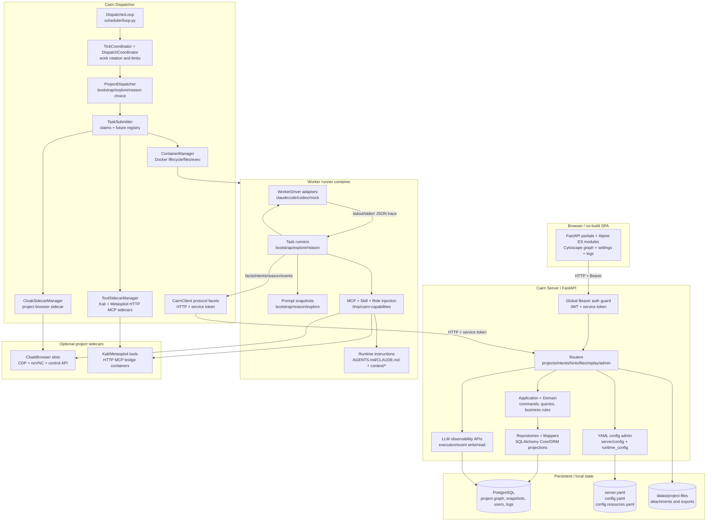
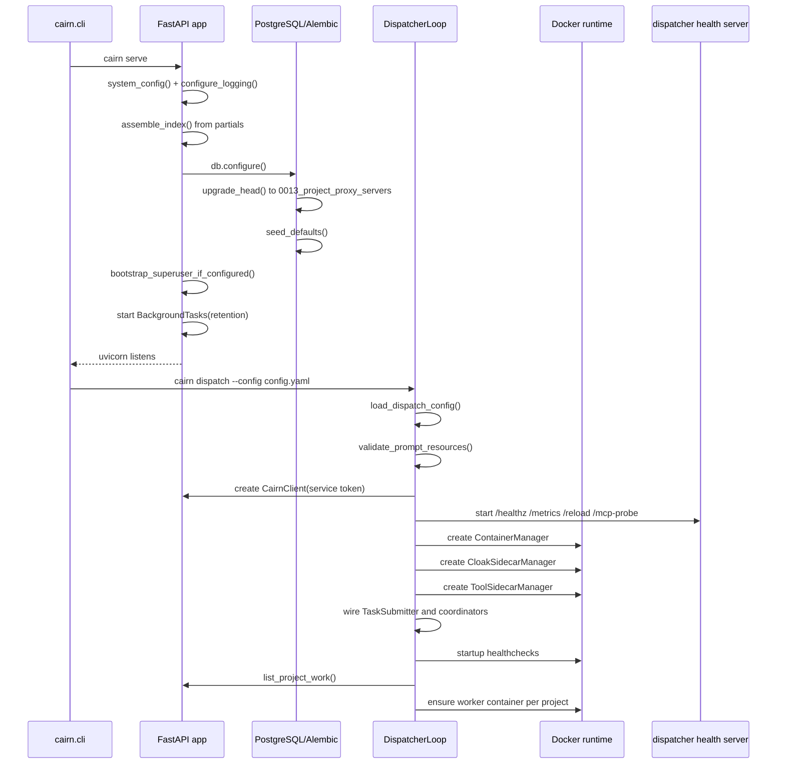
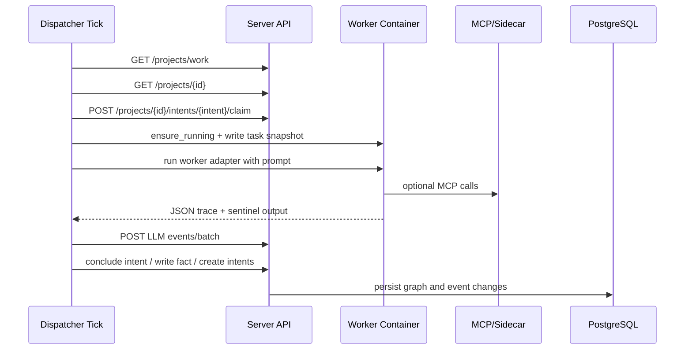
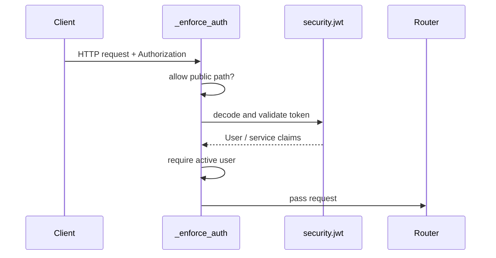

<!--
@ai: 本文件描述了项目的完整架构、设计模式与启动链路。任何 AI 会话在回答与项目架构相关的问题时，应首先阅读此文件。
使用提示："请参考 ARCHITECTURE.md 完成以下任务..."
为避免上下文溢出，AI 会话应在阅读本文件后按需查阅 CODEBASE_ANALYSIS.md 中的具体模块细节。

@update: 如需更新本文档，请遵循以下原则：
1. 优先局部修改受影响的章节，而非全文重写
2. 修改后必须在 UPDATE.md 追加一条变更记录
3. 如 Mermaid 图表有变更，确保图表代码完整且语法正确
4. 模块清单如有增减，同步更新 CODEBASE_ANALYSIS.md 中的对应模块章节

生成日期：2026-07-07
-->

# Cairn 架构与设计文档

## 1. 系统架构图

## 2. 启动与初始化链路

Server entry points:

- `cairn/src/cairn/cli.py`: `serve`, `dispatch`, `db migrate`, `db reset`, `config check`.
- `cairn/src/cairn/server/app.py`: `lifespan()`, global auth dependency, middleware, routers, static SPA.
- `cairn/src/cairn/dispatcher/scheduler/loop.py`: `DispatcherLoop`.

## 3. 模块划分与职责

| 模块名称 | 路径 | 职责 | 输入 | 输出 | 依赖 |
|---------|------|------|------|------|------|
| CLI | `cairn/src/cairn/cli.py` | 进程入口与维护命令 | shell args | Server/Dispatcher/DB action | server, dispatcher, shared config |
| Server app | `cairn/src/cairn/server/app.py` | FastAPI app、lifespan、全局认证、SPA shell | HTTP request | HTTP/HTML/JSON response | db, routers, security |
| Server routers | `cairn/src/cairn/server/routers/` | API 路由和依赖注入 | HTTP request, DTO | DTO/response | application, schemas, config |
| Application | `cairn/src/cairn/server/application/` | 用例编排、事务边界内的命令/查询 | DTO, DB connection | contracts/projections | domain, repositories |
| Domain | `cairn/src/cairn/server/domain/` | SQL-free 规则、错误和图逻辑 | domain values | decisions/errors | shared contracts |
| Repositories | `cairn/src/cairn/server/repositories/` | PostgreSQL SQL 读写 | DB connection, params | rows/projections | orm, mappers |
| Execution config | `cairn/src/cairn/server/execution_config/` | 项目创建时冻结 task/role/AI/capability/prompt 快照 | current config + selections | immutable snapshots | config, repositories |
| Server observability | `cairn/src/cairn/server/observability/` | LLM execution/event 写入、分页读取、retention | event payloads | event views | repositories, metrics |
| Security | `cairn/src/cairn/server/security/` | JWT、密码 hash、用户依赖、路径安全 | Bearer token/password | user context/token | config, users table |
| Frontend SPA | `cairn/src/cairn/server/partials/`, `static/js/` | 项目图、日志、设置、能力管理 UI | browser events/API JSON | DOM state/API calls | server APIs |
| Dispatcher scheduler | `cairn/src/cairn/dispatcher/scheduler/` | Tick、项目选择、claim、submit、cleanup | project summaries | running futures | protocol, runtime, tasks |
| Dispatcher tasks | `cairn/src/cairn/dispatcher/tasks/` | Bootstrap/Explore/Reason prompt、执行、解析、写回 | project snapshot, intent | facts/intents/reason result | workers, observability |
| Dispatcher runtime | `cairn/src/cairn/dispatcher/runtime/` | Docker 容器、mount、exec、cleanup、Cloak sidecar、tool sidecar | ContainerConfig, ToolSidecarsConfig | container/process/lease/status | docker |
| Worker adapters | `cairn/src/cairn/dispatcher/workers/adapters/` | CLI command/env/trace format 适配 | WorkerConfig, prompt | process command/events | Claude Code, Codex, mock |
| Capabilities | `capabilities/`, `cairn/src/cairn/dispatcher/capabilities.py` | MCP/Skill/Role catalog、注入、probe | execution config | mcp.json, plugin, instructions | config.resources.yaml |
| Shared contracts/config | `cairn/src/cairn/shared/` | Pydantic contracts、config models、metrics/logging | YAML/JSON | typed models | server, dispatcher |

## 4. 内部模块间通信

- Browser 与 Server：HTTP JSON + Bearer token；SPA shell 和 static files 由 FastAPI 提供。
- Dispatcher 与 Server：`CairnClient` 使用 HTTP + dispatcher service token。
- Dispatcher 与 Worker：Docker exec 运行 Claude Code/Codex/mock；stdout/stderr 由 dispatcher 解析和记录。
- Worker 与 MCP：Claude/Codex 启动时注入 `mcp.json` 或 CLI config；MCP wrapper 可能连接项目级 Cloak sidecar 或 Kali/Metasploit tool sidecar。
- Server 与 DB：SQLAlchemy engine + Alembic migration；启动时迁移到当前 head `0013_project_proxy_servers`。
- 共享数据：Project graph、execution snapshots、AI health、LLM logs 均在 PostgreSQL；YAML config 通过 server config modules 读写。

典型 Explore 链路：

## 5. 关键设计模式与架构风格

- Blackboard Architecture：Server 保存 shared graph，Dispatcher/Workers 基于 graph 状态推进。
- Layered Monolith：Server 内部按 routers/application/domain/repositories/schemas 分层，测试防止 domain 依赖 SQL/FastAPI。
- Adapter Pattern：`WorkerDriver` 统一 Claude Code、Codex、mock 的 command/env/trace 行为。
- Snapshot Pattern：项目创建时冻结 execution config，旧项目不随全局 config 静默漂移。
- Coordinator Pattern：Dispatcher loop 拆成 Tick、Dispatch、ProjectDispatcher、TaskSubmitter、RuntimeMaintenance。
- Sidecar Pattern：CloakBrowser 是项目级 browser runtime provider，通过 MCP wrapper lease/release 使用；Kali/Metasploit tool sidecar 是项目级 HTTP MCP bridge container，通过 dispatcher runtime 按需 ensure/status/cleanup。
- Guardrail Tests：`test_architecture_boundaries.py`、`test_route_auth_guard.py`、`test_db_migrations.py` 约束架构、认证和文档漂移。

## 6. 认证与授权架构

- 认证方式：JWT HS256 Bearer token。
- Token 来源：`POST /auth/login` 登录，`POST /auth/refresh` 刷新；dispatcher 使用 service token。
- 权限模型：普通 active user 可访问受保护业务接口；superuser 才能执行用户创建、AI profile secret、部分 admin 修改；service token 被映射为 synthetic active superuser 用于内部调度。
- 全局拦截点：`FastAPI(... dependencies=[Depends(_enforce_auth)])`。
- 公共路径：`/`、`/auth/login`、`/health`、`/metrics`、`/static/*`。
- OpenAPI 暴露：`/docs`、`/redoc`、`/openapi.json` 当前禁用，避免绕过全局依赖暴露 schema。

## 7. 运行时与能力架构

能力来源：

- `config.resources.yaml`: MCP server、Skill、Role catalog。
- `capabilities/skills/*/SKILL.md`: worker-facing skill workflow。
- `cairn/src/cairn/dispatcher/prompts/<phase>/roles/*.md`: phase-scoped role prompt。
- `capabilities/mcp/*`: MCP source/runtime assets。

执行时：

1. Server 在项目创建时保存 execution config snapshot。
2. Dispatcher 为 task 读取 snapshot。
3. `inject_project_capabilities()` 按 task type 注入 MCP、Skill、Role。
4. 对 `runtime_provider: cloak_sidecar` 的 MCP，`BrowserRuntimeContext` 向 `CloakSidecarManager` 租用 browser slot。
5. 对配置为 tool sidecar 的 MCP，dispatcher 通过 `ToolSidecarManager` 确保项目级 Kali/Metasploit HTTP sidecar 正在运行，并把 worker MCP wrapper 指向对应 HTTP bridge。
6. `inject_task_instructions()` 写入 task-local runtime instruction 文件：`AGENTS.md`、`CLAUDE.md`、`context/project.md`、`context/phase.md`、`context/capabilities.md`、`context/policy.json`。
7. Settings → Prompts 的 `GET /prompt-instruction-previews` 使用同一 renderer 提供全局只读模板预览，避免 UI 展示与真实 worker 注入漂移。
8. Worker 运行结束后 dispatcher release lease 并写回观测事件；项目完成或 cleanup 时清理 worker、Cloak sidecar 与 tool sidecar。

## 8. 数据库迁移架构

当前 Alembic head：`0013_project_proxy_servers`。

迁移链是线性的，`0013_project_proxy_servers` 直接跟随 `0011_intent_phase_checkpoints`；没有 `0012` 文件但 chain 有效。Server 启动时 `db.configure()` 默认执行 migration 到 head，并运行默认数据 seed。
