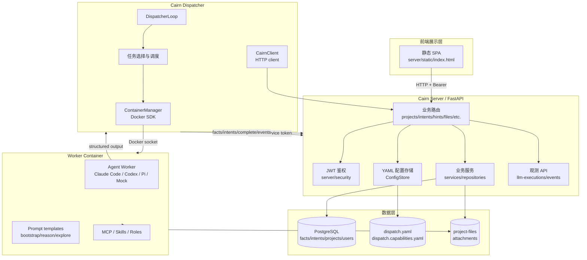
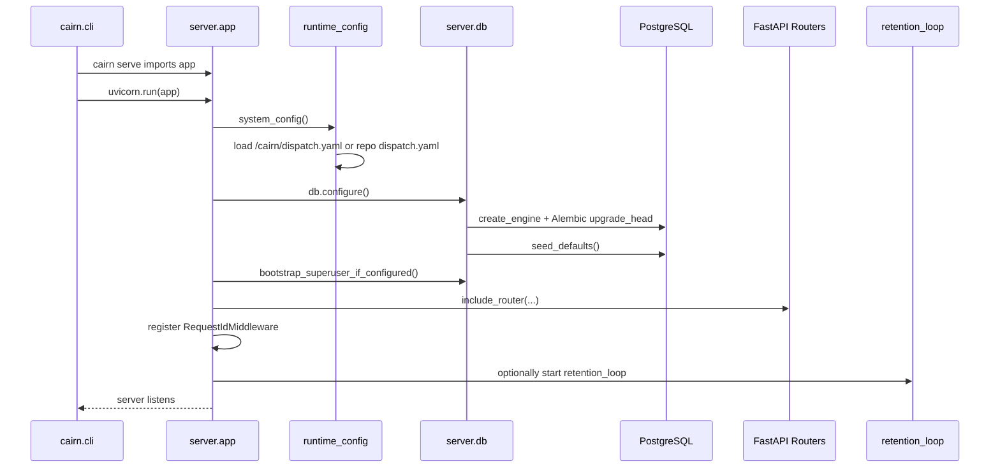
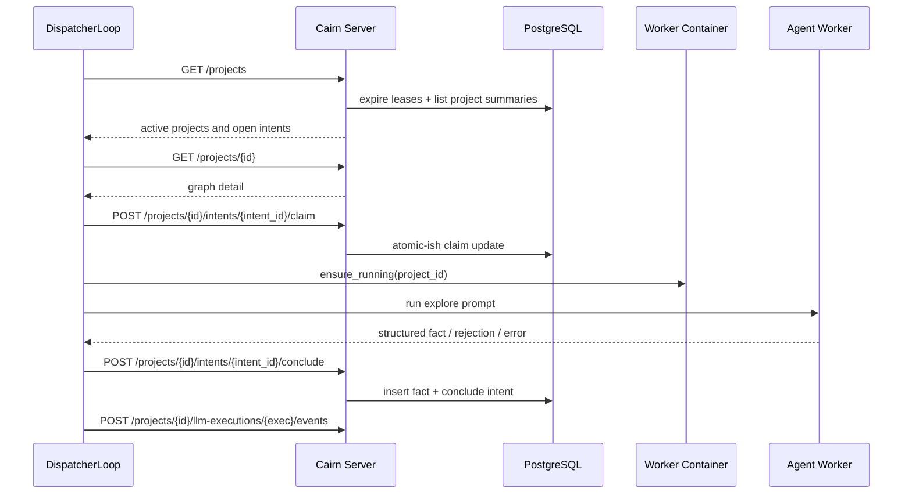

<!--
@ai: 本文件描述了项目的完整架构、设计模式与启动链路。任何 AI 会话在回答与项目架构相关的问题时，应首先阅读此文件。
使用提示："请参考 ARCHITECTURE.md 完成以下任务..."
为避免上下文溢出，AI 会话应在阅读本文件后按需查阅 CODEBASE_ANALYSIS.md 中的具体模块细节。

@update: 如需更新本文档，请遵循以下原则：
1. 优先局部修改受影响的章节，而非全文重写
2. 修改后必须在 UPDATE.md 追加一条变更记录
3. 如 Mermaid 图表有变更，确保图表代码完整且语法正确
4. 模块清单如有增减，同步更新 CODEBASE_ANALYSIS.md 中的对应模块章节

生成日期：2026-06-10
-->

# Cairn 架构与设计文档

## 1. 系统架构图



Cairn 是一个分层单体加外部 Worker 容器的架构。Server 负责共享事实图和配置管理；Dispatcher 是调度进程；Worker Container 是隔离执行环境。

## 2. 启动与初始化链路



Dispatcher 启动链路：

```mermaid
sequenceDiagram
    participant CLI as cairn.cli
    participant Loop as DispatcherLoop
    participant Config as DispatchConfig
    participant Client as CairnClient
    participant Health as HealthServer
    participant Docker as ContainerManager

    CLI->>Loop: cairn dispatch --config dispatch.yaml
    Loop->>Config: DispatchConfig.load(config_path)
    Loop->>Client: init(server, dispatcher_api_token)
    Loop->>Health: start /healthz and /metrics
    Loop->>Docker: docker.from_env()
    Loop->>Loop: startup healthchecks
    Loop->>Client: list_projects()
    Loop->>Docker: ensure project containers
    Loop->>Client: write protocol results
```

关键入口：

| 入口 | 文件 | 说明 |
|------|------|------|
| `cairn serve` | `cairn/src/cairn/cli.py` | 启动 FastAPI/Uvicorn |
| `cairn dispatch` | `cairn/src/cairn/cli.py` | 启动 DispatcherLoop |
| `cairn db migrate/status/reset` | `cairn/src/cairn/cli.py` | 数据库维护 |
| FastAPI app | `cairn/src/cairn/server/app.py` | 注册生命周期、鉴权、路由、静态文件 |
| Dispatcher loop | `cairn/src/cairn/dispatcher/scheduler/loop.py` | 调度 tick、容器与任务 |

## 3. 模块划分与职责

| 模块名称 | 路径 | 职责 | 输入 | 输出 | 依赖 |
|---------|------|------|------|------|------|
| CLI | `cairn/src/cairn/cli.py` | 进程入口和管理命令 | 命令行参数 | Server/Dispatcher/DB 操作 | FastAPI, DispatcherLoop, db |
| Server | `cairn/src/cairn/server/` | HTTP API、数据库访问、配置管理、静态 UI | HTTP Request | HTTP Response, DB/YAML/文件变更 | FastAPI, SQLAlchemy, Pydantic |
| Dispatcher | `cairn/src/cairn/dispatcher/` | 读取图状态、调度任务、管理容器、回写结果 | Server API, YAML config | HTTP writes, worker execution | requests, Docker SDK |
| Shared | `cairn/src/cairn/shared/` | 共享协议模型、配置模型、任务类型注册 | YAML/JSON | Pydantic models | Pydantic |
| Observability | `cairn/src/cairn/observability/` | 日志、trace id、Prometheus metrics | 请求/任务事件 | metrics/log context | prometheus-client |
| Migrations | `cairn/migrations/` | PostgreSQL schema 演进 | Alembic commands | DDL changes | Alembic |
| Capabilities | `capabilities/` | 技能、角色、payload、模板、MCP 配置素材 | YAML/Markdown | Worker prompt context | Dispatcher, prompt builder |
| Container | `container/` | Worker 运行镜像和 MCP wrapper | Docker build | worker image | Docker |
| Tests | `cairn/tests/` | 回归测试和关键行为验证 | pytest/unittest | pass/fail | httpx, test helpers |

## 4. 内部模块间通信

同步通信：

| 调用方 | 被调用方 | 协议/方式 | 用途 |
|--------|----------|-----------|------|
| SPA | Cairn Server | HTTP + Bearer token | 项目、图、配置、文件、观测 UI |
| Dispatcher | Cairn Server | HTTP + service JWT | 读取项目、claim/heartbeat/conclude、写观测事件 |
| Server | PostgreSQL | SQLAlchemy session | 持久化 projects/facts/intents/users/events |
| Server | YAML files | 原子写入/覆盖 | dispatch 和 capabilities 配置 |
| Dispatcher | Docker daemon | Docker socket | 创建/启动/停止 Worker 容器 |
| Dispatcher | Worker process | subprocess / CLI adapter | 运行 Claude Code、Codex、Pi 或 mock |

典型 Explore 请求链路：



异步通信：

| 机制 | 位置 | 说明 |
|------|------|------|
| Dispatcher tick loop | `dispatcher/scheduler/loop.py` | 周期轮询 Server，而不是消息队列 |
| ThreadPoolExecutor | Dispatcher | 并发运行 worker task 和 cleanup task |
| LLM execution events | Server observability API | Dispatcher 批量上报 prompt/stdout/stderr/usage |
| Retention loop | Server lifespan | 周期清理观测数据 |

共享数据：

| 数据 | 写入方 | 读取方 |
|------|--------|--------|
| projects/facts/intents/hints | Server routers, Dispatcher through API | SPA, Dispatcher, export/replay |
| worker_execution_configs | project creation/replay | Dispatcher, project detail APIs |
| dispatch.yaml | Server config routers, operator | Server runtime, Dispatcher |
| attachments/project-files | upload route, Worker container | SPA download, Worker |

## 5. 关键设计模式与架构风格

| 模式 | 应用位置 | 说明 |
|------|----------|------|
| Blackboard Architecture | facts/intents/hints graph | Worker 不直接通信，通过共享图协作 |
| Repository | `server/repositories/` | SQL 访问封装，降低 router 直接拼 SQL 的范围 |
| Adapter | `dispatcher/workers/adapters/` | 对接 Claude Code、Codex、Pi、mock |
| Scheduler | `dispatcher/scheduler/` | 基于项目状态、worker 健康和配置选择任务 |
| Service Layer | `server/services.py`, `project_creation_service.py` | 放置跨 repository 的业务规则 |
| Config-as-data | `dispatch.yaml`, `dispatch.capabilities.yaml` | Worker、能力、AI Profile、路径和运行参数由 YAML 驱动 |
| Lease/Heartbeat | intents, reason lock | 用心跳和超时释放运行中工作 |

总体架构风格是“中心化 Server + 独立调度器 + 容器化执行环境”的分层单体架构，不是微服务系统。边界通过 HTTP、PostgreSQL 和 Docker socket 连接。

## 6. 认证与授权架构

认证方式：

| 项 | 实现 |
|----|------|
| Token | JWT HS256 |
| 签名密钥 | `dispatch.yaml` 的 `system.auth.jwt_secret` |
| 默认有效期 | 1 小时 |
| 密码 | bcrypt hash |
| 服务账号 | JWT claim `role=service`，映射为 synthetic superuser |
| 初始管理员 | `system.initial_admin` 可在启动时 bootstrap |

鉴权入口：

| 位置 | 行为 |
|------|------|
| `server/app.py::_enforce_auth` | 全局依赖，保护除 `/`、`/auth/*`、`/health`、`/metrics`、`/static/*` 以外的路径 |
| `server/security/deps.py::current_user` | 校验 Bearer token 并加载用户 |
| `server/security/deps.py::current_active_superuser` | 要求 `is_superuser=True` |
| `server/routers/auth.py` | 登录、刷新、注册用户 |

权限模型：

- 用户表包含 `is_active` 和 `is_superuser`。
- `/auth/users` 明确要求 `current_active_superuser`。
- 多个系统管理面接口当前只要求已登录，未显式要求 superuser；详见 `CODEBASE_ANALYSIS.md` 的已知问题。
