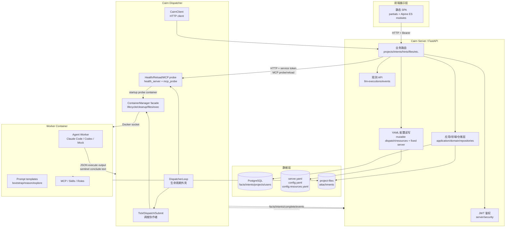
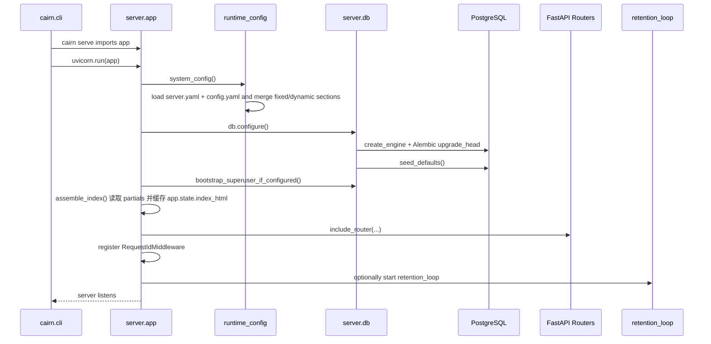
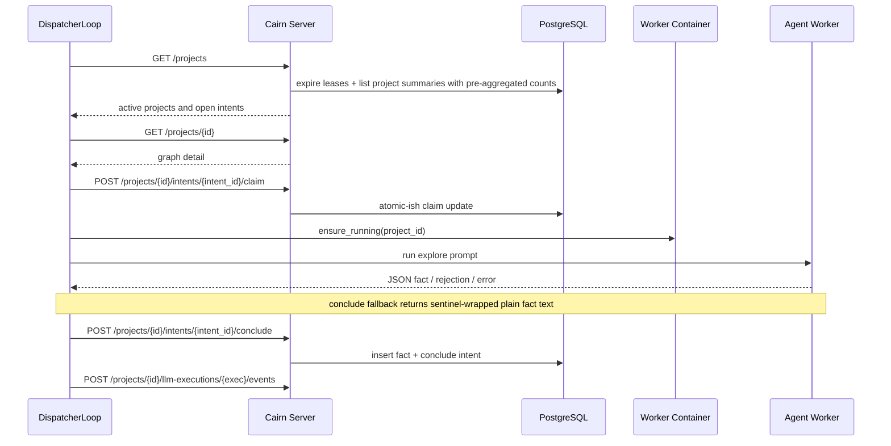

<!--
@ai: 本文件描述了项目的完整架构、设计模式与启动链路。任何 AI 会话在回答与项目架构相关的问题时，应首先阅读此文件。
使用提示："请参考 ARCHITECTURE.md 完成以下任务..."
为避免上下文溢出，AI 会话应在阅读本文件后按需查阅 CODEBASE_ANALYSIS.md 中的具体模块细节。

@update: 如需更新本文档，请遵循以下原则：
1. 优先局部修改受影响的章节，而非全文重写
2. 修改后必须在 UPDATE.md 追加一条变更记录
3. 如 Mermaid 图表有变更，确保图表代码完整且语法正确
4. 模块清单如有增减，同步更新 CODEBASE_ANALYSIS.md 中的对应模块章节

生成日期：2026-06-22
-->

# Cairn 架构与设计文档

## 1. 系统架构图



Cairn 是一个分层单体加外部 Worker 容器的架构。Server 负责共享事实图、执行配置快照和配置管理；Dispatcher 是调度进程；Worker Container 是隔离执行环境。

## 2. 启动与初始化链路



Dispatcher 启动链路：

```mermaid
sequenceDiagram
    participant CLI as cairn.cli
    participant Loop as DispatcherLoop
    participant Config as DispatchConfig
    participant Client as CairnClient
    participant Health as HealthServer
    participant Docker as ContainerManager

    CLI->>Loop: cairn dispatch --config config.yaml
    Loop->>Config: DispatchConfig.load(config_path)
    Loop->>Client: init(server, dispatcher_api_token)
    Loop->>Health: start /healthz, /metrics, /reload, /mcp-probe
    Loop->>Docker: docker.from_env()
    Loop->>Loop: startup healthchecks
    Loop->>Client: list_projects()
    Loop->>Docker: ensure project containers
    Loop->>Client: write protocol results
```

关键入口：

| 入口 | 文件 | 说明 |
|------|------|------|
| `cairn serve` | `cairn/src/cairn/cli.py` | 启动 FastAPI/Uvicorn |
| `cairn dispatch` | `cairn/src/cairn/cli.py` | 启动 DispatcherLoop |
| `cairn db migrate/status/reset` | `cairn/src/cairn/cli.py` | 数据库维护 |
| FastAPI app | `cairn/src/cairn/server/app.py` | 注册生命周期、鉴权、路由、静态文件 |
| Dispatcher loop | `cairn/src/cairn/dispatcher/scheduler/loop.py` | 调度 tick、容器与任务 |

## 3. 模块划分与职责

| 模块名称 | 路径 | 职责 | 输入 | 输出 | 依赖 |
|---------|------|------|------|------|------|
| CLI | `cairn/src/cairn/cli.py` | 进程入口和管理命令 | 命令行参数 | Server/Dispatcher/DB 操作 | FastAPI, DispatcherLoop, db |
| Server | `cairn/src/cairn/server/` | HTTP API、应用用例、领域规则、仓储访问、配置管理、静态 UI | HTTP Request | HTTP Response, DB/YAML/文件变更 | FastAPI, SQLAlchemy, Pydantic |
| Server Application | `cairn/src/cairn/server/application/` | 跨 repository 的用例编排：项目创建/读取/命令、intent/reason 命令、hints/files/attachments、execution config、capabilities、export、replay | Router 调用、DB connection | DTO/domain result | domain, repositories, mappers |
| Server Domain | `cairn/src/cairn/server/domain/` | intent/reason/project 业务规则、ID、时间、lease 清理、业务异常 | repository row/state、命令参数 | domain result 或 `DomainError` | 纯 Python，无 SQL/FastAPI/repository import |
| Execution Config | `cairn/src/cairn/server/execution_config/` | 项目/任务执行配置快照、create-only 结构化持久化和 dispatcher payload 组装 | `config.yaml`, `config.resources.yaml`, DB rows | dispatcher 兼容 dict | shared config/contracts |
| Dispatcher | `cairn/src/cairn/dispatcher/` | 读取图状态、调度任务、管理容器、回写结果，并暴露 reload/MCP probe 控制面 | Server API, YAML config, dispatcher control HTTP | HTTP writes, worker execution, probe results | requests, Docker SDK |
| Dispatcher Scheduler | `cairn/src/cairn/dispatcher/scheduler/` | tick、reload、planner、submitter、worker selection、runtime state、replay coordination | Project summaries/config/runtime state | submitted tasks, releases, metrics | protocol client, runtime, tasks |
| Dispatcher Protocol | `cairn/src/cairn/dispatcher/protocol/` | HTTP transport base 与 project/task/AI profile/observability 子客户端 | Server URL, service JWT | typed DTO 或 `ApiResult` | requests, shared contracts |
| Dispatcher Control/Probe | `cairn/src/cairn/dispatcher/health_server.py`, `cairn/src/cairn/dispatcher/mcp_probe.py` | Dispatcher 本地 HTTP 控制面，处理 health/metrics/reload 和 MCP initialize/tools-list 探测 | `/healthz`, `/metrics`, `/reload`, `/mcp-probe` | JSON health/probe result, Prometheus metrics | ContainerManager, shared config |
| Shared | `cairn/src/cairn/shared/` | 共享配置模型、拆分后的 HTTP contract DTO、任务类型注册 | YAML/JSON | Pydantic models | Pydantic |
| Server Observability | `cairn/src/cairn/server/observability/` | LLM execution/event 写入、查询、usage view、retention；热点 SQL 仍只在 execution/event/view/usage/retention repository/query 模块，application/router 不感知 SQL 细节 | Dispatcher events, HTTP queries | execution/event DTO | server repositories, redaction |
| Frontend SPA | `cairn/src/cairn/server/partials/`, `cairn/src/cairn/server/static/js/` | FastAPI partials 拼装页面；Alpine root 由原生 ES modules 装配，按 `shared/`、`app/`、`workspace/` 分层；项目视图使用轻量 poll-state revision 判断是否刷新完整图 | HTTP API, static partials/js | 浏览器 UI 状态和 API 调用 | Alpine, Tailwind |
| Shared Observability | `cairn/src/cairn/shared/observability/` | 日志、trace id、Prometheus metrics | 请求/任务事件 | metrics/log context | prometheus-client |
| Migrations | `cairn/migrations/` | PostgreSQL schema 演进 | Alembic commands | DDL changes | Alembic |
| Capabilities | `capabilities/` | 技能、角色、payload、模板、MCP 配置素材 | YAML/Markdown | Worker prompt context | Dispatcher, prompt builder |
| Container | `container/` | Worker 运行镜像和 MCP wrapper | Docker build | worker image | Docker |
| Tests | `cairn/tests/` | 回归测试和关键行为验证；DB 用例无 PostgreSQL 时 clean skip | `python -m pytest` | pass/fail/skip | pytest, httpx, test helpers |

当前 Alembic head 为 `0010_project_runtime_snapshots`，为项目 execution config 增加运行时快照 JSON 与 AI profile 明文 secret snapshot；`projects.graph_revision` 与 `projects.timeline_revision` 服务于前端轻量轮询。Alembic 默认 `alembic_version.version_num` 为 `VARCHAR(32)`，migration revision id 必须保持在 32 字符以内；`test_architecture_boundaries.py` 会扫描 `cairn/migrations/versions/*.py` 防止过长 revision 再次导致 `docker compose up --build` 在写入版本号时失败。

前端保持无构建架构：`assemble_index()` 仍拼装 `server/partials/*`，页面通过 `_doc_close.html` 只加载单一 ES module 入口 `/static/js/app/index.js`。`createAppState()` 负责合并 `app/`、`workspace/`、`shared/` 层状态并保留 duplicate key guard；Settings 数据加载入口在 `app/state-settings.js`，切换 section 时只调用该 section 的 loader，避免进入 Settings 后拉取 Prompts、AI Profiles、Proxies、Capabilities、Runtime 等全部管理数据。

Project graph 与 Execution Log 在前端状态层保持轻耦合联动：`workspace/state-graph.js` 的 intent 选择流程继续维护右侧 detail selection，同时调用 LLM log state 的 `syncLlmExecutionSelectionForIntent()`，按当前 `llmExecutions` 排序选择同 `intent_id` 的第一个 execution 并刷新 latest preview/page cards；找不到匹配时保留当前 log 选择。Execution Log header 还提供 `refreshCurrentLlmLog()` 手动刷新按钮，只强制刷新 execution list 与当前 execution 的事件视图，不改变 graph/detail/replay 状态，也不强制展开已折叠面板。

## 4. 内部模块间通信

同步通信：

| 调用方 | 被调用方 | 协议/方式 | 用途 |
|--------|----------|-----------|------|
| SPA | Cairn Server | HTTP + Bearer token | 项目、图、配置、文件、观测 UI |
| SPA | Cairn Server | `GET /projects/{id}/poll-state` | 读取 title/status/reason/counts/revision，只有 revision 变化时刷新完整项目图或时间线 |
| Dispatcher | Cairn Server | HTTP + service JWT | 读取项目、claim/heartbeat/conclude、写观测事件 |
| Cairn Server | Dispatcher health server | HTTP + service token | 触发 dispatcher reload；通过 `/mcp-probe` 在 worker image 内探测 MCP initialize/tools-list |
| Server | PostgreSQL | SQLAlchemy session | 持久化 projects/facts/intents/users/events |
| Server | YAML files | 原子写入/覆盖 | dispatch 和 resources 配置 |
| Dispatcher | Docker daemon | Docker socket | 创建/启动/停止 Worker 容器 |
| Dispatcher | Worker process | subprocess / CLI adapter | 运行 Claude Code、Codex 或 mock |

典型 Explore 请求链路：



异步通信：

| 机制 | 位置 | 说明 |
|------|------|------|
| Dispatcher tick loop | `dispatcher/scheduler/loop.py` | 周期轮询 Server，而不是消息队列 |
| ThreadPoolExecutor | Dispatcher | 并发运行 worker task 和 cleanup task |
| LLM execution events | Server observability API | Dispatcher 批量上报 prompt/stdout/stderr/usage |
| Retention loop | Server lifespan | 周期清理观测数据 |
| MCP probe request | Server admin API -> Dispatcher `/mcp-probe` | 使用临时 startup container 写入 `mcp.json` 和 probe 脚本，执行 initialize + `tools/list` 后删除容器 |

性能敏感查询仍收敛在 repository/query 层：project summaries 使用 facts/intents/hints 预聚合 join；execution list 先分页再聚合 events；event view 先计算 by-kind stats，再按可见 `event_kind` 拉取 primary events；retention 使用 DB join delete；replay route extraction 按 completion facts 可达子图加载。Router、application service 和 DTO contract 不暴露这些 SQL 形态。

Execution config 是不可变项目快照：创建项目或 replay project 时插入一次，`project_id` 已存在会触发 `ServerInvariantError`，不会覆盖 header/timeouts/AI profiles/capabilities/runtime snapshots。Dispatcher 因此不做版本轮询或 TTL；`ExecutionConfigResolver` 仅在 process/reload、project log-state clear 或 404 时失效缓存，并对缓存读写返回 deep copy，避免任务下游修改 dict 污染后续 dispatch。

共享数据：

| 数据 | 写入方 | 读取方 |
|------|--------|--------|
| projects/facts/intents/hints | Server routers, Dispatcher through API | SPA, Dispatcher, export/replay |
| projects.graph_revision/timeline_revision | project、intent、hint、reason、lease 命令 | SPA poll-state 和项目列表局部刷新 |
| project_execution_configs | project creation/replay create-only snapshot | Dispatcher, project detail APIs |
| server.yaml | operator | Server runtime、Dispatcher runtime merge、container limits read API |
| config.yaml | Server system settings routers, operator | Server runtime、Dispatcher；UI 可写 settings/runtime/tasks/observability/log-retention |
| config.resources.yaml | Server capability/role routers, operator | Dispatcher prompt/capability assembly、MCP probe metadata |
| attachments/project-files | upload route, Worker container | SPA download, Worker |

## 5. 关键设计模式与架构风格

| 模式 | 应用位置 | 说明 |
|------|----------|------|
| Blackboard Architecture | facts/intents/hints graph | Worker 不直接通信，通过共享图协作 |
| Router/Application/Domain | `server/routers/`, `server/application/`, `server/domain/` | Router 只做参数/鉴权/HTTP 响应映射，application/query service 编排事务用例，domain 是无 SQL 的规则/决策层 |
| Repository / Query | `server/repositories/`, `server/execution_config/repository.py`, `server/observability/*_repository.py` | 唯一 SQL 访问层，负责条件更新、lease 过期、ID 分配、export/replay/AI check/observability row 读取；project count 预聚合、execution 分页后聚合、retention `DELETE ... USING` 和 replay reachable subgraph 查询都保持在这一层 |
| Mapper | `server/mappers/` | 只做 row/projection 到 API/domain DTO 的转换，不查 SQL |
| Adapter | `dispatcher/workers/adapters/` | 对接 Claude Code、Codex、mock |
| Scheduler Coordinators | `dispatcher/scheduler/` | `DispatcherLoop` 保持生命周期外壳，tick/dispatch/runtime/submitter 协作者依赖 `SchedulerServices` 或具体 resolver，而不是完整 loop |
| Intent Scheduling | `dispatcher/scheduler/project_dispatcher.py`, default `reason.md` | Reason 只产出 `from` 与 `description`；Scheduler 对 unclaimed open intents 按 `created_at` 选择最新 intent，并在 claimed/running open intents 未结束时跳过 Reason |
| Task Submit Pipeline | `dispatcher/scheduler/task_submitter.py`, `task_claims.py`, `submission_registry.py` | bootstrap/explore/reason 共用不可变 execution config snapshot、worker selection、claim、export、submit、失败 release、runtime registry/log 流水线；claim 和 registry/log 已拆成 collaborator |
| Container Facade | `dispatcher/runtime/containers.py` | facade 保留对外方法名，容器生命周期、cleanup、archive/file、exec/process 辅助拆到小模块 |
| Task Lifecycle | `dispatcher/tasks/lifecycle.py`, `conclude_fallback.py` | 统一 reporter、heartbeat、cancel/timeout/unhealthy/parse failed 和 conclude fallback 前置检查 |
| Config-as-data | `server.yaml`, `config.yaml`, `config.resources.yaml` | `server.yaml` 保存固定部署/敏感/基础设施配置；`config.yaml` 保存 UI 可调整的调度、worker、任务、观测配置；`config.resources.yaml` 保存 remote support、capabilities、roles |
| Lease/Heartbeat | intents, reason lock | 用心跳和超时释放运行中工作 |

总体架构风格是“中心化 Server + 独立调度器 + 容器化执行环境”的分层单体架构，不是微服务系统。边界通过 HTTP、PostgreSQL 和 Docker socket 连接。

## 6. 认证与授权架构

认证方式：

| 项 | 实现 |
|----|------|
| Token | JWT HS256 |
| 签名密钥 | `server.yaml` 的 `server.auth.jwt_secret`，可被 `config.yaml` 同名字段覆盖但默认不通过 UI 编辑 |
| 默认有效期 | 1 小时 |
| 密码 | bcrypt hash |
| 服务账号 | `server.auth.dispatcher_api_token` 对应的 JWT claim `role=service`，映射为 synthetic superuser |
| 初始管理员 | `server.initial_admin` 可在启动时 bootstrap |

鉴权入口：

| 位置 | 行为 |
|------|------|
| `server/app.py::_enforce_auth` | 全局依赖，保护除 `/`、`/auth/login`、`/health`、`/metrics`、`/static/*` 以外的路径；其他 `/auth/*` 不做 blanket 豁免 |
| `server/security/deps.py::current_user` | 校验 Bearer token 并加载用户 |
| `server/security/deps.py::current_active_superuser` | 要求 `is_superuser=True` |
| `server/routers/auth.py` | 登录、刷新、注册用户 |

权限模型：

- 用户表包含 `is_active` 和 `is_superuser`。
- `/auth/users` 明确要求 `current_active_superuser`。
- 敏感写接口和 secret/report/check 管理接口使用 `current_active_superuser`；catalog 和项目快照读取依赖全局 Bearer token。
