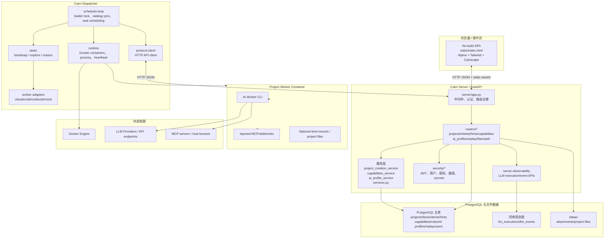
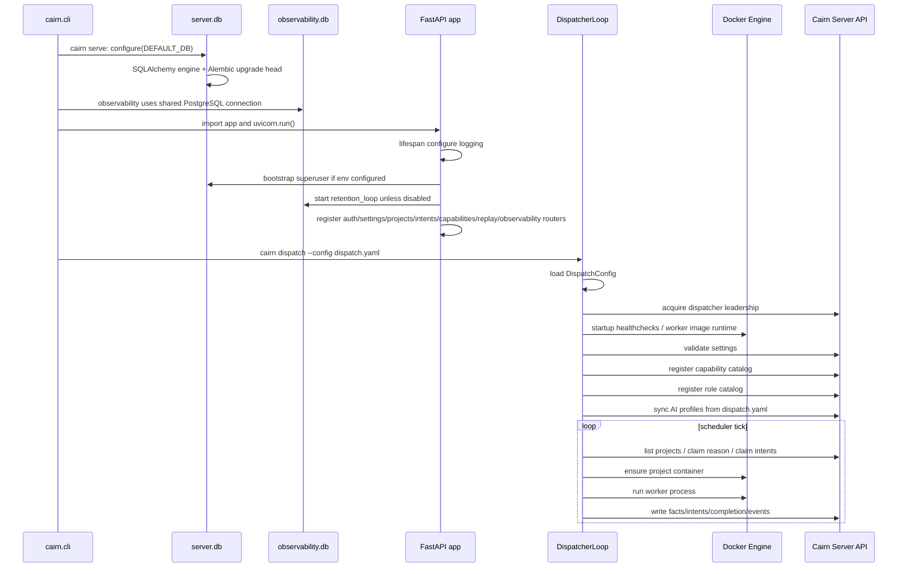
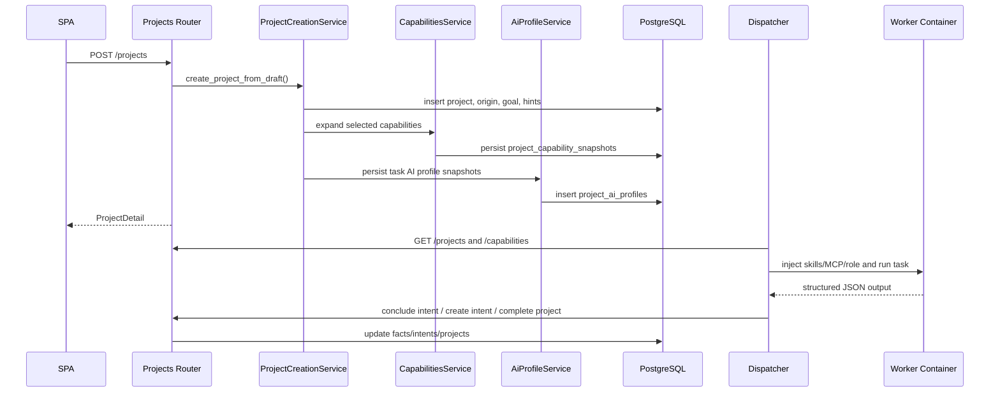

<!--
@ai: 本文件描述了项目的完整架构、设计模式与启动链路。任何 AI 会话在回答与项目架构相关的问题时，应首先阅读此文件。
使用提示："请参考 ARCHITECTURE.md 完成以下任务..."
为避免上下文溢出，AI 会话应在阅读本文件后按需查阅 CODEBASE_ANALYSIS.md 中的具体模块细节。

@update: 如需更新本文档，请遵循以下原则：
1. 优先局部修改受影响的章节，而非全文重写
2. 修改后必须在 UPDATE.md 追加一条变更记录
3. 如 Mermaid 图表有变更，确保图表代码完整且语法正确
4. 模块清单如有增减，同步更新 CODEBASE_ANALYSIS.md 中的对应模块章节

生成日期：2026-06-09
-->

# Cairn 架构与设计文档

## 1. 系统架构图

Cairn 是单体 API server + 独立 dispatcher 进程的分层架构。Server 是事实图和配置状态的权威写入点；Dispatcher 是调度和 worker runtime 的权威执行点；worker 通过 prompt 和结构化 JSON contract 与系统交互，不直接操作数据库。

## 2. 启动与初始化链路

`cairn serve` 负责配置主库和观测库，然后启动 FastAPI。`cairn dispatch` 独立运行，启动时加载 `dispatch.yaml`，注册 capability/role/AI profile catalog，并通过 server 的 dispatcher lock API 做 leader 选举。

代码更新后的本地验收不以“服务启动成功”为止，而是要求继续通过 Docker 暴露的 UI 做浏览器回归。标准流程是：运行测试集 → `docker compose up --build` → 启动 host Chrome 远程调试 → 用 `chrome-devtools` MCP 访问 Docker 启动的服务并执行关键页面操作。需要稳定闭环时，可改用 `dispatch.test.yaml` 的 `mock` worker 配置。

## 3. 模块划分与职责

| 模块 | 路径 | 职责 | 输入 | 输出 | 依赖 |
|------|------|------|------|------|------|
| CLI | `cairn/src/cairn/cli.py` | serve/dispatch/db 维护命令 | CLI 参数 | Server/dispatcher 进程或 JSON 状态 | server.db, DispatcherLoop |
| Server App | `server/app.py` | FastAPI app、认证依赖、健康检查、静态资源 | HTTP request | HTTP response | routers, db, observability |
| Server Routers | `server/routers/` | HTTP 层入参、状态码、响应模型 | Pydantic DTO | JSON / files | services, db |
| Domain Services | `server/*_service.py`, `server/services.py` | 项目创建、capability 展开、AI profile snapshot、图操作 | DB conn + domain input | DB rows / Pydantic models | models, db |
| Models | `server/models_pkg/` | API/DB 领域模型和 validation | Python dict / JSON | Pydantic models | pydantic |
| Database | `server/db.py`, `server/orm.py`, `migrations/` | PostgreSQL engine/session、ORM metadata、Alembic migrations、健康状态 | `CAIRN_DATABASE_URL` | SQLAlchemy session / status | SQLAlchemy, Alembic, psycopg |
| Security | `server/security/` | JWT、用户、密码、secret 加密、路径安全 | token/password/path | auth user / encrypted secret | pyjwt, bcrypt, cryptography |
| Observability | `server/observability/`, `observability/` | LLM events、retention、metrics、trace | execution/event reports | queryable events / Prometheus text | PostgreSQL, metrics |
| Dispatcher Scheduler | `dispatcher/scheduler/` | leader loop、project cache、worker selection、AI overlay | project graph + config | submitted tasks | protocol client, runtime |
| Dispatcher Tasks | `dispatcher/tasks/` | bootstrap/explore/reason 执行模板 | ProjectDetail, Intent, WorkerConfig | outcome + graph writes | worker drivers, runtime |
| Runtime | `dispatcher/runtime/` | Docker container、process、heartbeat、cancel | worker command | ProcessResult / container state | docker |
| Capabilities | `capabilities/`, `dispatcher/capabilities.py` | MCP/skills/roles 资产声明与注入 | dispatch config + project snapshots | prompt instructions + container files | filesystem, Docker |
| Frontend | `server/static/` | 项目 UI、图展示、设置页 | HTTP/browser state | API 操作 | Alpine, Tailwind, Cytoscape |

## 4. 内部模块间通信

- Server 内部通过直接函数调用和同一 PostgreSQL/SQLAlchemy session 完成事务一致性。
- Dispatcher 只通过 HTTP JSON API 与 Server 通信，不直接写数据库。
- Worker 进程通过 stdout/stderr 和结构化 JSON contract 与 Dispatcher 通信。
- Observability 事件由 Dispatcher reporter 通过 Server API 写入同一 PostgreSQL 数据库中的观测表。
- Project 文件和附件通过 filesystem 存储，元信息与 hint/project 关联存在主库中。

## 5. 关键设计模式与架构风格

- **Blackboard Architecture**：projects/facts/intents/hints 是共享黑板，worker 不直接通信，只通过图状态协作。
- **Layered Monolith**：Server 是单进程 FastAPI 分层单体，HTTP 层、服务层、模型层、数据层边界清晰。
- **Service Layer**：`project_creation_service.py`、`ai_profile_service.py`、`capabilities_service.py` 承载跨路由复用逻辑。
- **Strategy/Adapter**：Dispatcher worker drivers 将 Claude Code、Codex、Pi、mock 的 healthcheck/execute/conclude 差异封装到统一接口。
- **Lease + Leader Election**：Dispatcher 用 server-side lock 避免多调度器重复派发，用 heartbeat lease 控制任务持有状态。
- **Snapshot Pattern**：capabilities、roles、AI profiles 在项目维度保存 snapshot，避免 catalog 后续变更破坏历史项目。

## 6. 认证与授权架构

- 认证方式：Bearer JWT。`/auth/login` 颁发 access/refresh token，`/auth/refresh` 刷新 token。
- 用户存储：`users` 表保存用户名、bcrypt password hash、角色、active 状态和时间戳。
- 拦截点：`server/app.py` 的全局 dependency `_enforce_auth`。
- 公开路径：`/`、`/auth/login`、`/auth/refresh`、`/auth/me`、`/health`、`/metrics`、`/static/*`。
- 权限模型：当前主要是登录用户级保护，用户模型有 `role` 字段，但 API 多数只区分“已认证/未认证”和 active 状态。
- Secret 处理：AI profile `sk` 使用加密列 `sk_ciphertext`，读取时优先解密列，保留旧 plaintext 列兼容路径。

## 7. 回归测试架构约束

- 浏览器回归是架构级要求，不是可选 smoke test。
- 本地闭环层依赖：
  - Docker 启动的 `cairn-server` / `cairn-dispatcher`
  - host Chrome 远程调试端口 `9222`
  - `chrome-devtools-host` capability
- 为了降低外部依赖波动，本地闭环允许使用 `dispatch.test.yaml` 的 `mock` worker；真实模型与外部 MCP 作为第二层追加验收。
- 关键前端控件应保留稳定测试选择器，避免 UI 文案或布局微调导致浏览器回归脆弱。
