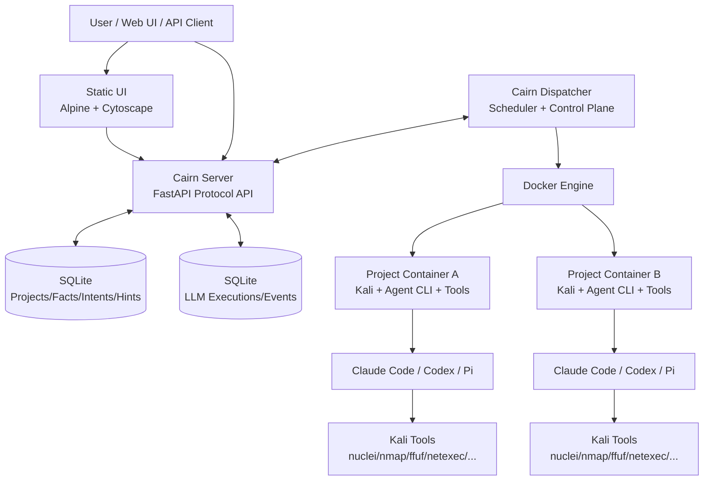
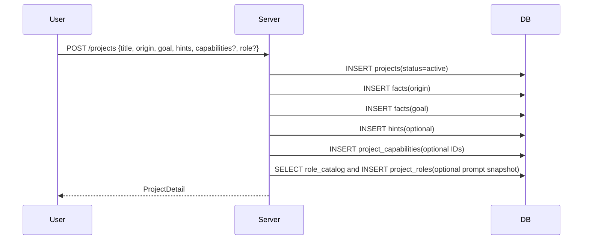
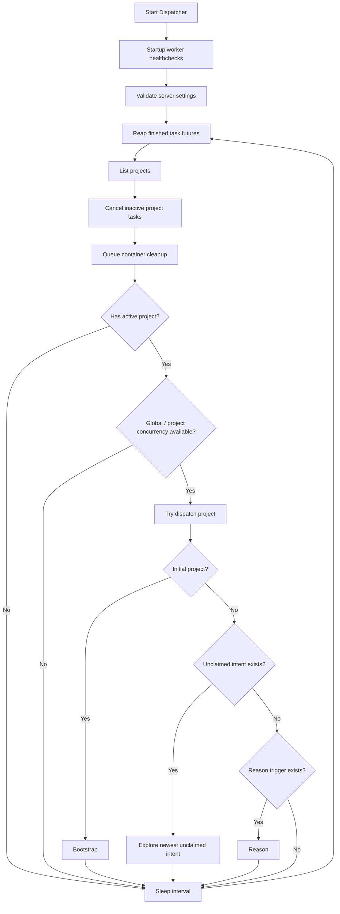
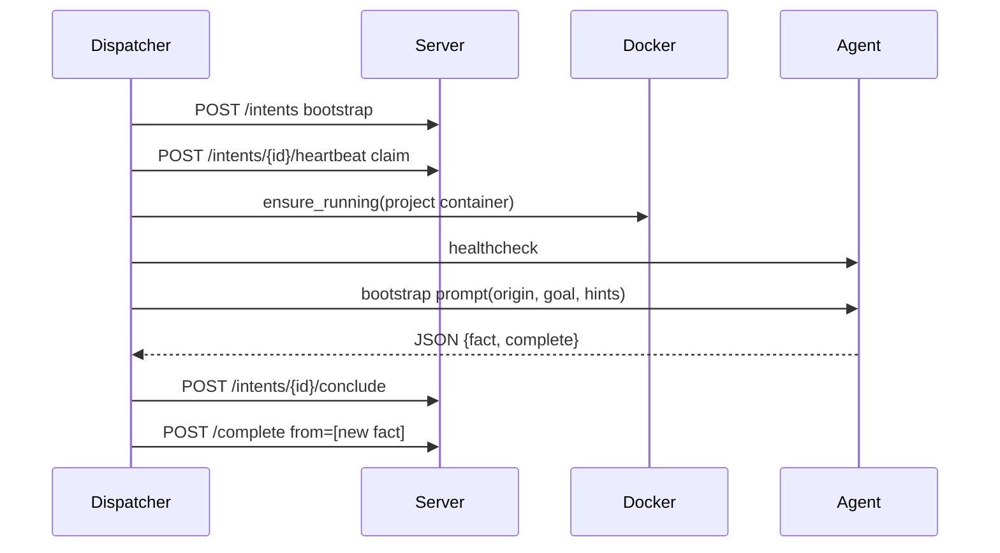
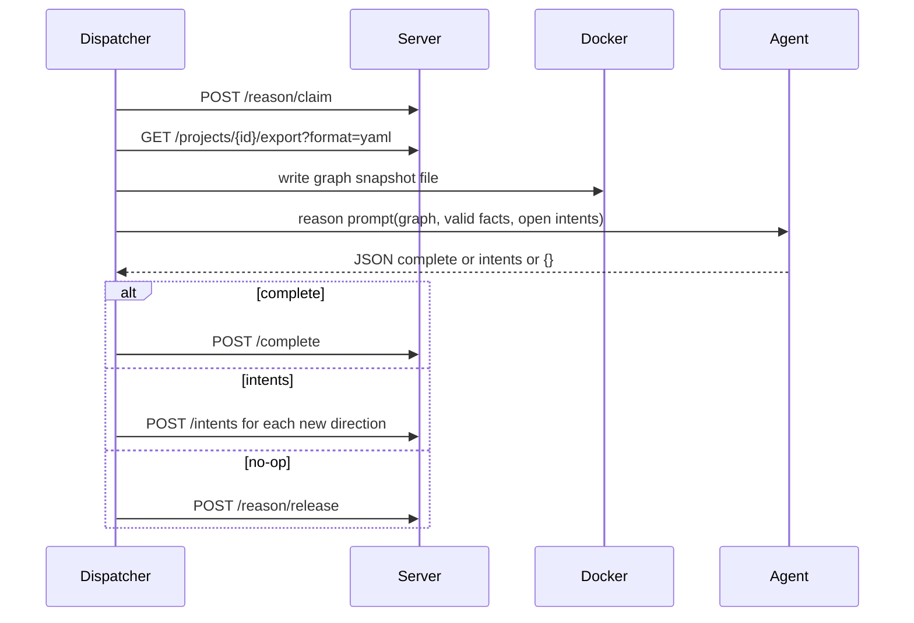
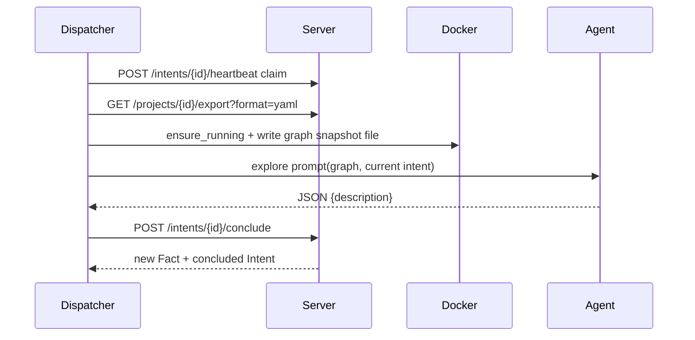
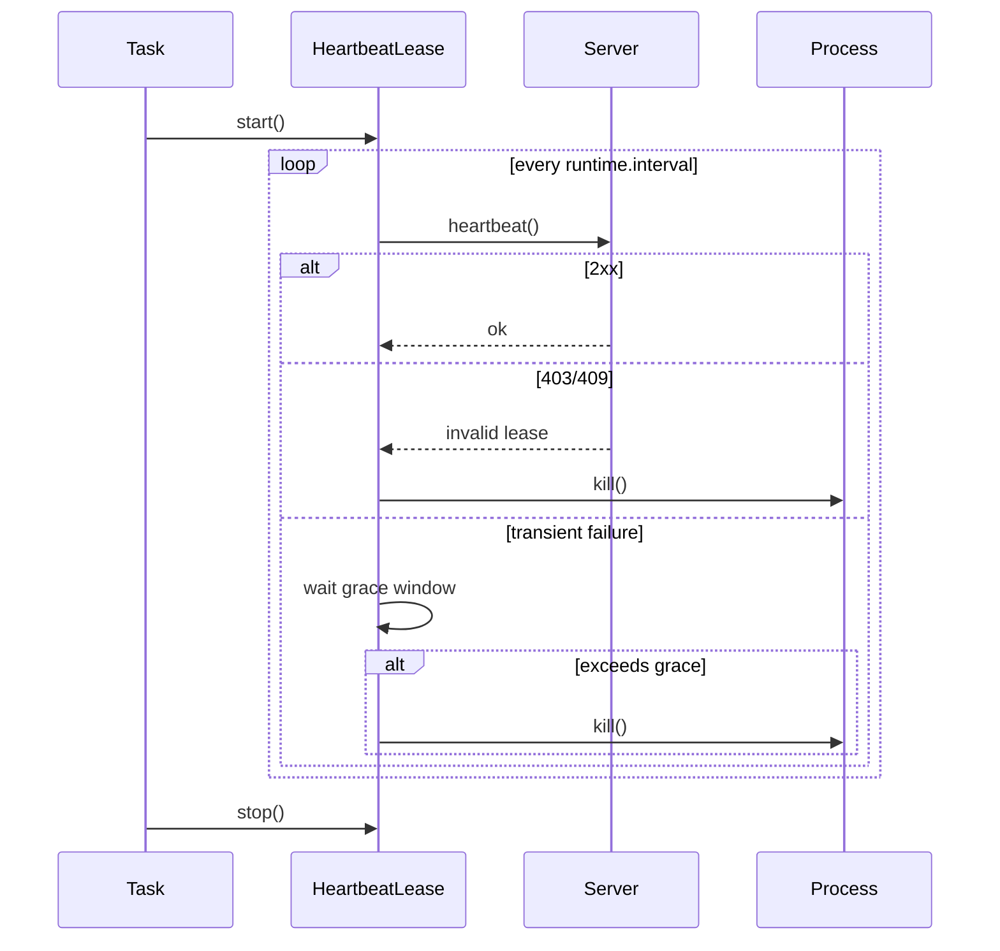

<!--
@ai: 本文件描述 Cairn 项目的核心架构、运行链路和关键设计决策。后续任何 Codex 会话在回答与本项目相关的问题前，应优先阅读本文件，再结合 CODEBASE_ANALYSIS.md 和 AI/PROJECT_OVERVIEW.md。

推荐使用方式：
- “请参考 AI/ARCHITECTURE.md 完成以下任务...”
- “请基于 AI/CODEBASE_ANALYSIS.md 定位代码修改点...”
- “请基于 AI/PROJECT_OVERVIEW.md 快速说明项目运行方式...”
-->

# Cairn 架构与设计

## 1. 项目概览

### 项目名称与核心目标

Cairn 是一个基于事实图的多 Agent 协作探索与调度系统。

它将渗透测试、CTF、漏洞研究、复杂推理等目标导向任务建模为从 `origin` 到 `goal` 的状态空间搜索。系统核心黑板不预设固定 Agent 角色，而是维护一张共享图谱：`Fact` 表示已确认事实，`Intent` 表示待探索方向，`Hint` 表示人类或外部策略输入。项目可以额外选择 primary role 与 MCP/skill capabilities，这些属于控制面上下文，不改变黑板语义。Dispatcher 根据当前图状态动态调度 Agent Worker，在隔离的项目容器内执行任务，并将结构化结果写回事实图。

### 技术栈

| 层级 | 技术 |
| --- | --- |
| 后端 API | Python 3.12+、FastAPI、Pydantic |
| 存储 | SQLite、WAL、主业务 DB 与 observability DB 分离、Docker volume 持久化 |
| 调度器 | Python ThreadPoolExecutor、Requests、Docker SDK |
| Worker 运行时 | Docker 容器、Kali Linux、Claude Code CLI、Codex CLI、Pi Coding Agent、Mock |
| 前端 | 静态 HTML、Tailwind、Alpine.js、Cytoscape、Dagre/Klay/ELK/Cola 布局 |
| 配置 | YAML、`dispatch.yaml`、`dispatch_mock.yaml` |
| 部署 | Docker Compose、uv、`ghcr.io/astral-sh/uv:python3.13-trixie` |

### 工程目录结构

```text
Cairn/
├── README.md
├── Dockerfile
├── docker-compose.yaml
├── dispatch.yaml
├── dispatch_mock.yaml
├── docs/
│   └── specs/
│       ├── dispatcher-design.md
│       └── server-protocol.md
├── container/
│   ├── Dockerfile
│   ├── README.md
│   └── AGENTS.md
├── cairn/
│   ├── pyproject.toml
│   ├── uv.lock
│   └── src/cairn/
│       ├── cli.py
│       ├── server/
│       │   ├── app.py
│       │   ├── db.py
│       │   ├── models.py
│       │   ├── services.py
│       │   ├── observability/
│       │   │   ├── db.py
│       │   │   ├── models.py
│       │   │   ├── repository.py
│       │   │   ├── retention.py
│       │   │   ├── redaction.py
│       │   │   └── routers.py
│       │   ├── routers/
│       │   │   ├── projects.py
│       │   │   ├── intents.py
│       │   │   ├── hints.py
│       │   │   ├── settings.py
│       │   │   ├── export.py
│       │   │   ├── capabilities.py
│       │   │   ├── attachments.py
│       │   │   ├── files.py
│       │   │   └── replay.py
│       │   └── static/
│       │       ├── index.html
│       │       └── vendor/
│       └── dispatcher/
│           ├── config.py
│           ├── contracts.py
│           ├── output_parser.py
│           ├── prompting.py
│           ├── capabilities.py
│           ├── roles.py
│           ├── protocol/client.py
│           ├── scheduler/
│           │   ├── loop.py
│           │   └── worker_select.py
│           ├── tasks/
│           │   ├── bootstrap.py
│           │   ├── reason.py
│           │   ├── explore.py
│           │   └── common.py
│           ├── runtime/
│           │   ├── containers.py
│           │   ├── process.py
│           │   ├── heartbeat.py
│           │   ├── cancellation.py
│           │   └── startup_healthcheck.py
│           ├── observability/
│           │   ├── buffer.py
│           │   ├── redaction.py
│           │   ├── reporter.py
│           │   └── trace.py
│           ├── workers/
│           │   ├── base.py
│           │   ├── registry.py
│           │   └── adapters/
│           │       ├── claudecode.py
│           │       ├── codex.py
│           │       ├── pi.py
│           │       └── mock.py
│           └── prompts/
│               ├── default/
│               ├── cypher/
│               └── mock/
├── capabilities/
│   ├── README.md
│   ├── mcp/
│   ├── skills/
│   └── roles/
└── AI/
    ├── ARCHITECTURE.md
    ├── CODEBASE_ANALYSIS.md
    ├── PROJECT_OVERVIEW.md
    └── UPDATE.md
```

## 2. 架构设计

### 系统架构图



### 核心模块职责

| 模块 | 输入 | 输出 | 主要职责 | 依赖 |
| --- | --- | --- | --- | --- |
| `cairn.cli` | CLI 参数 | Server 或 Dispatcher 进程 | 项目命令入口 | Click、Uvicorn、DispatcherLoop |
| `server.app` | HTTP 请求 | API 响应、静态页面 | FastAPI 应用组装 | routers、db |
| `server.db` | DB path | SQLite 连接 | 初始化 schema、连接管理 | sqlite3 |
| `server.observability.db` | observability DB path | SQLite 连接 | LLM execution/event 独立库初始化 | sqlite3 |
| `server.observability.routers` | LLM execution/event API | Execution Log 响应 | 观察事件写入、查询、finish | repository |
| `server.observability.repository` | Execution/Event rows | 模型对象 | 观察事件 redaction、截断、序列查询 | observability models |
| `server.models` | 请求/响应数据 | Pydantic 模型 | 协议数据结构与校验 | Pydantic |
| `server.services` | SQLite row | 业务辅助结果 | ID 生成、超时清理、模型转换 | FastAPI HTTPException |
| `server.routers.projects` | Project API | Project/Facts/Status | 项目创建、状态、reason lease、complete/reopen | db、services |
| `server.routers.intents` | Intent API | Intent/Fact | intent 创建、claim、heartbeat、release、conclude | db、services |
| `server.routers.export` | Project id | YAML/timeline 文本 | Prompt 图快照导出 | PyYAML |
| `server.routers.capabilities` | Catalog / Project capability / Role API | 能力选择、role catalog、role snapshot | MCP/skill/role 控制面 API | db、models |
| `dispatcher.config` | `dispatch.yaml` | DispatchConfig | 配置解析、Worker env、capability/role 路径、prompt placeholder 校验 | Pydantic、PyYAML |
| `dispatcher.scheduler.loop` | Server 状态 | Worker task futures | 核心调度循环、并发控制、容器清理 | CairnClient、ContainerManager |
| `dispatcher.tasks.bootstrap` | origin/goal/hints | Fact + optional complete | 初始直接求解任务 | WorkerDriver、HeartbeatLease |
| `dispatcher.tasks.reason` | graph snapshot | complete 或 intents | 图级推理与新方向生成 | WorkerDriver、contracts |
| `dispatcher.tasks.explore` | graph + intent | Fact | 执行某个已认领探索方向 | WorkerDriver、contracts |
| `dispatcher.capabilities` | DispatchConfig + project selection | WorkerExecutionContext | MCP/skill catalog 与容器注入 | ContainerManager |
| `dispatcher.roles` | DispatchConfig + project role snapshot | role instructions | Role catalog 与 role prompt 注入 | RoleConfig |
| `dispatcher.runtime.containers` | project id、command | Docker container exec | 项目容器生命周期与文件/目录写入 | docker-py |
| `dispatcher.runtime.process` | Docker exec | stdout/stderr/returncode | 容器内进程控制、kill、输出收集 | Docker API |
| `dispatcher.runtime.heartbeat` | heartbeat callback | lease 状态 | 周期保活与失效杀进程 | CairnClient |
| `dispatcher.workers.adapters` | prompt/env | Agent CLI argv | 不同 Worker 后端命令适配 | Claude/Codex/Pi/Mock CLI |
| `dispatcher.observability.reporter` | prompt/stdout/trace/result | observability API 事件 | Dispatcher 侧观察事件发送、缓冲、脱敏 | CairnClient |
| `dispatcher.observability.trace` | Codex JSONL / Claude stream-json | TraceEvent | 结构化执行轨迹解析 | json |

### 架构风格与设计模式

| 设计 | 在本项目中的体现 |
| --- | --- |
| Blackboard Architecture | Server 维护共享事实图，Agent 不直接通信，只通过 Fact/Intent/Hint 交互 |
| Stigmergy | Agent 通过写入图状态间接影响其他 Agent |
| OODA Loop | Observe 图、Orient 态势、Decide intent、Act 执行探索 |
| Control Plane / Data Plane 分离 | Dispatcher 是控制面，Worker 容器是执行面，Server 是协议真相源 |
| Adapter Pattern | `WorkerDriver` 抽象不同 Agent CLI，支持 Claude Code、Codex、Pi、Mock |
| Lease / Heartbeat | Intent claim 与 reason claim 通过 heartbeat 保活，超时释放 |
| Append-only Fact Graph | Fact 只增不改，状态变化通过新增事实表达 |

## 3. 核心业务流程

### 3.1 创建项目



### 3.2 Dispatcher 主循环



### 3.3 Bootstrap 任务



### 3.4 Reason 任务



### 3.5 Explore 任务



## 4. 工具调用机制

### 不是 Server 直接调用 Kali

Server 不调用 Kali 工具。Dispatcher 也不直接决定执行 `nmap`、`nuclei`、`ffuf` 等具体命令。真实工具调用发生在项目容器内部，由 Agent CLI 根据 prompt 自行执行。

```text
Dispatcher
  -> docker exec "codex exec ..." / "claude -p ..." / "pi ..."
     -> Agent CLI 在 Kali 容器内运行
        -> Agent 使用 bash/tool 能力调用 nuclei、ffuf、netexec、impacket、playwright 等工具
           -> Agent 输出 JSONL / stream-json / 文本
              -> Dispatcher 提取最终 assistant 文本中的 JSON 契约并写回 Cairn Server
              -> Dispatcher 旁路解析结构化 trace 写入 Execution Log
```

### Worker 容器环境

`container/Dockerfile` 基于 `kalilinux/kali-rolling`，安装：

| 类别 | 工具 |
| --- | --- |
| Kali 基础 | `kali-linux-headless` |
| Web/漏洞扫描 | `nuclei`、`katana`、`dirsearch`、`nikto`、`dalfox` |
| 内网/域渗透 | `netexec`、`impacket-*`、`kerbrute`、`bloodyad`、`coercer` |
| 网络工具 | `ncat`、`chisel-common-binaries`、`iputils-ping` |
| PoC/知识库 | `/home/kali/pocs`、`/home/kali/tools`、`/home/kali/knowledges` |
| Agent CLI | `@openai/codex`、`@anthropic-ai/claude-code`、`@mariozechner/pi-coding-agent` |

>>⚠️ 注意：Agent 容器内具备攻击工具链，只应在明确授权、隔离网络和合规场景中使用。

### Host 文件夹共享

项目容器支持通过 `dispatch.yaml` 配置 host bind mount，用于 CTF 附件、源码包、离线工具、字典和大体积执行产物共享。挂载不会改变黑板架构：Fact / Intent / Hint 的真相仍在 Cairn Server 和 SQLite 中，bind mount 只提供容器内文件访问能力。

```yaml
container:
  bind_mounts:
    - name: "ctf-attachments"
      host_path: "./attachments"
      container_path: "/mnt/attachments"
      read_only: true
    - name: "project-files"
      host_path: "./datas/project-files/{project_id}"
      container_path: "/mnt/project"
      read_only: false
```

`host_path` 支持相对路径和 `{project_id}` 模板；相对路径基于 `dispatch.yaml` 所在目录解析。Dispatcher 会自动创建 host 目录，并在 startup healthcheck 中验证挂载。Agent 不会自动知道附件语义，推荐在项目 `origin` 或 `Hint` 中明确说明，例如：“附件源码已挂载在 `/mnt/attachments/web-src`，请优先审计该目录。”

## 5. MCP / Skill / Role 控制面

### 设计边界

Capability 与 Role 是控制面配置，不是黑板数据：

| 类型 | 存储 | 运行时用途 | 是否写入 Fact/Intent/Hint |
| --- | --- | --- | --- |
| MCP / Skill catalog | Dispatcher `dispatch.yaml`，启动时注册到 Server | UI 创建/编辑项目时可选 | 否 |
| Project capability selection | Server `project_capabilities` 保存 ID | 任务启动前复制到 worker 容器 | 否 |
| Role catalog | Dispatcher `roles[]`，启动时注册到 Server | UI 创建项目时可选 primary role | 否 |
| Project role snapshot | Server `project_roles` 保存 prompt 快照和 sha256 | 注入 `bootstrap` / `explore` / `reason` prompt | 否 |

黑板语义保持不变：`Fact` 只代表已确认客观发现，`Intent` 只代表待探索方向，`Hint` 只代表人工/外部策略输入。

### 注入路径

任务启动前 Dispatcher 调用 `inject_project_capabilities()`，按项目和任务实例隔离复制资源：

```text
/tmp/cairn-capabilities/{project_id}/{task_instance_id}/
├── mcp.json
├── mcp/<mcp_id>/
└── skills/<skill_id>/
```

- `bootstrap` task instance: `bootstrap-{intent_id}`
- `explore` task instance: `explore-{intent_id}`
- `reason` task instance: `reason-{worker_name}-{random}`

MCP `command/args/env` 支持 `{capability_root}` 占位符。Claude adapter 使用 `--mcp-config` / `--add-dir`；Codex adapter 使用 `--add-dir` 与 `-c mcp_servers.<id>.*=...`。

**HTTP transport**（Streamable HTTP, MCP 2025-03-26）— `McpServerCapabilityConfig.transport: "http"` 时走 `url` + 可选 `bearer_token_env`:

- token 通过 env 注入,**不**写入 `mcp.json` 持久文件 (Codex 路径) 或**仅在序列化时现场拼**到 `headers` (Claude 路径),序列化后立即释放;
- `bearer_token_env` 指向的 env var 名会合并进 worker container `environment`,确保 Codex / Claude 进程可通过 `os.environ` 拿到;
- HTTP server 与 worker 容器的网络连通由部署者负责(可走 `cairn` docker network 或 `network_mode: host`),dispatch.yaml 不自动改 `network_mode` / `extra_hosts`;
- `Authorization: Bearer ...` 由 observability `redaction.py` 内置正则兜底,即使下游 SDK 漏脱敏,落库前也会替换为 `Authorization: Bearer ***`;
- HTTP MCP server 可达性由 `inject_project_capabilities` 在写 `mcp.json` 前做一次 TCP 探活(默认 1s,`healthcheck_timeout` 可配),失败 → 跳过该 mcp 并写 `injection.errors`;`catalog_payload.available` 不接探活结果,代表 config 有效而非 per-task 可达。

未做(显式留作后续): TLS 软提示(按用户要求跳过)、SSRF 防护、多 URL 故障转移、Basic auth / OAuth / mTLS;token 轮换后 in-flight worker 需自然回收(`container.completed_action` 控制)。

### Cypher Agent

`dispatch.yaml` 当前可使用 `runtime.prompt_group: "cypher"` 启用 Cypher Agent prompt group，面向自动化 CTF、授权渗透测试和漏洞研究。预置资源：

| 目录 | 内容 |
| --- | --- |
| `capabilities/skills/cypher-ctf` | CTF workflow |
| `capabilities/skills/cypher-pentest` | 授权渗透测试 workflow |
| `capabilities/skills/cypher-vuln-research` | 漏洞研究 / PoC / root cause workflow |
| `capabilities/roles/cypher-ctf-operator/ROLE.md` | CTF primary role |
| `capabilities/roles/cypher-pentest-operator/ROLE.md` | Pentest primary role |
| `capabilities/roles/cypher-vuln-researcher/ROLE.md` | Vulnerability research primary role |

## 6. Heartbeat 与任务存活

### Lease 类型

| Lease | 使用场景 | Server 字段 | API |
| --- | --- | --- | --- |
| Intent lease | `bootstrap`、`explore` | `intents.worker`、`last_heartbeat_at` | `POST /projects/{project_id}/intents/{intent_id}/heartbeat` |
| Reason lease | `reason` | `projects.reason_worker`、`reason_last_heartbeat_at` | `POST /projects/{project_id}/reason/heartbeat` |

### Heartbeat 工作方式



### Server 过期清理

Server 在读取项目、列项目、claim/release 等路径中调用超时清理：

| 函数 | 行为 |
| --- | --- |
| `expire_workers()` | 对未结论 intent，如果 `last_heartbeat_at` 超过 `intent_timeout`，清空 `worker` |
| `expire_reason_leases()` | 对项目 reason lease，如果 `reason_last_heartbeat_at` 超过 `reason_timeout`，清空 reason 字段 |

这保证 Dispatcher 崩溃、Agent 卡死、网络异常时，其他调度轮次能重新认领未完成任务。

>>⚠️ 注意：heartbeat 保证的是 claim/lease 存活，不是强行让项目一直 active。项目被用户置为 `stopped` 或 `completed` 后，heartbeat 会失败，Dispatcher 会取消本地任务。

## 7. 防止 Infinite Loop 的机制

系统通过多层机制降低无限循环风险：

| 层级 | 机制 | 作用 |
| --- | --- | --- |
| 进程层 | Linux `timeout -k 5s {timeout}s` | 单个 Agent 进程不会无限运行 |
| 任务层 | `bootstrap.timeout`、`reason.timeout`、`explore.timeout` | 每类任务都有硬时间预算 |
| 收尾层 | `conclude_timeout` | 超时后只允许短时间总结已确认事实 |
| 调度层 | `reason_checkpoints` | 图没有新变化时不重复 reason |
| 图结构 | intent conclude 后有 `to_fact_id` | 已完成 intent 不再被重复探索 |
| 并发层 | `max_workers`、`max_project_workers`、`max_running_projects` | 防止单项目或单 Worker 占满资源 |
| 输出层 | JSON contract validation | 非法输出不会写图 |
| backoff | unhealthy/rejected retry window | 避免短周期反复失败重试 |

### Reason 触发条件

Dispatcher 只在以下情况触发 `reason`：

```text
checkpoint 不存在
或 facts 数量增加
或 hints 数量增加
或 open_intents 从大于 0 变成 0
```

如果图状态未变化，Dispatcher 不会重复 reason。

>>⚠️ 注意：系统防的是调度层和进程层死循环，不完全防语义层“不断生成低质量新 intent”。如果 Agent 每次 reason 都提出新方向，系统会继续探索，直到项目 completed、stopped、任务失败、超时或人工干预。

## 8. API 总览

### Settings

| 方法 | 路径 | 用途 |
| --- | --- | --- |
| GET | `/settings` | 获取 `intent_timeout`、`reason_timeout` |
| PUT | `/settings` | 更新超时设置 |

### Projects

| 方法 | 路径 | 用途 |
| --- | --- | --- |
| GET | `/projects` | 获取项目摘要列表 |
| POST | `/projects` | 创建项目，写入 origin/goal/hints，可保存 capability selection 与 role prompt 快照 |
| GET | `/projects/{project_id}` | 获取完整项目图 |
| DELETE | `/projects/{project_id}` | 删除项目 |
| PUT | `/projects/{project_id}/title` | 更新标题 |
| PUT | `/projects/{project_id}/status` | active/stopped 切换 |
| POST | `/projects/{project_id}/complete` | 标记完成并写 goal intent |
| POST | `/projects/{project_id}/reopen` | 从 completed 回到 active |

### Reason

| 方法 | 路径 | 用途 |
| --- | --- | --- |
| POST | `/projects/{project_id}/reason/claim` | 认领项目级 reason lease |
| POST | `/projects/{project_id}/reason/heartbeat` | 维持 reason lease |
| POST | `/projects/{project_id}/reason/release` | 释放 reason lease |

### Intents

| 方法 | 路径 | 用途 |
| --- | --- | --- |
| POST | `/projects/{project_id}/intents` | 创建 open intent |
| POST | `/projects/{project_id}/intents/{intent_id}/heartbeat` | claim/heartbeat intent |
| POST | `/projects/{project_id}/intents/{intent_id}/release` | 释放 intent |
| POST | `/projects/{project_id}/intents/{intent_id}/conclude` | 写入新 fact 并结论 intent |

### Hints 与 Export

| 方法 | 路径 | 用途 |
| --- | --- | --- |
| POST | `/projects/{project_id}/hints` | 添加 Hint |
| GET | `/projects/{project_id}/export?format=yaml` | 导出 YAML 图快照 |
| GET | `/projects/{project_id}/export?format=timeline` | 导出时间线 |

### Attachments

| 方法 | 路径 | 用途 |
| --- | --- | --- |
| POST | `/projects/{project_id}/attachments` | 上传文件到项目附件目录，并自动写入指向 `/mnt/attachments/{project_id}/<file>` 的 Hint |

> 🔧 向后兼容：附件上传通过 `multipart/form-data` 的 `files` 与可选 `descriptions` 字段，文件名会经过 `[^A-Za-z0-9._ -]+` 安全过滤。Worker 容器内挂载点固定为 `CAIRN_WORKER_ATTACHMENTS_ROOT`（默认 `/mnt/attachments`）。

### Files

| 方法 | 路径 | 用途 |
| --- | --- | --- |
| GET | `/projects/{project_id}/files` | 列出项目报告 / exploit / vuln-research / 附件文件 |
| GET | `/projects/{project_id}/files/download?source=project\|attachment&path=...` | 下载指定文件 |

> ⚠️ 注意：路径必须相对于 `datas/project-files/{project_id}/` 或 `datas/attachments/{project_id}/`，且不可包含 `..`。源码在 `cairn/src/cairn/server/routers/files.py` 中实现。

### Replay

| 方法 | 路径 | 用途 |
| --- | --- | --- |
| POST | `/projects/{project_id}/replay-runs` | 基于已完成项目创建 replay run（含 replay 子项目 + 步骤表） |
| POST | `/projects/{project_id}/replay-runs/{run_id}/advance` | Dispatcher 推进下一步 replay intent |

> ⚡ 性能敏感：replay 不重新跑 LLM，而是按原项目的 step 顺序复演 `intents → facts` 关系，每步创建新 intent 并等候 worker 产出新 fact。Dispatcher 在主循环中通过 `_advance_replay_project()` 调用 advance API。

### Capabilities 与 Roles

| 方法 | 路径 | 用途 |
| --- | --- | --- |
| GET | `/capabilities/catalog` | 查询 MCP/skill catalog |
| POST | `/capabilities/catalog` | Dispatcher 注册 MCP/skill catalog |
| GET | `/projects/{project_id}/capabilities` | 查询项目启用能力 |
| PUT | `/projects/{project_id}/capabilities` | 更新项目启用能力 |
| GET | `/roles/catalog` | 查询可选 primary roles |
| POST | `/roles/catalog` | Dispatcher 注册 role catalog |
| GET | `/projects/{project_id}/role` | 查询项目 role prompt 快照 |

### Execution Log

| 方法 | 路径 | 用途 |
| --- | --- | --- |
| GET | `/projects/{project_id}/llm-executions` | 查询项目 execution 列表 |
| GET | `/projects/{project_id}/llm-events` | 按 sequence 增量查询项目事件 |
| GET | `/projects/{project_id}/llm-executions/{execution_id}/events` | 查询单个 execution 的事件 |
| POST | `/projects/{project_id}/llm-executions` | 创建 execution 记录 |
| POST | `/projects/{project_id}/llm-executions/{execution_id}/events` | 写入 execution event |
| POST | `/projects/{project_id}/llm-executions/{execution_id}/finish` | 标记 execution 结束 |

## 9. 配置与运行

### `dispatch.yaml` 关键配置

```yaml
server: "http://cairn-server:8000"

runtime:
  interval: 3
  max_workers: 8
  max_running_projects: 3
  max_project_workers: 4
  healthcheck_timeout: 20
  prompt_group: "cypher"

tasks:
  bootstrap:
    timeout: 300
    conclude_timeout: 90
  reason:
    timeout: 300
    max_intents: 2
  explore:
    timeout: 300
    conclude_timeout: 90

observability:
  enabled: true
  record_prompts: true
  record_stdout: true
  record_stderr: true
  record_raw_worker_stream: false

remote_support:
  enabled: false
  dnslog:
    url: ""
  ssh:
    host: ""
    port: 22
    username: ""
    password: ""

capabilities:
  mcp_servers:
    - id: "example-mcp"
      name: "Example MCP"
      command: "python3"
      args: ["{capability_root}/mcp/example-mcp/server.py", "--stdio"]
      env: {}
      source_path: "./capabilities/mcp/example-mcp"
      task_types: ["bootstrap", "explore", "reason"]
  skills:
    - id: "cypher-ctf"
      name: "Cypher CTF"
      source_path: "./capabilities/skills/cypher-ctf"
      task_types: ["bootstrap", "explore", "reason"]
  mcp_servers:
    - id: "kali-server-mcp"
      name: "Kali Server MCP"
      command: "/usr/local/bin/kali-mcp-stdio"
      args: []
      env: {}
      task_types: ["bootstrap", "explore", "reason"]
    - id: "metasploit-mcp"
      name: "Metasploit MCP"
      command: "/usr/local/bin/metasploit-mcp-stdio"
      args: []
      env: {}
      task_types: ["explore", "reason"]

roles:
  - id: "cypher-ctf-operator"
    name: "Cypher CTF Operator"
    source_path: "./capabilities/roles/cypher-ctf-operator/ROLE.md"
    task_types: ["bootstrap", "explore", "reason"]

container:
  image: "ghcr.io/oritera/cairn-worker-container:latest"
  network_mode: "cairn"
  completed_action: "stop"
  stopped_action: "remove"
  bind_mounts:
    - name: "ctf-attachments"
      host_path: "./attachments"
      container_path: "/mnt/attachments"
      read_only: true
    - name: "project-files"
      host_path: "./datas/project-files/{project_id}"
      container_path: "/mnt/project"
      read_only: false

workers:
  - name: "claudecode"
    type: "claudecode"
    task_types: [bootstrap, reason, explore]
    max_running: 4
    priority: 0
    env:
      ANTHROPIC_MODEL: "${ANTHROPIC_MODEL}"
      ANTHROPIC_BASE_URL: "${ANTHROPIC_BASE_URL}"
      ANTHROPIC_AUTH_TOKEN: "${ANTHROPIC_AUTH_TOKEN}"
  - name: "codex"
    type: "codex"
    task_types: [bootstrap, reason, explore]
    max_running: 2
    priority: 1
    env:
      CODEX_MODEL: "${CODEX_MODEL}"
      CODEX_BASE_URL: "${CODEX_BASE_URL}"
      OPENAI_API_KEY: "${OPENAI_API_KEY}"
```

> 🔧 向后兼容：`DispatchConfig.load()` 在 YAML 解析后、`pydantic` 校验前会递归地把所有字符串里的 `${ENV_VAR}` 替换成环境变量值；引用未设置的环境变量会立刻抛错，错误信息带 YAML 路径（如 `dispatch.yaml.remote_support.ssh.password`）。文档示例统一使用 `${...}` 形式占位。

### Execution Log 与 Remote Support

- Execution Log 是独立 observability 旁路，不是黑板事实来源。业务真相仍只来自 `facts/intents`。
- Server 使用独立的 observability SQLite DB，默认路径为 `~/.local/share/cairn/cairn_observability.db`；`cairn serve` 可通过 `--observability-db-path` 指定。
- Dispatcher 的 `observability` 配置控制是否发送 prompt/stdout/stderr/raw worker stream 以及 Dispatcher 侧缓冲、脱敏和大小限制；Server 端写入 API 仍使用内置 `ObservabilitySettings()` 做二次 redaction/truncation。
- Worker 的结构化执行轨迹会解析为 `tool_call`、`tool_result`、`command_start`、`command_end`、`agent_message`、`thinking`、`usage` 等事件；Claude `system/init`、`system/api_retry` 分别显示为 `session_init`、`api_retry`。
- UI 默认隐藏 `usage`，可通过 `Show Usage` 开关查看。
- Codex/Claude 的结构化流只用于 Execution Log 和最终 assistant 文本提取；真正写入 Fact/Intent/Complete 的仍是 prompts 要求的最终 JSON 契约。
- `remote_support` 只提供 DNSLog 与远程 SSH 两类资源，并合并进 worker env；它不改变 `container.network_mode`，默认仍是 `cairn`。
- Remote Support 只注入 `bootstrap.md` 与 `explore.md`，不注入 conclude/reason，避免破坏“执行、总结、推理”边界。
- prompt 中只出现环境变量名，不渲染 SSH 密码明文；redaction 规则覆盖 `CAIRN_REMOTE_SSH_PASSWORD` 与通用 `*PASSWORD`。
- Capability / Role 注入同样只影响 worker runtime 与 prompt 控制面，不改变 `facts/intents/hints` 的真相来源。

### 启动命令

```bash
docker pull --platform=linux/amd64 ghcr.io/oritera/cairn-worker-container:latest
docker pull ghcr.io/astral-sh/uv:python3.13-trixie
docker compose up --build
```

手动方式：

```bash
uv run --project cairn cairn serve
uv run --project cairn cairn serve --observability-db-path ~/.local/share/cairn/cairn_observability.db
uv run --project cairn cairn dispatch --config dispatch.yaml
uv run --project cairn cairn dispatch --config dispatch.yaml --startup-healthcheck-only
```

## 10. 已知风险与架构债务

| 风险 | 说明 |
| --- | --- |
| 单 Dispatcher 假设 | 当前设计和文档明确按单 Dispatcher 实例运行，不支持多 Dispatcher 共同调度同一 Server |
| Catalog 全量覆盖 | Dispatcher 启动时全量覆盖 capability/role catalog；多 Dispatcher 时配置必须一致 |
| 语义循环风险 | 可防进程死循环，但不能完全防 Agent 持续生成低价值 intent |
| 密钥泄露风险 | 已迁移：`dispatch.yaml` 使用 `${ENV_VAR}` 引用敏感凭据，Config 加载时强制要求环境变量被设置 |
| 高权限执行风险 | Worker CLI 使用危险执行参数，Kali 容器内工具能力强，必须隔离运行 |
| 测试覆盖不明显 | 当前仓库未看到系统性测试目录，变更后应优先用 mock prompt/worker 做端到端验证 |
| Intent 历史不足 | 协议只记录当前/最终 worker，不保留完整 worker 历史 |
