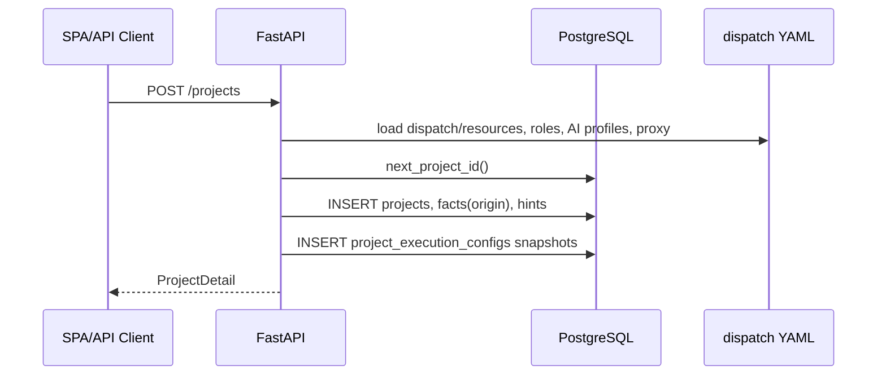
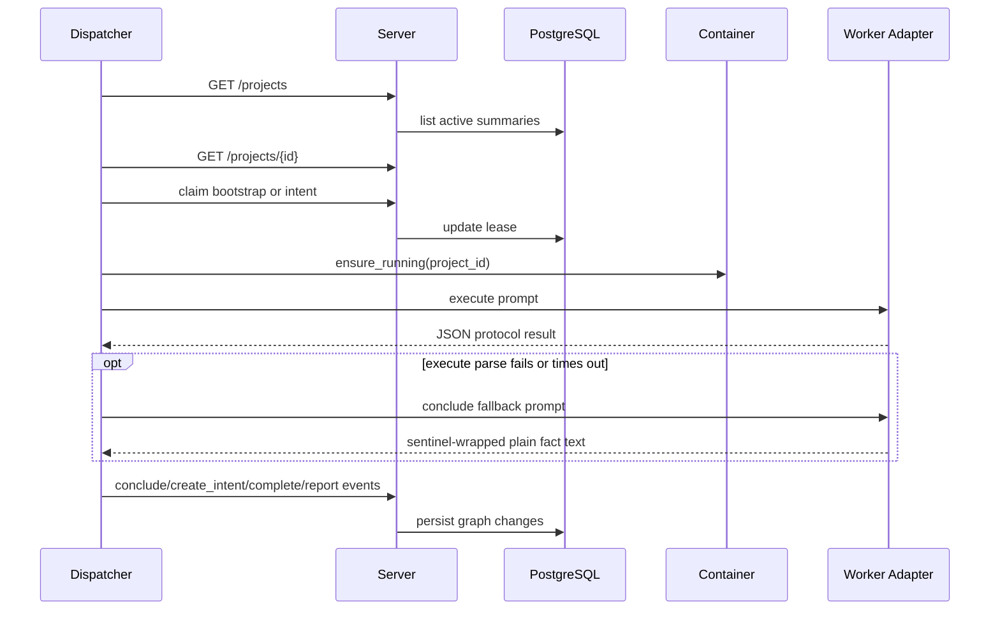
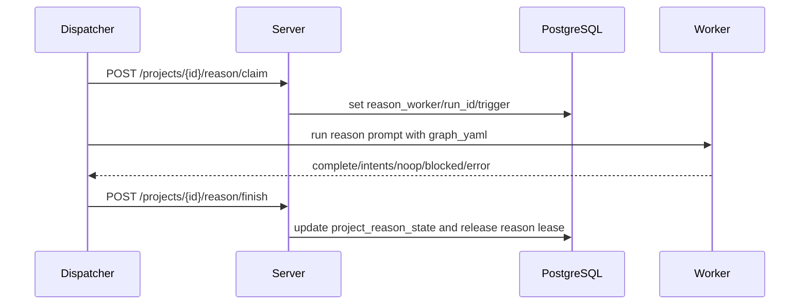
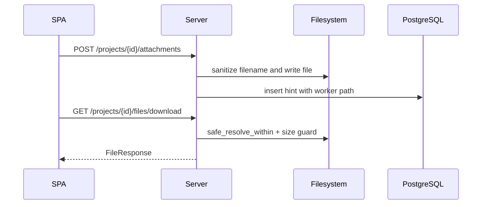
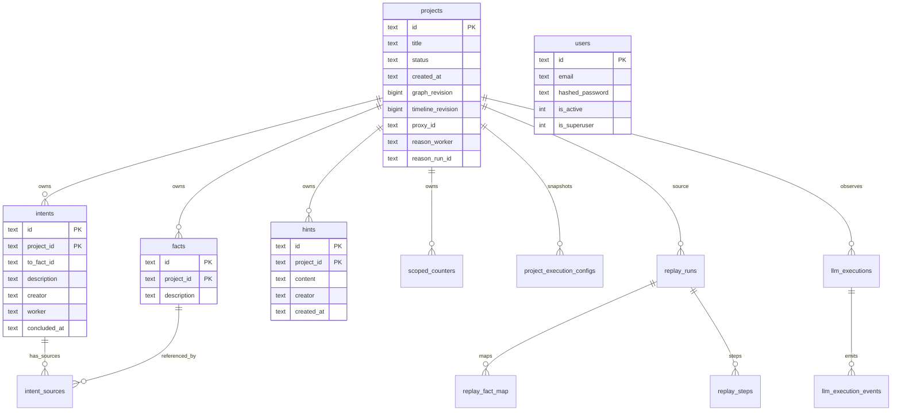

<!--
@ai: 本文件是项目的全面代码分析。当需要了解具体实现细节、函数签名、数据模型或业务逻辑时，请查阅本文件。
本文件按模块组织，每个模块包含其文件清单、核心函数、数据结构和实现细节。

@update: 如需更新本文档，请遵循以下原则：
1. 优先局部修改受影响的章节，而非全文重写
2. 修改后必须在 UPDATE.md 追加一条变更记录
3. 如数据模型或 API 端点有变更，同步更新 ARCHITECTURE.md 中的相关图表
4. 新增的函数入口点不超过 15 个上限时，追加到入口点列表；超过则替换次重要的

生成日期：2026-06-20
-->

# Cairn 全面代码分析

## 1. 项目概览

| 项 | 内容 |
|----|------|
| 项目名称 | Cairn |
| 版本 | `0.2.1` |
| 核心描述 | Fact-graph based collaborative exploration protocol |
| 核心目标 | 用 fact-intent graph 和共享黑板机制，把未知状态空间搜索任务拆成可并行探索、可回写、可观测的 Agent 工作流。 |

Cairn 的核心不是固定渗透测试流程，而是一个通用 problem-solving engine。用户创建项目并给出 origin、goal 和 hints；Server 维护图一致性；Dispatcher 基于图状态调度 Bootstrap、Reason、Explore 任务；Worker 在隔离容器中执行 AI CLI 或 mock 后端，再把事实、意图、完成信号和观测事件写回 Server。

技术栈：

| 层级 | 技术 | 版本/约束 |
|------|------|-----------|
| 运行时/语言 | Python | `>=3.12` |
| 后端框架 | FastAPI | `>=0.115` |
| ASGI Server | Uvicorn | `>=0.34` |
| CLI | Click | `>=8.1` |
| 数据库 | PostgreSQL | Docker Compose 使用 `postgres:16-alpine` |
| ORM / Migration | SQLAlchemy, Alembic | SQLAlchemy `>=2.0`, Alembic `>=1.13` |
| 配置 | PyYAML, Pydantic v2 | YAML + validated models |
| Docker 控制 | Docker SDK for Python | `>=7.1.0` |
| HTTP Client | requests, tenacity | Dispatcher 调 Server |
| 认证 | PyJWT, bcrypt | JWT + 密码 hash |
| 观测 | prometheus-client | HTTP/Dispatcher/Worker metrics |
| 前端 | Static HTML partials, Alpine ES modules, Tailwind, Cytoscape | `server/partials/*` 启动时由 `assemble_index()` 拼装为 SPA shell；Alpine root 由 `static/js/app/index.js` 组合 `app/`、`workspace/`、`shared/` 模块；无构建静态资源 |
| 测试 | pytest + unittest 风格测试文件 | dev 依赖声明 `pytest`，统一入口为 `python -m pytest` |

## 2. 工程目录结构

```text
Cairn/
├── cairn/
│   ├── pyproject.toml                # Python 包元信息、依赖、CLI 入口
│   ├── alembic.ini                   # Alembic 配置
│   ├── migrations/                   # PostgreSQL 迁移
│   ├── src/cairn/
│   │   ├── cli.py                    # cairn serve / dispatch / db 命令
│   │   ├── server/                   # FastAPI Server、application/domain/repositories/routers
│   │   ├── dispatcher/               # 调度器、tasks、runtime、worker adapters、prompts
│   │   ├── shared/                   # config、contracts、任务类型
│   │   └── observability/            # 日志、metrics、trace id
│   └── tests/                        # 认证、路径安全、调度、配置、观测等测试
├── capabilities/                     # 技能、角色、payload 和模板
├── container/                        # Worker 容器镜像与 MCP wrapper
├── datas/                            # 默认数据目录
├── README/                           # 图片和架构可视化素材
├── server.yaml                       # 固定部署/敏感/基础设施配置
├── config.yaml                       # UI 可写的调度、worker、任务、观测配置
├── config.resources.yaml             # remote_support、capabilities、roles 配置
├── docker-compose.yaml               # 本地完整栈
└── Dockerfile                        # app 镜像
```

核心文件：

| 文件 | 作用 |
|------|------|
| `cairn/src/cairn/cli.py` | CLI 入口，启动 Server、Dispatcher 和 DB 命令 |
| `cairn/src/cairn/server/app.py` | FastAPI app、lifespan、全局鉴权、路由注册、静态文件 |
| `cairn/src/cairn/server/partials/` | SPA HTML partials，由 `assemble_index()` 拼装 |
| `cairn/src/cairn/server/static/js/app/index.js` | Alpine app 入口，导入并组合 core、settings、prompts、AI profile、proxy、workspace 状态模块 |
| `cairn/src/cairn/server/static/js/app/create-app-state.js` | 合并 app state fragments，默认阻止重复 key 静默覆盖 |
| `cairn/src/cairn/server/static/js/app/state-core.js` | 全局 API、轮询、登录、导航等核心状态；使用 `/projects/{id}/poll-state` 判定是否刷新完整图或时间线 |
| `cairn/src/cairn/server/static/js/app/state-settings*.js`, `state-prompts.js`, `state-ai-profiles.js`, `state-proxies.js` | Settings、Prompt group、AI Profile、Proxy 管理状态 |
| `cairn/src/cairn/server/static/js/workspace/` | 项目列表/图、能力选择、LLM log、replay 等工作区状态 |
| `cairn/src/cairn/server/static/js/shared/` | API client、表单、偏好、默认值、summary、capability selection 等共享 JS helper |
| `cairn/src/cairn/server/db.py` | SQLAlchemy engine/session、Alembic migration、seed |
| `cairn/src/cairn/server/orm.py` | 数据表、索引、约束定义 |
| `cairn/src/cairn/server/application/` | 项目、intent、reason、hints/files/attachments、execution config、capabilities、export、replay 等 HTTP 用例编排；replay 已拆为 service、orchestration、route、attachments、step advancer |
| `cairn/src/cairn/server/domain/` | 图操作、claim/conclude/reason lease、项目状态等无 SQL 纯业务规则 |
| `cairn/src/cairn/server/repositories/` | 项目、intent、reason、lease、ID、AI profile check、export、replay 等 SQL repository/query |
| `cairn/src/cairn/server/observability/*_repository.py` | LLM execution、event、event view、usage、retention SQL repository/query，观测 application 模块只负责映射和编排 |
| `cairn/src/cairn/server/execution_config/` | 执行配置不可变快照、create-only 结构化表持久化与 dispatcher payload 组装 |
| `cairn/src/cairn/server/mappers/` | DB row 到 API/domain DTO 的转换 |
| `cairn/src/cairn/dispatcher/scheduler/loop.py` | Dispatcher 主循环、任务分发 |
| `cairn/src/cairn/dispatcher/health_server.py` | Dispatcher 控制面 HTTP server，暴露 `/healthz`、`/metrics`、`/reload`、`/mcp-probe` |
| `cairn/src/cairn/dispatcher/mcp_probe.py` | 在临时 startup container 中探测 MCP server，执行 JSON-RPC initialize + `tools/list` 并返回 per-capability 状态 |
| `cairn/src/cairn/dispatcher/scheduler/task_submitter.py` | bootstrap/explore/reason 提交流程；claim/release 与 runtime registry/log 分别委托给 `task_claims.py` 和 `submission_registry.py` |
| `cairn/src/cairn/dispatcher/tasks/lifecycle.py` | 统一 reporter 与 heartbeat lease 生命周期 |
| `cairn/src/cairn/dispatcher/tasks/reason_result.py` | Reason 输出解析、complete/intents 写回和 finish outcome 映射 |
| `cairn/src/cairn/dispatcher/protocol/` | Dispatcher 调 Server 的 HTTP client，按 project/task/AI profile/observability 子 API 拆分 |
| `cairn/src/cairn/dispatcher/runtime/containers.py` | Worker 容器 facade；生命周期、cleanup、archive/file、exec/process 辅助拆到 runtime helper |
| `cairn/src/cairn/shared/config/` | `server.yaml`、`config.yaml` 与 `config.resources.yaml` 配置模型、加载、merge 和资源校验 |
| `cairn/src/cairn/shared/contracts/` | Server 与 Dispatcher 共享 HTTP DTO；按 settings/timeouts/proxies/AI profiles/LLM events/projects/reason 拆分 |

## 3. 关键入口点

| 入口点 | 文件位置 | 触发方式 | 功能说明 |
|--------|----------|----------|----------|
| `main()` | `cairn/src/cairn/cli.py` | `cairn` CLI | Click 根命令 |
| `serve()` | `cairn/src/cairn/cli.py` | `cairn serve` | 启动 Uvicorn/FastAPI |
| `dispatch()` | `cairn/src/cairn/cli.py` | `cairn dispatch` | 启动 DispatcherLoop |
| `db_migrate()` | `cairn/src/cairn/cli.py` | `cairn db migrate` | 执行 Alembic migration |
| `lifespan()` | `cairn/src/cairn/server/app.py` | FastAPI startup/shutdown | 配置日志、DB、管理员 bootstrap、retention loop |
| `_enforce_auth()` | `cairn/src/cairn/server/app.py` | FastAPI global dependency | 全局 Bearer token 鉴权 |
| `create_project()` | `server/routers/projects.py` | `POST /projects` | 创建项目和 execution config snapshot |
| `claim_open_intent_or_409()` | `server/domain/intents.py` | Intent claim API | Worker claim open intent |
| `create_project_from_draft()` | `server/application/project_creation.py` | `POST /projects` | 创建项目、origin/hints 和 execution config snapshot |
| `load_project_execution_config()` | `server/execution_config/assembler.py` | execution config API / Dispatcher | 单 task payload 组装 |
| `DispatcherLoop.run()` | `dispatcher/scheduler/loop.py` | Dispatcher process | 持续调度 tick |
| `TickCoordinator.run_iteration()` | `dispatcher/scheduler/tick_coordinator.py` | Dispatcher tick | 维护 runtime、获取 work summaries、触发 dispatch |
| `TaskSubmitter.dispatch_*()` | `dispatcher/scheduler/task_submitter.py` | 调度提交 | 统一 claim/export/worker selection/submit/release |
| `run_bootstrap_task()` | `dispatcher/tasks/bootstrap.py` | Dispatcher task | Bootstrap 阶段 |
| `run_reason_task()` / `run_explore_task()` | `dispatcher/tasks/` | Dispatcher task | Reason 和 Explore 阶段 |

## 4. 核心算法

| 算法/机制 | 文件位置 | 功能描述 | 复杂度/特性 | 备注 |
|-----------|----------|----------|-------------|------|
| Fact-Intent graph expansion | `server/domain/*`, `server/application/*`, `dispatcher/scheduler/*` | 通过 facts、intents、hints 逐步扩展状态空间 | 与项目图规模线性相关 | 核心业务模型 |
| Project poll revisions | `server/repositories/projects.py`, `server/application/*`, `server/static/js/app/state-core.js` | 图变更递增 `graph_revision`，title/status/hints/files 等时间线变更递增 `timeline_revision`；SPA 轻量轮询 poll-state 后按 revision 决定是否拉完整项目 | O(1) project row update + 聚合 counts | 降低高频轮询时完整 graph API 压力 |
| Round-robin project ordering | `dispatcher/scheduler/dispatch_coordinator.py` | 在 active/running/idle 项目间轮转调度 | O(n log n) 排序 + O(n) 轮转 | 避免固定顺序饥饿 |
| Frontier branch priority | `dispatcher/scheduler/frontier_priority.py`, `dispatcher/prompts/default/reason.md` | 对 Reason 提议的 leaf branch 结合 expected value、depth、coverage、mechanism proximity 和运行态做调度打分 | 与候选 intent 数线性相关 | mechanism proximity 使用领域无关语义：decision gate、state transition、data boundary、invariant check、persisted state、confirmed primitive、causal mechanism |
| Worker selection | `dispatcher/scheduler/worker_select.py`, `worker_selection.py` | 根据 task type、AI profile、健康状态选择 worker | 与 worker 数量线性相关 | 支持 primary/fallback |
| AI worker selection | `dispatcher/scheduler/ai_worker_selector.py`, `project_context.py` | 根据 execution config 的 AI profile chain、secret overlay、worker 健康选择 worker | 与 profile/worker 数量线性相关 | 独立于 loop 可测 |
| Lease expiration | `server/domain/lease_cleanup.py`, `server/repositories/leases.py` | domain 计算过期策略，repository 执行 intent/reason lease 条件更新 | 批量 SQL update | Server lifespan 后台循环定期执行 |
| Project summary counts | `server/repositories/projects.py` | 项目列表和 dispatcher work summaries 的 facts/intents/hints 计数 | 预聚合 join，避免逐 project correlated count | `test_hot_query_repositories.py` 用 PostgreSQL `EXPLAIN` 检查无 `SubPlan` |
| Replay advance | `server/application/replay/`, `server/repositories/replay.py`, `dispatcher/scheduler/replay.py` | 从完成项目生成 replay run 并推进步骤 | route extraction 按 completion facts 反向加载可达子图 | 事务内创建/推进在 service，事务外附件复制、激活和失败补偿在 orchestration |
| Observability query/write | `server/observability/*`, `server/observability/*_repository.py` | 写入 execution/event、增量查询、usage view、retention sweep | execution list 先分页再聚合 events；event view 先按 kind 统计再拉 primary events；retention 用 DB join delete | SQL 收敛在 execution/event/view/usage/retention repository/query 类，router/application 不感知 SQL 细节 |
| MCP capability health probe | `server/capability_health.py`, `dispatcher/mcp_probe.py` | Server admin API 调 dispatcher `/mcp-probe`，Dispatcher 用 worker image 临时容器执行 MCP initialize + `tools/list` | 与 MCP 数量线性相关；每次 probe 创建并清理一个 startup container | 成功会写回 `last_probe_*` 并把 MCP `available` 设为 true，否则设为 false |
| Redaction | `server/observability/redaction.py`, `dispatcher/observability/redaction.py` | 对 token/key 等敏感文本脱敏 | 与事件文本长度和 pattern 数量相关 | 用于观测数据 |
| Execution config snapshot immutability | `server/execution_config/repository.py`, `dispatcher/scheduler/execution_config_resolver.py` | 项目创建/replay 创建时只插入一次执行配置；Dispatcher 缓存返回 deep copy | 写入 O(task types + profiles)，读取按 `(project_id, task_type)` 缓存 | 已创建 project 的配置不 PATCH/覆盖，reload/project clear/404 负责缓存失效 |

## 5. 主要业务流程

### 项目创建



### Bootstrap/Explore 执行



Bootstrap/Explore 的 execute 阶段仍使用 JSON protocol contract，由 `parse_json_output()` 解析，再按阶段校验 fact、intent、complete、noop、blocked 等结果。`bootstrap_conclude` 和 `explore_conclude` fallback 不再返回 JSON；成功输出必须是 `32173462130721312360912<facts text>32173462130721312360912`，失败或拒绝时不包裹 sentinel。Dispatcher 通过 `parse_sentinel_fact_output()` 解析该文本，要求只出现一个 sentinel pair、内容非空，且内容不能是 JSON。Claude conclude 命令只开放 `Read` 工具；mock worker 对 conclude 阶段也输出同样的 sentinel 文本。

### Reason 阶段



Reason prompt 只接受 marker-wrapped JSON 三态输出：complete、intents、noop。新增 intent 仍走 fact-intent graph 写回，但每个候选必须保持 leaf-level branch metadata：`branch_key` 使用至少三段的稳定层级 key，`branch_depth` 只在同一 leaf 内递增，`expected_value` 表示长期价值。Prompt 的调度启发保持领域无关，优先靠近 decision gate、state transition、data boundary、invariant check、persisted state、confirmed primitive 或 causal mechanism 的方向；历史案例、具体漏洞类型和安全 payload 词不应出现在默认 Reason prompt 中。

### 附件上传与文件下载



## 6. 数据模型



关键约束：

| 表 | 约束 |
|----|------|
| `facts` | `(id, project_id)` 复合主键，`project_id` cascade 到 `projects` |
| `intents` | `(id, project_id)` 复合主键；每个项目最多一个 `to_fact_id='goal'`；每个非 goal fact 只能被一个 intent 产生 |
| `intent_sources` | 引用 `(intent_id, project_id)`，cascade 删除 |
| `users` | `email` unique |
| `replay_runs` | `replay_project_id` unique |
| `replay_steps` | `(run_id, source_intent_id)` unique |
| `project_execution_configs` | `project_id` primary key；创建/replay 时 insert-only，重复写入是 server invariant failure |
| `projects.graph_revision`, `projects.timeline_revision` | Alembic `0005_project_poll_revisions` 添加，默认为 0；新项目创建时写入 1 |
| `proxies` | `type IN ('socks5','http','https')` |
| `ai_profile_check_requests` | `status IN ('pending','running','completed','failed')` |

敏感字段：

| 字段/配置 | 存储方式 | 说明 |
|-----------|----------|------|
| `users.hashed_password` | bcrypt hash | 不存明文密码 |
| `server.auth.jwt_secret` | YAML 配置 | JWT HS256 签名密钥 |
| `server.auth.dispatcher_api_token` | YAML 配置 | Dispatcher reload/API service token |
| AI profile `sk` | YAML/加密包装服务 | Server 提供读取 secret 的接口 |
| proxy password | YAML-backed config | Dispatcher 启动任务时注入 worker env |
| remote SSH password | YAML config | Worker remote support env |

核心状态：

| 实体 | 状态 |
|------|------|
| Project | `active`、`stopped`、`completed`；另有 `graph_revision`/`timeline_revision` 计数用于 UI polling，不是业务状态 |
| Intent | open、claimed、concluded、goal completion |
| Reason | idle、claimed、heartbeat、finished、backoff/blocked |
| Replay step | `pending`、running/concluded 类状态由 replay 服务维护 |
| AI profile check | `pending`、`running`、`completed`、`failed` |

## 7. API 端点

项目没有独立 OpenAPI 文件；`/docs`、`/redoc` 和 `/openapi.json` 当前在 `FastAPI(...)` 初始化中显式禁用，避免匿名暴露完整 schema。当前扫描到 `@router`/`@app` 装饰器 86 个。

| 分组 | 主要端点 | 用途 | 认证 |
|------|----------|------|------|
| App | `GET /`, `GET /health`, `GET /metrics` | SPA、健康检查、Prometheus | public |
| Auth | `POST /auth/login`, `GET /auth/me`, `POST /auth/refresh`, `POST /auth/users` | 登录、用户信息、刷新、创建用户 | login public；users 需要 superuser |
| Projects | `GET/POST /projects`, `GET /projects/work`, `GET/DELETE /projects/{id}`, `GET /projects/{id}/poll-state`, `PUT /projects/{id}/title/status` | 项目 CRUD、调度摘要、轻量轮询状态和状态管理 | Bearer |
| Execution Configs | `GET /projects/{id}/execution-configs`, `GET /projects/{id}/execution-configs/{task_type}` | 读取创建时冻结的执行配置快照；无 PATCH/更新端点 | Bearer |
| Reason | `/projects/{id}/reason/*` | reason claim/heartbeat/release/state/finish | Bearer |
| Complete/Reopen | `POST /projects/{id}/complete`, `POST /projects/{id}/reopen` | 完成或重开项目 | Bearer |
| Intents | `POST /projects/{id}/intents`, `/claim`, `/heartbeat`, `/release`, `/conclude` | intent 生命周期 | Bearer |
| Hints | `POST /projects/{id}/hints` | 添加人工提示 | Bearer |
| Attachments/Files | `POST /projects/{id}/attachments`, `GET /projects/{id}/files`, `/download` | 附件上传和文件浏览 | Bearer |
| Export/Replay | `GET /projects/{id}/export`, `POST /projects/{id}/replay-runs` | 导出与复现 | Bearer |
| Capabilities/Roles | `/capabilities/*`, `/roles/catalog`, `/projects/{id}/capabilities` | 能力和角色管理；admin MCP probe 经 dispatcher `/mcp-probe` 执行真实 initialize/tools-list | Catalog/project snapshot Bearer；admin 写入/import/probe 需要 superuser |
| AI Profiles | `/ai-profiles/*`, `/projects/{id}/ai-profiles` | AI profile catalog、secret、health check | Bearer |
| Proxies/Settings | `/proxies/*`, `/task-timeouts/defaults` | 系统代理配置和任务超时默认值读取 | Bearer；proxy 写入需要 superuser |
| System Config | `GET/PUT /system-settings`, `GET /container-limits` | 聚合读写 `settings`、runtime limits、task timeouts、observability、server log/retention；container limits 从固定 `server.yaml` 只读 | GET Bearer；PUT superuser |
| Observability | `/projects/{id}/llm-executions*`, `/llm-events*` | LLM execution/event 记录与查询 | Bearer |

## 8. 错误处理策略

| 层面 | 策略 |
|------|------|
| 数据库不可用 | `DatabaseUnavailable` 和 `SQLAlchemyError` 被转换为 503 JSON |
| 业务冲突 | domain 层抛 `DomainError`/`ConflictError` 等业务异常，`server/app.py` 统一映射到 HTTP JSON；部分 router 仍直接使用 `HTTPException` |
| 鉴权失败 | 401 + `WWW-Authenticate: Bearer` |
| 权限不足 | 403 |
| 文件路径 | traversal、非法 project_id/path 返回 400；不存在返回 404；超大文件返回 413 |
| Dispatcher HTTP | `CairnClient` 对部分请求返回 `ApiResult`，对读取请求调用 `raise_for_status()` |
| Worker 执行 | execute 阶段解析 JSON protocol；conclude fallback 解析 sentinel plain text；缺失 sentinel、多个 sentinel、空内容或 JSON 内容都会记录为 parse_error |

日志和 trace：

- `RequestIdMiddleware` 为每个 HTTP 请求绑定 `X-Request-Id`。
- Server 和 Dispatcher 都有独立 logging 配置。
- HTTP latency/request count、dispatcher ticks/inflight/overflow、worker unhealthy 等暴露为 Prometheus metrics。

## 9. 配置与运行

配置加载顺序：

| 配置 | 加载位置 |
|------|----------|
| Fixed server/deployment config | 优先 `/cairn/server.yaml`，否则 repo 根 `server.yaml`；保存 database/auth/paths/dispatcher reload/worker_runtime 等启动级配置 |
| Mutable dispatch config | 优先 `/cairn/config.yaml`，否则 repo 根 `config.yaml`；保存 UI 可写的 settings/runtime/tasks/observability/worker_pool |
| Runtime system config | `runtime_config.system_config()` 读取 `server.yaml + config.yaml` 并 merge `server`、`dispatcher` sections |
| Dispatcher full config | CLI 参数 `--config` 指定，并强制读取同目录 `server.yaml` 和 `config.resources.yaml` |
| Resources config | `/cairn/config.resources.yaml` 或 repo 根 `config.resources.yaml`，包含 `remote_support`、`capabilities`、`roles` |
| Docker Compose startup | 推荐 `./start.sh`，导出 `CAIRN_HOST_ROOT` 后 `docker compose up -d --build`；dispatcher 在 host repo path 下运行，便于 Docker socket worker mount 使用 host-visible 路径 |

核心命令：

```bash
uv run --project cairn cairn serve
uv run --project cairn cairn dispatch --config config.yaml
uv run --project cairn cairn dispatch --config config.yaml --startup-healthcheck-only
uv run --project cairn cairn db migrate
./start.sh
```

重要配置项：

| 配置 | 说明 |
|------|------|
| `server.yaml: server.database.url` | PostgreSQL URL，SQLite 被显式拒绝 |
| `server.yaml: server.auth.jwt_secret` | JWT 签名密钥 |
| `server.yaml: server.auth.dispatcher_api_token` | Dispatcher reload 和 MCP probe 控制面 token |
| `server.yaml: server.paths` | Server 数据、附件、project-files 路径 |
| `server.yaml: dispatcher.reload/health_addr` | Dispatcher 控制面地址和 reload URL |
| `server.yaml: worker_runtime.container.*` | Worker image、network、limits、bind mounts |
| `config.yaml: server.settings/log/retention` | UI 可写的业务超时、日志格式和 retention 开关 |
| `config.yaml: dispatcher.runtime` | UI 可写的调度并发、tick interval、healthcheck timeout、prompt group |
| `worker_pool.workers[]` | Worker 后端、优先级、env、模型 |
| `worker_pool.proxies[]` | 系统代理配置 |
| `tasks.bootstrap/reason/explore` | 超时和 reason max intents |
| `observability.*` | 记录范围、事件大小、retention |
| `config.resources.yaml` | remote support、MCP、skills、roles、probe metadata 和能力可用性 |

## 10. 基础设施与横切关注点

| 关注点 | 实现 |
|--------|------|
| 日志 | Python logging，Server/Dispatcher 分别配置 |
| Metrics | `prometheus-client`，Server `/metrics`，Dispatcher health server `/metrics` |
| Dispatcher control plane | Dispatcher health server 暴露 `/healthz`、`/metrics`、`/reload`、`/mcp-probe`；reload/probe 使用 `server.auth.dispatcher_api_token` 鉴权 |
| Trace | contextvars trace id，HTTP 响应 `X-Request-Id` |
| Security headers | `SecurityHeadersMiddleware` 为每个响应补充 `X-Content-Type-Options: nosniff`、`X-Frame-Options: DENY`、`Referrer-Policy: no-referrer` |
| Redaction | Server/Dispatcher 观测模块脱敏 token/key |
| 文件安全 | project_id/path 校验、symlink escape 检查、download size cap、危险 MIME 强制 attachment |
| 静态资源缓存 | SPA 和 static vendor 资源 `Cache-Control: no-store` |
| 容器隔离 | 每项目 worker container，Docker labels 管理生命周期 |
| MCP 探测隔离 | MCP admin probe 使用 startup container 写入临时 `mcp.json` 和 probe 脚本，执行后删除容器 |
| 配置写入 | `ConfigStore` 临时文件 + fsync + replace，Docker bind mount EBUSY 时 fallback overwrite |

## 11. 测试策略

测试文件覆盖面：

| 测试文件 | 覆盖主题 |
|----------|----------|
| `test_auth.py` | JWT、登录、刷新、superuser 注册 |
| `test_path_security.py` | 文件路径、symlink escape、下载大小限制 |
| `test_ai_profile_*` | AI profile、secret、bridge、flow |
| `test_capability_*` | 能力配置和 admin 行为 |
| `test_mcp_http_transport.py` | MCP HTTP transport、bearer token、redaction |
| `test_mcp_probe.py`, `test_mcp_probe_server.py` | Dispatcher MCP probe runner、Server-to-dispatcher probe request 和 YAML probe result 写回 |
| `test_observability*.py` | LLM events、文件和 retention |
| `test_db_*` | migration、PostgreSQL hardening |
| `test_worker_cli_adapters.py` | Worker CLI adapters |
| `test_yaml_config.py`, `test_dispatch_sidecar_config.py`, `test_proxy_settings.py` | YAML 配置、resources sidecar 和代理 |
| `test_scheduler_refactor.py` | Dispatcher scheduler 协作者和 TaskSubmitter 流水线回归 |
| `test_architecture_boundaries.py` | domain/router/mapper/application/observability/scheduler/旧路径架构边界检查 |
| `test_execution_config_source.py` | 执行配置不可变快照、重复 persist 防覆盖、replay 独立 snapshot、PATCH route 移除、secret 隔离 |
| `test_hot_query_repositories.py` | project count、execution/event view、retention、replay route 和 PostgreSQL `EXPLAIN` 热点查询防回归 |

当前验证状态：

- 仓库当前有 55 个顶层 `test_*.py` 测试文件。
- CI blocking checks 包括 `uv run ruff check src tests`、`uv run mypy src` 和 pytest coverage。
- 2026-06-15 当前环境使用 `uv run ruff check src tests`、`uv run mypy src`、`uv run python -m pytest -q -m 'not db'` 通过；`reset_postgres_db()` 用例自动标记为 `db`，快速集不触发 PostgreSQL。
- 2026-06-17 新增/更新回归覆盖 aggregate `/system-settings`、旧 system-config route 移除、capability admin MCP probe、dispatcher `/mcp-probe` JSON 转发和 probe runner 容器清理。
- 2026-06-17 新增/更新 execution config 回归覆盖 create-only snapshot、防覆盖、Dispatcher resolver deep-copy 缓存隔离，以及 reload/project clear 缓存失效。
- 2026-06-20 当前源码包含 project poll-state revision 回归：`test_projects_router.py` 覆盖 `graph_revision`、`timeline_revision`、hint-only timeline bump、intent lifecycle graph bump、conclude/title 分流；`test_static_cache.py` 检查前端使用 poll-state 而不是每 tick 拉完整项目。
- 2026-06-17 热点查询回归覆盖 config loader 测试路径、project summary 预聚合、execution list 分页后聚合、event view usage 收敛、retention `DELETE ... USING`、replay reachable subgraph，以及 `EXPLAIN` 无 `SubPlan`/join delete 验收。
- 2026-06-13 当前环境使用 `uv run python -m pytest -q -m db` 通过：38 passed, 91 skipped, 181 deselected；无本地 DB 的用例通过 availability probe clean skip。
- 重点回归通过：architecture boundaries、scheduler refactor、hints/attachments/files、execution configs、capabilities、replay、observability、retention、contract parsing。

## 12. 待办与已知问题

显式标记：

| 类型 | 位置 | 说明 |
|------|------|------|
| SECURITY | `docker-compose.yaml` | Dispatcher 需要 Docker socket，注释已说明 docker.sock RCE blast radius |
| TODO/FIXME/HACK | authored source | 当前扫描未发现项目自有显式 TODO/FIXME/HACK 标记 |
| TODO | `server/static/vendor/*` | vendor 依赖内部 TODO，不属于项目业务代码 |
| XXX placeholder | `capabilities/templates/*` | 报告模板中的占位字段 |

审查发现：

| 严重度 | 问题 | 位置 | 影响 |
|--------|------|------|------|
| 已修复 | 多个管理面接口只要求登录，未要求 superuser | `routers/settings.py`, `routers/proxies.py`, `routers/capabilities.py`, `routers/ai_profiles.py` | 管理写接口和敏感读接口已要求 superuser/service token |
| 已收敛 | AI Profile secret 通过 API 明文返回 | `server/routers/ai_profiles.py` | secret endpoint 仍供 dispatcher service token 注入 worker env，普通用户不可访问 |
| 已修复 | AI profile check request claim 为 read-then-update，缺少状态条件保护 | `server/repositories/ai_profiles.py` | claim 改为单条 `UPDATE ... FOR UPDATE SKIP LOCKED RETURNING`，router 不再直接持有 SQL |
| 已修复 | 测试依赖未完整声明 | `pyproject.toml` dev group | 已加入 `pytest>=8.0`，并配置 `testpaths`、`pythonpath` 和 `db` marker |
| 已修复 | Alembic revision id 超过默认版本表宽度导致 compose 启动失败 | `migrations/versions/0002_exec_config_names.py` | head 缩短为 `0002_exec_config_names`，业务 DDL 不变；边界测试扫描 revision/down_revision 长度不超过 32 |
| 已修复 | `facts` 缺 project_id 索引、`llm_executions` 缺 started_at 索引 | `migrations/versions/0003_add_scan_indexes.py` | 新增 `idx_facts_project`（project_id）和 `idx_llm_executions_started`（started_at）；orm.py 同步更新 |
| Low | Dispatcher 阶段入口仍偏大 | `dispatcher/tasks/bootstrap.py`, `dispatcher/tasks/explore.py`, `dispatcher/tasks/reason.py` | common/process/writeback/release/outcome/text/snapshot 已拆分；TaskSubmitter 提交流水线已统一，阶段主流程仍可继续收敛 |
| Low | Dispatcher `/mcp-probe` 为同步 probe，会创建 startup container 并顺序探测目标 MCP | `dispatcher/mcp_probe.py`, `dispatcher/health_server.py` | 适合 admin 手动健康检查；不要把 probe-all 放入高频自动轮询，否则会增加 Docker daemon 和 worker image 启动压力 |
| Low | review docs 曾在工作树中被删除，容易丢失架构上下文 | `AI/` | 本次已恢复并更新；后续 review 应检查 `AI/` 是否仍受版本控制 |

下一阶段可优化空间：

| 优先级 | 候选 | 位置 | 收益/风险/验收 |
|--------|------|------|----------------|
| Medium | `IntentRepository.insert_sources()` 当前逐条 insert，可改为批量 insert | `server/repositories/intents.py` | 多 source intent 创建和 replay seed 写入会减少 round trips；需保持 position 顺序和空 sources 行为；用多 source fixture 验证行数、排序和 replay 路由一致性 |
| Medium | `_hydrate_intent_sources()` project-scoped 查询可收窄到当前 intent ids | `server/repositories/intents.py` | 大项目只读 open intents 时避免扫描无关 sources；风险是全项目详情仍需完整 sources；用 project detail/open-intent fixtures 验证 API 输出不变并比较 `EXPLAIN` |
| Low | Lease expiration 增加 PostgreSQL `EXPLAIN` 和 `last_heartbeat_at`/reason heartbeat 索引评估 | `server/repositories/leases.py`, `server/domain/lease_cleanup.py` | 不先加索引，先用大量 active/concluded intent fixture 确认是否真实热点；验收为计划稳定、过期释放行为不变 |
| Low | Event 查询评估 `event_kind` 过滤组合索引 | `server/observability/event_repository.py`, `event_view_repository.py` | 只有大 usage/noisy event fixture 显示瓶颈后再实施；风险是写入成本和索引膨胀；验收为 event_kinds filter、cursor advance 和 usage hidden stats 不变 |
| Low | Prompt/settings YAML 读写评估缓存或 section-level reload | `server/config_store.py`, `shared/config/loader.py`, settings/prompt routers | 可能减少管理面重复 YAML parse；风险是 UI 写入一致性、dispatcher reload 语义和 bind mount fallback；验收需覆盖写后读、并发保存和 reload path |

## 13. 隐藏细节与注意事项

| 标注 | 内容 |
|------|------|
| 注意 | Server 的全局鉴权只区分 public 和 authenticated；是否需要 superuser 要由各 router 单独声明。 |
| 注意 | Dispatcher service token 被建模为 `role=service` 的 synthetic superuser。 |
| 注意 | `server.yaml`、`config.yaml` 与 `config.resources.yaml` 是强绑定 sidecar；不再兼容旧 capabilities sidecar。 |
| 注意 | `DispatchConfig.load(path)` 读取同目录 `server.yaml` 和 `config.resources.yaml`，旧 `cairn.shared.config.dispatch`、`shared.dispatch_config`、`shared.protocol_models`、`shared.contracts.models` 路径已删除。 |
| 注意 | 当前 Alembic head 是 `0005_project_poll_revisions`；revision id 需要保持不超过 Alembic 默认版本表宽度 32 字符。 |
| 注意 | `GET /projects/{id}/poll-state` 只返回轻量 summary/revision；完整 graph 仍来自 `GET /projects/{id}`，前端按 graph/timeline revision 分流刷新。 |
| 注意 | Execution config 是项目创建时冻结的 snapshot，`version` 固定作为 metadata；需要修改配置时应创建 replay/new project，而不是覆盖原 project snapshot。 |
| 注意 | MCP probe 成功或失败都会写回 `config.resources.yaml` 的 `last_probe_*` 字段；失败会把对应 MCP `available` 置为 false。 |
| 性能敏感 | 项目详情会构建完整 facts/intents/hints 图，项目规模变大后仍可能成为 hot path；项目列表/调度 summaries 已用 repository 预聚合 counts 避免逐项目子查询。 |
| 性能敏感 | LLM event 写入有批量接口和 event size limit；execution list 已先分页再聚合 events，event view 已按 kind 收敛 usage 查询，retention loop 通过 `DELETE ... USING` 交给 DB join delete。 |
| 性能敏感 | Replay route extraction 不再加载完整项目 replay 图，而是从 completion facts 反向加载可达子图；仍需保持 missing producer、多 producer、cycle 错误语义。 |
| 向后兼容 | Prompt 模板要求固定变量，如 `{graph_yaml}`、`{intent_id}`、`{capability_instructions}`，配置模型会校验。 |
| 向后兼容 | Worker execute 输出结构驱动 fact/intent/complete 解析；conclude fallback 使用 sentinel plain-text contract，变更需同步 prompts、parser、adapters 和测试。 |
