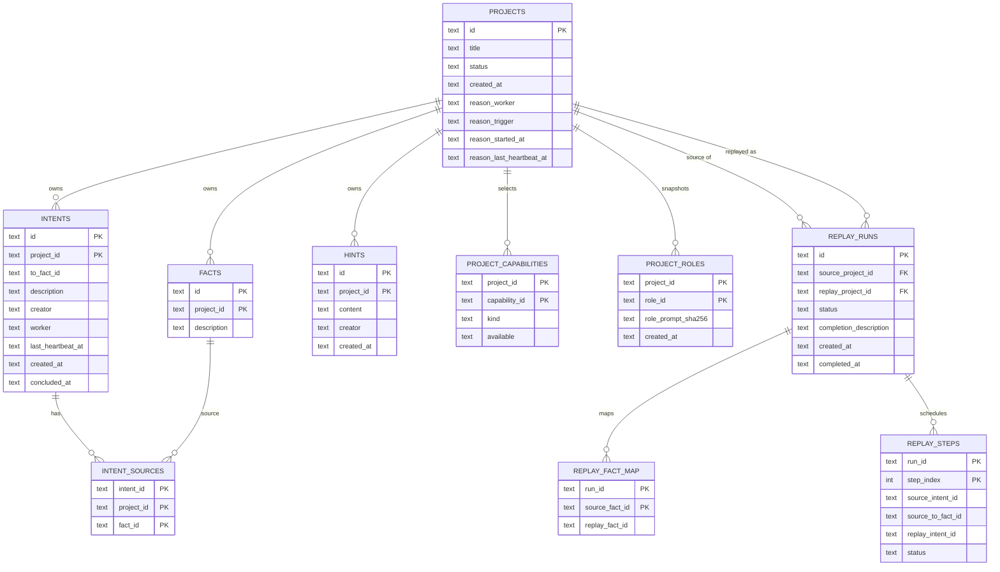

<!--
@ai: 本文件是 Cairn 代码库的完整分析笔记。后续 Codex 会话应先阅读本文件来定位模块、函数、数据流、配置和潜在风险，再进行代码修改或故障分析。
-->

# Cairn 代码库分析

## 1. 仓库类型与运行单元

Cairn 是一个 Python 单包应用，代码位于 `cairn/src/cairn`，通过 `cairn/pyproject.toml` 暴露 CLI：

```toml
[project.scripts]
cairn = "cairn.cli:main"
```

实际运行时有两个长期进程：

| 进程 | 命令 | 职责 |
| --- | --- | --- |
| Server | `cairn serve` | FastAPI 协议服务、主业务 SQLite、observability SQLite、前端静态页面 |
| Dispatcher | `cairn dispatch --config dispatch.yaml` | 读取图状态、选择任务、管理容器、执行 Agent、写回图 |

Docker Compose 启动这两个服务，Server 持久化 `./datas/cairn/`，Dispatcher 挂载 Docker socket 和 `dispatch.yaml`。

Server 当前有两个 SQLite 数据库：

| DB | 默认路径 | 内容 |
| --- | --- | --- |
| 主业务 DB | `~/.local/share/cairn/cairn.db` | `projects/facts/intents/intent_sources/hints/settings` |
| Observability DB | `~/.local/share/cairn/cairn_observability.db` | `llm_executions/llm_execution_events` |

`cairn serve` 可分别通过 `--db-path` 与 `--observability-db-path` 指定路径；compose 挂载同一个 `./datas/cairn/` 目录承载这两个文件。

## 2. 核心实体与关系



### 实体语义

| 实体 | 语义 |
| --- | --- |
| Project | 一个从 origin 到 goal 的问题实例 |
| Fact | 已确认客观事实，只增不改 |
| Intent | 从一个或多个 Fact 出发的探索方向，可 open、claimed、concluded |
| Hint | 人工或外部策略提示，不参与因果图 |
| Project.reason | 项目级 reason lease，不是事实图的一部分 |

## 3. Server 代码分析

### `server/db.py`

职责：

| 函数/对象 | 作用 |
| --- | --- |
| `DEFAULT_DB` | 默认 SQLite 路径 `~/.local/share/cairn/cairn.db` |
| `SCHEMA` | 初始化 settings/projects/facts/intents/intent_sources/hints/counters |
| `configure(path)` | 设置数据库路径并执行 schema |
| `get_conn()` | SQLite 连接上下文，开启 WAL 和 foreign keys |
| `sqlite_status()` | 输出 DB/WAL/SHM 文件状态、journal mode、busy timeout、quick_check 与迁移状态，不执行 checkpoint |
| `checkpoint_truncate()` | 显式执行 `PRAGMA wal_checkpoint(TRUNCATE)`，供 `cairn db checkpoint` 使用 |
| `diagnostic_error()` | 将 SQLite DatabaseError 渲染为带 DB/WAL/SHM 状态的诊断文本 |

重要细节：

>>⚠️ 注意：`configure()` 一旦 `_db_path` 已设置就直接 return。测试或多实例场景中，如果同一 Python 进程想切换 DB path，需要额外处理。

SQLite 运行补强：

```text
Dispatcher 启动前会对主库执行 quick_check；leader lock 相关 acquire/heartbeat/check_health/current_holder/is_expired 遇到 SQLite 瞬态错误会关闭 thread-local connection 并短退避重试。
Server /health 捕获 sqlite3.DatabaseError，返回 503 degraded 和 diagnostic_error。
Dispatcher /healthz 捕获 leader 状态回调异常，仍返回 HTTP 200，但 JSON status=degraded，避免 Docker healthcheck 因一次 DB 瞬态读失败重启 dispatcher。
状态查询不再执行 wal_checkpoint；checkpoint 必须通过显式 `cairn db checkpoint` 触发。
不要在 Server 或 Dispatcher 运行时手动删除 `cairn.db-wal` / `cairn.db-shm`。
```

### `server/observability/*`

职责：

| 文件 | 作用 |
| --- | --- |
| `observability/db.py` | 初始化独立 LLM execution SQLite DB，默认 `cairn_observability.db` |
| `observability/models.py` | 定义 execution/event、event kind、process state API 模型 |
| `observability/repository.py` | 写入 execution/event、按 sequence 查询、finish、删除项目观察数据 |
| `observability/routers.py` | 暴露 `/projects/{id}/llm-*` API |
| `observability/redaction.py` | Server 侧内置脱敏与单事件截断 |
| `observability/retention.py` | 按保留天数清理旧 execution/event |

关键端点：

| 方法 | 路径 | 说明 |
| --- | --- | --- |
| GET | `/projects/{project_id}/llm-executions` | 查询项目 execution 列表 |
| GET | `/projects/{project_id}/llm-events` | 按 sequence 增量查询项目所有事件 |
| GET | `/projects/{project_id}/llm-executions/{execution_id}/events` | 查询单个 execution 事件 |
| POST | `/projects/{project_id}/llm-executions` | 创建 execution |
| POST | `/projects/{project_id}/llm-executions/{execution_id}/events` | 写入 event |
| POST | `/projects/{project_id}/llm-executions/{execution_id}/finish` | 标记 execution 完成 |

重要边界：

```text
observability DB 不参与 facts/intents/hints/settings 的业务真相判定。
Dispatcher 的 observability 配置控制是否发送、发送哪些事件，以及 Dispatcher 侧缓冲/脱敏/大小限制。
Server 写入 API 当前使用 routers.py 内置的 ObservabilitySettings() 做二次 redaction/truncation，不从 dispatch.yaml 动态读取。
`create_execution()` 必须使用 upsert 而不是 `INSERT OR REPLACE`：ExecutionReporter 重试或 finish fallback 不能清掉已有 `llm_execution_events` 的聚合状态。`list_executions()` 会从 event 表聚合修正 `event_count`、`bytes_written`、`last_event_at`，用于恢复旧数据不一致。`finish_execution()` 会在缺少 `process_end` 事件时自动补一条去重的结束事件，保证 Execution Log 至少有默认可见的终态卡片。

**BUILTIN 脱敏正则**（Dispatcher 与 Server 两端对齐）覆盖：
- `CAIRN_REMOTE_SSH_PASSWORD=...` 形式
- 通用 `*PASSWORD` / `*TOKEN` / `*SECRET` 形式
- `Authorization: Bearer <token>` 形式（包括 `Authorization: "Bearer <token>"` 与 JSON 编码 `"Authorization": "Bearer <token>"`），不命中 `XAuthorization` 等非授权头
- `Bearer <token>` 单独成行/词的形式

加入 HTTP MCP transport 后，header 形式的 `Authorization: Bearer ...` 进入 worker 事件流；上述正则保证在 observability 落库前替换为 `Authorization: Bearer ***`。dispatch.yaml 的 `observability.redaction_patterns` 是补充层，不要去掉这些内置项。
```

### `server/models.py`

职责：

| 模型 | 用途 |
| --- | --- |
| `Settings` | 全局超时配置 |
| `Fact`、`Intent`、`Hint` | 图对象响应模型 |
| `ProjectMeta`、`ProjectSummary`、`ProjectDetail` | 项目元信息和完整图 |
| `CreateProjectRequest` | 创建项目；支持 `capabilities` 与 `role` / `role_id` |
| `CapabilitySelection` | 项目启用的 MCP server IDs 与 skill IDs |
| `ProjectRoleSelection` | 创建项目时选择的 primary role ID |
| `CapabilityCatalogItem`、`ProjectCapabilitiesResponse` | capability catalog 与项目能力选择响应 |
| `RoleCatalogItem`、`RegisterRoleCatalogItem`、`ProjectRole`、`ProjectRoleResponse` | role catalog、role prompt 注册与项目 role 快照 |
| `CreateIntentRequest` | 创建探索方向 |
| `HeartbeatRequest` | intent/reason heartbeat |
| `ConcludeRequest` | intent 结论写入 |
| `CompleteRequest` | 项目完成 |
| `ReopenRequest` | completed 项目重新打开 |

输入校验主要做文本 trim 和非空检查。`Intent.from_` 使用 alias `"from"` 兼容 JSON 字段。

### `server/services.py`

职责：

| 函数 | 作用 |
| --- | --- |
| `utcnow()` | 生成 UTC 秒级时间 |
| `next_project_id()` | 全局项目 ID，如 `proj_001` |
| `next_fact_id()` | 项目内 Fact ID，如 `f001` |
| `next_intent_id()` | 项目内 Intent ID，如 `i001` |
| `validate_facts_exist()` | 验证 intent/complete 的来源 Fact 存在 |
| `validate_goal_not_in_sources()` | 禁止 `goal` 作为 from |
| `validate_intent_creator_worker()` | 创建时 worker 必须为空或等于 creator |
| `expire_workers()` | intent worker 超时释放 |
| `expire_reason_leases()` | reason lease 超时释放 |

### `server/routers/projects.py`

关键端点：

| 方法 | 路径 | 函数 | 说明 |
| --- | --- | --- | --- |
| GET | `/projects` | `list_projects()` | 返回摘要并执行超时清理 |
| POST | `/projects` | `create_project()` | 创建项目、写 origin/goal/hints，并保存可选 capability selection 与 role prompt 快照 |
| GET | `/projects/{project_id}` | `get_project()` | 返回完整图 |
| PUT | `/projects/{project_id}/status` | `update_project_status()` | active/stopped 切换 |
| POST | `/projects/{project_id}/reason/claim` | `claim_project_reason()` | 认领 reason |
| POST | `/projects/{project_id}/reason/heartbeat` | `heartbeat_project_reason()` | 维持 reason |
| POST | `/projects/{project_id}/reason/release` | `release_project_reason()` | 释放 reason |
| POST | `/projects/{project_id}/complete` | `complete_project()` | 写向 goal 的 completion intent 并置 completed |
| POST | `/projects/{project_id}/reopen` | `reopen_project()` | 删除 completion intent，写 external_feedback fact，恢复 active |

`stopped` 行为：

```text
UPDATE projects SET status='stopped'
UPDATE intents SET worker=NULL WHERE project_id=? AND concluded_at IS NULL
clear_project_reason()
```

这会让 Dispatcher 下一轮取消本地任务。

### `server/routers/capabilities.py`

职责：项目级 MCP/skill 能力选择、capability catalog、role catalog 与项目 role 快照查询。

关键端点：

| 方法 | 路径 | 函数 | 说明 |
| --- | --- | --- | --- |
| GET | `/capabilities/catalog` | `get_capability_catalog()` | 查询 Dispatcher 注册的 MCP/skill catalog，不包含 secret |
| POST | `/capabilities/catalog` | `register_capability_catalog()` | Dispatcher 启动时全量注册 capability catalog |
| GET | `/projects/{project_id}/capabilities` | `get_project_capabilities()` | 查询项目已选能力与 unavailable IDs |
| PUT | `/projects/{project_id}/capabilities` | `update_project_capabilities()` | 更新项目能力选择 |
| GET | `/roles/catalog` | `get_role_catalog()` | 查询可选 primary role，不返回 prompt 正文 |
| POST | `/roles/catalog` | `register_role_catalog()` | Dispatcher 启动时全量注册 role catalog，Server 计算 prompt sha256 |
| GET | `/projects/{project_id}/role` | `get_project_role()` | 查询项目创建时保存的 role prompt 快照 |

边界：

```text
Server 保存 capability ID selection 与 role prompt snapshot；不保存 MCP env/token 或 skill 文件内容。
Capability / Role 是控制面配置，不进入 Fact / Intent / Hint 黑板语义。
```

### `server/routers/ai_profiles.py`

职责：维护 AI profile catalog、缓存 Dispatcher 观测到的 provider 模型列表，并把项目创建时选择的 worker/model/base_url/api_key_env 保存为项目级快照。

关键行为：

| 行为 | 说明 |
| --- | --- |
| Catalog CRUD | `/ai-profiles` 管理可选 AI profile，支持 dispatcher 从 `dispatch.yaml` worker 自动 sync seeded profile；`workers.models` 会写入同一个 profile 的 `models` 列表 |
| Health report | Dispatcher 通过 `/ai-profiles/health-report` 回写探活结果，Server 用 `available` 和 `last_health_*` 保存最后状态 |
| Model report | `/ai-profiles/models-report` 和 `ai_profile_models` 是兼容遗留缓存；当前 Dispatcher 不再请求 provider `/v1/models`，Create Project 使用 profile 手动配置的 `model` |
| Legacy selection | `ai_profiles` 输入代表单套 primary/fallback，保存为 `task_type='legacy'` |
| Task-specific selection | `ai_profile_selections` 分别保存 `bootstrap`、`explore`、`reason` 三类 selection；Create Project 写入 `primary_model` 和 `primary_reasoning_type` |
| Model validation | 保存项目选择时，`primary_model` 必须等于 profile 默认 `model` 或存在于兼容缓存 `ai_profile_models`，否则 400 |
| Dispatcher fallback | Dispatcher 读取 `snapshots` 后按 task type 选链；若某 task type 没有专属快照，会 fallback 到 legacy |

重要兼容点：

```text
GET /projects/{project_id}/ai-profiles 同时返回：
- selection：兼容旧客户端，当前固定等于 selections.explore
- selections：bootstrap/explore/reason 三类任务选择，包含 primary_profile_id / primary_model / fallback_profile_ids
- snapshots：dispatcher 实际使用的项目 AI profile 快照；snapshot_model 是最终执行模型，snapshot_reasoning_type 是最终 reasoning effort
- catalog：可选 profile 列表；Create Project 使用 profile.models 下拉选择模型，profile.model 是默认模型

当三类任务选择不同时，新客户端必须读取 selections 或 snapshots；不要把 selection 当作完整项目级 AI 配置。
```

当前模型选择数据流：

```text
dispatch.yaml worker env.CODEX_MODEL / env.ANTHROPIC_MODEL 作为默认模型
  + worker.models 作为额外手动模型列表
  + worker.model_reasoning_effort 作为默认 reasoning type
  -> Dispatcher _build_ai_sync_payload() 同步单个 seeded profile + models 列表
  -> Server /ai-profiles/sync 按 seeded_from_worker upsert，并写 ai_profile_models
  -> frontend 项目创建页通过下拉选择 profile/model/reasoning_type
  -> frontend 提交 primary_model + primary_reasoning_type
  -> Server persist_project_ai_selections() 写入 project_ai_profiles.snapshot_model / snapshot_reasoning_type
```

### `server/routers/intents.py`

关键端点：

| 方法 | 路径 | 函数 | 说明 |
| --- | --- | --- | --- |
| POST | `/projects/{project_id}/intents` | `create_intent()` | 创建 open intent |
| POST | `/projects/{project_id}/intents/{intent_id}/heartbeat` | `heartbeat()` | claim 或续租 intent |
| POST | `/projects/{project_id}/intents/{intent_id}/release` | `release()` | 释放 open intent |
| POST | `/projects/{project_id}/intents/{intent_id}/conclude` | `conclude()` | 新建 Fact 并设置 `to_fact_id` |

`heartbeat()` 的双重用途：

```text
如果 intent.worker is null，则本次 heartbeat 也是 claim。
如果 intent.worker == 当前 worker，则本次 heartbeat 是续租。
如果 intent.worker 是其他 worker，则 409。
```

#### 项目级代理注入

每次调度时 `_resolve_project_proxy()` 从 Server 重新获取代理定义并缓存到 `_project_proxy_cache`；`_resolve_proxy_env()` 传给 `ContainerManager`(通过 `proxy_resolver` 参数)，启动 worker 容器时合并 env。socks5 注入 `ALL_PROXY` + `NO_PROXY`，http/https 注入 `HTTP_PROXY` + `HTTPS_PROXY` + `NO_PROXY`。startup-healthcheck 容器不走代理。代理凭据在 observability redaction 中覆盖。

相关测试：`test_proxy_settings.py`(28 case 覆盖 schema / env 转换 / redaction / 缓存 / DB CRUD / FK cascade)。

### MCP transport: http

`McpServerCapabilityConfig` 支持两种 transport:

- `stdio`(默认): `command` + `args` + `env`,容器内 spawn 子进程走 stdio,与既有 Kali/Metasploit 桥一致。
- `http`: `url` 必须,可选 `bearer_token_env` 指向环境变量名,容器内 worker 通过 streamable HTTP 与远端 MCP server 通信。

实现要点:

- **token 注入**: `bearer_token_env` 是 env var **名**(非值),被 `DispatchConfig._interpolate_env_data` 的 skip 列表排除,避免被 `${VAR}` 插值吞掉。`DispatchConfig.load()` 在 `model_validator` 阶段校验该 env 必须存在,缺失即抛 `ValueError`,不延迟到运行时。
- **Codex 路径**: codex adapter 走 `-c mcp_servers.<id>.url=...` + `-c mcp_servers.<id>.bearer_token_env_var=<NAME>`,由 Codex 自身在调用时读 env。
- **Claude 路径**: 写到 `mcp.json` 的 `headers.Authorization: Bearer <token>` 是 `_mcp_config_detail` **现场拼**、序列化后立即释放,不长期持有,不进 `WorkerExecutionContext`。
- **可达性预检**: `inject_project_capabilities` 写 `mcp.json` 前对 http 类型的 server 做一次 TCP `socket.create_connection` 探活(默认超时 1s,由 `healthcheck_timeout` 控制);失败 → 跳过该 mcp,`injection.errors` 记录 `mcp_server:<id>: http probe failed`,UI 显示 `unavailable`。catalog_payload 的 `available` 字段仍为 `true` 表示 config 有效,与 per-task 探活解耦。
- **Worker env 传播**: `ContainerManager` 启动容器时把 `bearer_token_env_keys` 合并进 container `environment`,与 `common_env` 合并规则一致;容器内 worker 进程可 `os.environ[name]` 取到。**这要求 dispatcher 进程 os.environ 也有该 var** —— 已由 `DispatchConfig.load()` 强校验。
- **网络可达性**: HTTP MCP server 与 worker 容器的网络连通由部署者负责;若 HTTP MCP 在 host 上,需 `container.network_mode: host` 或把 host 端口 bind 到 cairn network(本项目不自动改 `network_mode` / `extra_hosts`)。
- **未做**: TLS 软提示(按用户要求跳过)、SSRF 防护(允许 `http://` 与内网 URL)、多 URL 故障转移、Basic auth / OAuth / mTLS,token 轮换后 in-flight worker 不会主动失效(靠 `container.completed_action` 自然回收)。

相关测试: `cairn/tests/test_mcp_http_transport.py`(24 case 覆盖 schema、插值、Codex adapter、worker env 传播、探活、redaction)。

### `server/routers/attachments.py`

`POST /projects/{project_id}/attachments` 接收 `multipart/form-data` 上传，将文件落到 `CAIRN_ATTACHMENTS_ROOT/{project_id}/`（默认 `datas/attachments/{project_id}/`），并在成功落盘后写一条指向 worker 容器内路径的 Hint。

关键行为：

| 步骤 | 说明 |
| --- | --- |
| 1. 校验项目 `hint_writable` | 复用 `check_project_hint_writable()`；已 stopped/completed 项目拒绝 |
| 2. 安全文件名 + dedupe | `[^A-Za-z0-9._ -]+` 替换为 `_`，重复文件名自动追加 `-N` |
| 3. 分块写盘（1 MiB） | 失败时回滚已写文件 |
| 4. 写 Hint | 默认 creator=`Human`，`description` 形如 `附件为 worker 容器内文件：/mnt/attachments/{project_id}/{filename}` |

> 🔧 向后兼容：API 路径是稳定的 `/projects/{project_id}/attachments`；新增字段必须可在 `descriptions` 缺失时 fallback 到 `""`。

### `server/routers/files.py`

`GET /projects/{project_id}/files` 列举项目报告 / exploit / vuln-research / 附件四类文件，按 `category` 标签分组；`GET /projects/{project_id}/files/download?source=project\|attachment&path=...` 走 `FileResponse` 暴露文件。

路径安全：相对路径校验不允许 `..`、绝对路径或空段；`source` 仅接受 `project` 或 `attachment`。

运行时文件数据流：

```text
worker 写 /mnt/project/...
  -> Dispatcher bind_mounts.project-files host_path=datas/project-files/{project_id}
  -> Server CAIRN_PROJECT_FILES_ROOT 指向 datas/project-files
  -> GET /projects/{project_id}/files rglob 扫描并返回
  -> Graph Files tab 打开或轮询时刷新
```

> ⚡ 性能敏感：列表遍历以 `Path.rglob` 触发，不做索引；大项目目录需要 server 端做缓存或截断。

### `server/routers/replay.py`

replay 入口与推进：

| 端点 | 函数 | 说明 |
| --- | --- | --- |
| `POST /projects/{project_id}/replay-runs` | `create_replay_run()` | 校验源项目 completed + 存在 completion intent + 存在 replayable worker route，复制 `datas/attachments/{source}/` 到新项目子目录并写 `replay_runs` / `replay_steps` / `replay_fact_map` |
| `POST /projects/{project_id}/replay-runs/{run_id}/advance` | `advance_replay_run()` | 按 `step_index` 顺序取出下一个 pending step，创建 replay intent 并等 worker conclude 落新 fact |

`_extract_replay_route()` 解析 completion intent 的 source facts，找出 `worker` 字段，构造 `(worker_name, source_to_fact_id)` 序列；`_replay_intent_description()` 替换 attachment 路径中的 source project id。

> 🔧 向后兼容：replay run id 形如 `replay_{replay_project_id}`，方便用项目 id 直接定位。

### `server/routers/export.py`

用途：

| format | 输出 | 用途 |
| --- | --- | --- |
| `yaml` | 当前项目图 YAML | Dispatcher 构造 reason/explore prompt |
| `timeline` | 人类可读事件时间线 | UI 或审计 |

导出时会把时间格式转成本地时区字符串。

## 4. Dispatcher 代码分析

### `dispatcher/config.py`

配置模型：

| 模型 | 字段 |
| --- | --- |
| `RuntimeConfig` | `max_workers`、`max_running_projects`、`max_project_workers`、`interval`、`healthcheck_timeout`、`prompt_group` |
| `TasksConfig` | `bootstrap`、`reason`、`explore` |
| `ContainerConfig` | `image`、`user`、`network_mode`、`completed_action`、`stopped_action`、`cap_add`、`bind_mounts` |
| `RemoteSupportConfig` | `enabled`、`dnslog.url`、`ssh.host/port/username/password` |
| `McpServerCapabilityConfig` | `id`、`name`、`transport` (`stdio`/`http`)、`command`/`url` 二选一、`args`、`env`、`bearer_token_env`、`healthcheck_timeout`、`source_path`、`task_types`、`description` |
| `SkillCapabilityConfig` | `id`、`name`、`source_path`、`task_types`、`description` |
| `CapabilitiesConfig` | `mcp_servers`、`skills` |
| `RoleConfig` | `id`、`name`、`task_types`、`description`、`prompt` 或 `source_path` |
| `WorkerConfig` | `name`、`type`、`task_types`、`max_running`、`priority`、`models`、`model_reasoning_effort`、`env` |

Worker 类型：

| type | 必需环境变量 |
| --- | --- |
| `claudecode` | `ANTHROPIC_MODEL`、`ANTHROPIC_BASE_URL`、`ANTHROPIC_AUTH_TOKEN` |
| `codex` | `CODEX_MODEL`、`CODEX_BASE_URL`、`OPENAI_API_KEY` |
| `pi` | `PI_MODEL`、`PI_BASE_URL`、`PI_API_KEY`、`PI_PROVIDER_API` |
| `mock` | 无必需环境变量 |

`workers.models` 是 codex/claudecode 的可选静态模型列表，不会触发 provider 远程模型发现。`env.CODEX_MODEL` / `env.ANTHROPIC_MODEL` 仍是必填默认模型，并且在 AI profile 同步时始终排在第一位；默认模型的 seeded profile 名称始终保持原 `worker.name`，兼容已有项目选择。额外模型写入同一个 profile 的 `models` 列表，供 Create Project 的 `Configured Model` 下拉选择。

`model_reasoning_effort` 是 worker/profile 默认 reasoning type，取值 `low | medium | high | xhigh`。项目创建时可以按 task 覆盖为 `primary_reasoning_type`，最终进入 snapshot。运行时 Dispatcher 把 snapshot 值注入 `CAIRN_MODEL_REASONING_EFFORT`：Codex adapter 转为 `-c model_reasoning_effort="..."`，Claude Code adapter 转为 `--effort ...`。

>>⚠️ 注意：`common_env` 会合并进每个 worker 的 `env`，worker 自己的 env 覆盖 common env。`remote_support` 也会被转换为 `CAIRN_*` 环境变量后合并进 worker env；它只影响 worker runtime，不写入黑板事实。

`remote_support` 当前刻意保持极简：

```yaml
remote_support:
  enabled: false
  dnslog:
    url: ""
  ssh:
    host: ""
    port: 22
    username: ""
    password: ""
```

启用后可能注入：`CAIRN_REMOTE_SUPPORT_ENABLED`、`CAIRN_DNSLOG_URL`、`CAIRN_REMOTE_SSH_HOST`、`CAIRN_REMOTE_SSH_PORT`、`CAIRN_REMOTE_SSH_USERNAME`、`CAIRN_REMOTE_SSH_PASSWORD`。

`${ENV_VAR}` 插值:

`DispatchConfig.load()` 在 YAML 解析后、`pydantic` 校验前递归遍历所有字符串，按 bash 风格解析以下三种引用:

| 语法 | 解析 |
| --- | --- |
| `${VAR}` | 必须设置；`os.environ` 缺则抛 `ValueError`，错误信息带 YAML 路径 |
| `${VAR:-default}` | unset OR 空时用 default（空字符串也算） |
| `${VAR-default}` | 仅 unset 时用 default；显式空串保留 |

正则只识别大写字母/下划线/数字开头的变量名，默认值中 `}` 为终止符。`{project_id}` 之类的 dispatcher 模板占位符不匹配，原样保留给后续 `prepare_bind_mount_data()` / `prepare_role_data()` 解析；`$VAR`（无花括号）不识别，保留原样。

Capability / Role 解析规则：

- `prepare_capability_data()` 会把 skill 和 MCP `source_path` 解析成基于 `dispatch.yaml` 的绝对路径。
- `prepare_role_data()` 会把 role `source_path` 解析成基于 `dispatch.yaml` 的绝对路径。
- `validate_capability_resources()` 校验 skill/MCP `source_path` 存在且为目录。
- `validate_role_resources()` 校验 role `source_path` 存在且为文件。
- 默认 prompt required tokens 已要求 `bootstrap.md` / `explore.md` / `reason.md` 包含 `{capability_instructions}` 与 `{role_instructions}`；`mock` prompt group 例外。

### `dispatcher/protocol/client.py`

`CairnClient` 封装 Server API：

| 方法 | Server API |
| --- | --- |
| `list_projects()` | GET `/projects` |
| `get_project(project_id)` | GET `/projects/{project_id}` |
| `get_settings()` | GET `/settings` |
| `export_project(project_id)` | GET `/projects/{id}/export?format=yaml` |
| `heartbeat()` | POST intent heartbeat |
| `claim_reason()` | POST reason claim |
| `reason_heartbeat()` | POST reason heartbeat |
| `release_reason()` | POST reason release |
| `release()` | POST intent release |
| `conclude()` | POST intent conclude |
| `complete()` | POST project complete |
| `create_intent()` | POST project intent |
| `get_project_capabilities()` | GET project capability selection |
| `get_project_role()` | GET project role snapshot |
| `register_capability_catalog()` | POST capability catalog |
| `register_role_catalog()` | POST role catalog |
| `advance_replay_run(project_id)` | POST `/projects/{project_id}/replay-runs/{run_id}/advance` |
| `create_llm_execution()` / `create_llm_event()` / `finish_llm_execution()` | observability 写入 API |

它使用 thread-local `requests.Session`，适配多线程任务执行。

### `dispatcher/scheduler/loop.py`

这是调度核心。

#### 主循环

```python
run()
  run_startup_healthchecks()
  while True:
    _validate_server_settings()
    _register_capability_catalog()
    _register_role_catalog()
    _reap_futures()
    _reap_cleanup_futures()
    summaries = client.list_projects()
    _initialize_reason_checkpoints(summaries)
    _refresh_runtime_projects(summaries)
    _cancel_inactive_tasks(summaries)
    _queue_container_cleanups(summaries)
    _dispatch_available(summaries)
    sleep(runtime.interval)
```

#### 项目调度规则

```text
如果 project 非 active：跳过
如果项目是 initial：调度 bootstrap
否则如果存在未认领普通 intent：调度 explore
否则如果 reason 已被认领：跳过
否则如果 reason_trigger 存在：调度 reason
否则跳过
```

#### Replay project 推进

replay 项目在主循环里被单独钩起：每次 tick 先调 `_advance_replay_project(project_id)`，向 Server 询问下一步动作（`created_intent` / `completed` / `blocked` / `waiting`），按返回值决定本轮是否把该项目视为"有进展"。它复用普通调度前的并发预算，所以 replay 与正常项目共享 `max_project_workers`。

#### Worker 选择规则

`_select_worker(project_id, task_type)`：

```text
过滤不支持 task_type 的 worker
过滤已达到 max_running 的 worker
过滤短暂 unhealthy 的 worker
过滤短暂 rejected 的 worker
按 priority 升序
按当前运行数升序
随机打散同级
```

#### Reason checkpoint

`_reason_trigger()` 只在以下变化时触发：

```text
checkpoint is None -> "initial"
facts 增加 -> facts:x->y
hints 增加 -> hints:x->y
open_intents 从 >0 到 0 -> open_intents:x->0
```

>>⚠️ 注意：`reason_checkpoints` 在 Dispatcher 内存中，不持久化。Dispatcher 重启后会通过项目摘要初始化一部分状态。

### `dispatcher/tasks/bootstrap.py`

输入：

```text
ProjectDetail
bootstrap Intent
WorkerConfig
```

主要流程：

```text
start HeartbeatLease.for_intent
ensure_running(project container)
run healthcheck
render bootstrap.md with origin/goal/hints
run worker process
parse JSON
if complete:
  conclude bootstrap intent -> new fact
  complete project from new fact
if timeout/parse fail:
  try bootstrap_conclude fallback
finally:
  lease.stop()
```

输出契约：

```json
{"accepted": true, "data": {"fact": {"description": "..."}, "complete": {"description": "..."}}}
```

### `dispatcher/tasks/reason.py`

输入：

```text
ProjectDetail
export_yaml
WorkerConfig
```

主要流程：

```text
start HeartbeatLease.for_reason
ensure_running(project container)
run healthcheck
prepare open_intents and valid fact ids
write graph snapshot into /tmp/cairn-prompts/...
render reason.md
run worker process
parse JSON
if complete:
  client.complete()
if intents:
  client.create_intent() for each
if noop:
  no graph write
finally:
  release reason
```

输出契约：

```json
{"accepted": true, "data": {"complete": {"from": ["f001"], "description": "..."}}}
```

或：

```json
{"accepted": true, "data": {"intents": [{"from": ["f001"], "description": "..."}]}}
```

或：

```json
{"accepted": true, "data": {}}
```

### `dispatcher/tasks/explore.py`

输入：

```text
ProjectDetail
export_yaml
Intent
WorkerConfig
```

主要流程：

```text
start HeartbeatLease.for_intent
ensure_running(project container)
run healthcheck
write graph snapshot file
render explore.md
run worker process
parse JSON
if fact:
  conclude intent
if timeout/parse fail:
  try explore_conclude fallback
finally:
  lease.stop()
```

输出契约：

```json
{"accepted": true, "data": {"description": "..."}}
```

### `dispatcher/contracts.py`

职责：

| 函数 | 作用 |
| --- | --- |
| `parse_json_output()` | 从 stdout 中提取 JSON object |
| `validate_reason_payload()` | 校验 reason 输出，返回 `complete`、`intents`、`noop`、`rejected` |
| `validate_bootstrap_execute_payload()` | 校验 bootstrap 主阶段输出 |
| `validate_bootstrap_conclude_payload()` | 校验 bootstrap conclude 输出 |
| `validate_explore_payload()` | 校验 explore/conclude 输出 |

兼容性：

```text
支持 {"accepted": true, "data": {...}}
也兼容部分无 accepted 包装的旧格式
```

>>⚠️ 注意：`reason` 在 open intents 为空时必须产出至少一个 intent，否则校验失败。

## 5. Runtime 代码分析

### `dispatcher/capabilities.py`

职责：把 `dispatch.yaml` 中声明的 MCP/skill catalog 转换为 Server 可展示的脱敏 payload，并在任务启动前把项目已选能力注入容器。

关键行为：

| 函数 | 作用 |
| --- | --- |
| `catalog_payload(config)` | 生成 MCP/skill catalog 注册 payload |
| `inject_project_capabilities(...)` | 解析项目 selection，按 task type 过滤，复制 MCP/skill 目录，写 `mcp.json`，返回 prompt instructions 与 `WorkerExecutionContext` |

注入路径按任务实例隔离：

```text
/tmp/cairn-capabilities/{project_id}/{task_instance_id}/mcp.json
/tmp/cairn-capabilities/{project_id}/{task_instance_id}/mcp/<mcp_id>/
/tmp/cairn-capabilities/{project_id}/{task_instance_id}/skills/<skill_id>/
```

### `dispatcher/roles.py`

职责：构造 role catalog 注册 payload，从项目 role snapshot 生成 `{role_instructions}`。

| 函数 | 作用 |
| --- | --- |
| `catalog_payload(config)` | 读取 `RoleConfig.prompt` 或 `source_path`，生成含 prompt 的注册 payload |
| `inject_project_role(project_id, task_type, role_data)` | 校验项目 role snapshot，生成 prompt 注入文本和摘要 |

Role prompt 是控制面上下文：创建项目时保存快照，运行时注入 `bootstrap` / `explore` / `reason`，不作为 Fact 写入。

### `runtime/containers.py`

核心行为：

| 方法 | 作用 |
| --- | --- |
| `container_name(project_id)` | 生成 `cairn-dispatch-{project_id}` |
| `ensure_running(project_id)` | 复用、启动或创建项目容器 |
| `create_startup_container()` | 启动健康检查临时容器 |
| `cleanup_completed(project_id)` | completed 后 stop/remove |
| `cleanup_stopped(project_id)` | stopped 后 stop/remove |
| `build_exec_process()` | 构建带 Linux timeout 的 `ManagedProcess` |
| `write_text_file()` | tar archive 写文件进容器 |
| `write_directory()` | tar archive 写目录进容器，用于 capability MCP/skill 注入 |
| `validate_bind_mounts()` | startup 阶段验证 host bind mount 可用性 |
| `mount_mismatches()` | 诊断已存在项目容器与当前 bind mount 配置是否一致 |

项目容器支持 `container.bind_mounts`，用于 CTF 附件、源码、工具文件和大输出共享。`host_path` 支持 `{project_id}` 模板以隔离每个项目的可写目录；全局附件目录建议设置 `read_only: true`。该机制只提供文件访问能力，不改变 Fact / Intent / Hint 的 Server 黑板真相源。

`build_exec_process()` 会在命令前加：

```bash
timeout -k 5s {timeout_seconds}s ...
```

这是防止单个 Agent 进程无限运行的核心机制。

### `runtime/process.py`

职责：

| 方法 | 作用 |
| --- | --- |
| `start()` | Docker exec_create + exec_start reader thread |
| `communicate(timeout)` | 等待输出，超时 kill |
| `kill()` | inspect exec pid 并在容器内 kill -KILL |
| `cancel(reason)` | 标记取消并 kill |

### `runtime/heartbeat.py`

职责：

| 方法 | 作用 |
| --- | --- |
| `for_intent()` | 构造 intent heartbeat lease |
| `for_reason()` | 构造 reason heartbeat lease |
| `start()` | 启动 daemon thread |
| `attach_process()` | 绑定当前 Docker exec |
| `_run()` | 每 interval heartbeat |
| `_fail()` | 标记失败并 kill 当前进程 |

失败策略：

```text
2xx -> success
403/409 -> lease 无效，立即失败并 kill
其他错误 -> transient failure，超过 2 * interval 后 kill
```

## 6. Worker Driver 分析

### Driver 抽象

`WorkerDriver` 定义：

```python
build_healthcheck(worker) -> list[str]
trace_format() -> str | None
build_execute(worker, prompt, session, context=None) -> DriverResult
build_conclude(worker, prompt, session, context=None) -> list[str]
extract_session(session, stdout, stderr) -> str | None
extract_response_text(stdout, stderr) -> str
```

### Claude Code

执行命令：

```bash
claude --session-id {uuid} --dangerously-skip-permissions \
  --print \
  --output-format stream-json \
  --verbose \
  -- "{prompt}"
claude -r {session} --dangerously-skip-permissions \
  --print \
  --output-format stream-json \
  --verbose \
  -- "{conclude_prompt}"
```

如果 `WorkerExecutionContext` 中有能力注入，Claude adapter 会追加 `--mcp-config {mcp_config_path}` 与 `--add-dir {skill_root}`。

健康检查通过 Anthropic Messages API curl。

`trace_format()` 返回 `claude_stream_json`。Dispatcher 会把 stdout 中的 Claude stream-json 解析成 `agent_message`、`thinking`、`tool_call`、`tool_result`、`command_start`、`command_end`、`usage`、`session_init`、`api_retry`、`system_event` 等 Execution Log 事件；Claude `system` subtype 为 `thinking_tokens` 时归类为 `usage`，不作为普通 system 卡片展示。真正进入业务 JSON 校验的是 driver 从最终 assistant/result 文本提取出的内容。

### Codex

执行命令：

```bash
env CODEX_NON_INTERACTIVE=1 codex exec \
  --ignore-user-config \
  --ignore-rules \
  --skip-git-repo-check \
  --dangerously-bypass-approvals-and-sandbox \
  --json \
  --model "$CODEX_MODEL" \
  -c 'model_provider="cairn"' \
  -c 'model_providers.cairn.name="cairn"' \
  -c 'model_providers.cairn.wire_api="responses"' \
  -c 'model_reasoning_effort="high"' \
  -c "model_providers.cairn.base_url=\"$CODEX_BASE_URL\"" \
  -c 'model_providers.cairn.env_key="OPENAI_API_KEY"' \
  -- "{prompt}"
```

如果 `WorkerExecutionContext` 中有能力注入，普通 `codex exec` 会追加 `--add-dir {skill_root}` 供 Codex 访问项目 skill 目录，并通过 `-c mcp_servers.<id>.*=...` 注入 MCP server 配置。

conclude 通过：

```bash
env CODEX_NON_INTERACTIVE=1 codex exec resume {session} ...
```

resume 命令同样携带 `--json`、模型 provider 配置、`--ignore-user-config`、`--ignore-rules`、`--skip-git-repo-check` 和 `--dangerously-bypass-approvals-and-sandbox`。当前实现刻意不在 `codex exec resume` 上携带 `--add-dir`，因为该参数在 resume 子命令中不受支持；MCP `-c mcp_servers.<id>.*` 配置仍会传入。

`trace_format()` 返回 `codex_jsonl`。Dispatcher 会解析 Codex JSONL 中的 `thread.started`、`session_meta`、`response_item`、`event_msg` 和当前版本的 `item.started/item.completed`，用于提取 session id、最终 assistant message 和结构化 Execution Log 事件。Codex CLI 的非 JSON 行 `Reading additional input from stdin...` 被降级为 `system_event` 而不是 `trace_parse_error`；但当前判断仍使用原始 `line`，如果该提示带 ANSI 控制字符，建议改用已 strip ANSI 的 `plain` 判断。

### Pi

Pi driver 会生成 `models.json`，限制扩展、技能、主题、上下文文件，并只开放工具：

```text
read,write,edit,bash,grep,find,ls
```

Pi stdout 是事件流，driver 从 `turn_end` 或 `agent_end` 中提取 assistant 文本。

### Mock

Mock driver 用 Python 脚本模拟各种结果，适合测试调度、超时、非法输出、拒绝、失败等分支。

## 7. Prompt 设计

Prompt 组位于：

```text
cairn/src/cairn/dispatcher/prompts/default/
cairn/src/cairn/dispatcher/prompts/cypher/
cairn/src/cairn/dispatcher/prompts/mock/
```

默认 prompt：

| 文件 | 任务 |
| --- | --- |
| `bootstrap.md` | 初始直接求解，只有达成 goal 才返回 |
| `bootstrap_conclude.md` | bootstrap 超时/解析失败后的事实总结 |
| `reason.md` | 判断完成或生成新 intents |
| `explore.md` | 执行某个具体 intent |
| `explore_conclude.md` | explore 超时/解析失败后的事实总结 |

`default` 与 `cypher` 的 `bootstrap` / `explore` / `reason` prompt 都支持 `{capability_instructions}` 与 `{role_instructions}`；conclude prompt 保持只总结既有事实。

`cypher` prompt group 面向自动化 CTF、授权渗透测试和漏洞研究，要求输出带 `[cypher:finding ...]` 或 `[cypher:intent ...]` 的结构化前缀。

>>⚠️ 注意：conclude prompt 明确要求 Agent 停止探索，只总结已经确认的事实。这是超时后落地 partial Fact 的关键约束。

Remote Support prompt 注入规则：

- 只在 `default/bootstrap.md` 和 `default/explore.md` 中保留 `{remote_support_instructions}` 占位符。
- `bootstrap_conclude.md`、`explore_conclude.md`、`reason.md` 不注入远程能力提示。
- 注入内容只说明 `CAIRN_DNSLOG_URL` 与 `CAIRN_REMOTE_SSH_*` 环境变量可用，不包含 SSH 密码值。
- 这不会改变 JSON 输出契约，也不会改变 facts/intents 写入规则。

### Prompt 注入实现细节

Prompt 注入由三个层次组成：模板占位符替换、项目级控制面块（role/capability/remote support）、worker adapter CLI 参数。

```mermaid
flowchart LR
    Config[dispatch.yaml\nruntime.prompt_group]
    Template[prompts/{group}/{stage}.md]
    Task[task runner\nbootstrap/explore/reason]
    Cap[capability_instructions\n+ WorkerExecutionContext]
    Role[role_instructions]
    Remote[remote_support_instructions]
    Render[render_prompt]
    Driver[WorkerDriver.build_execute]
    CLI[Agent CLI argv]

    Config --> Template
    Task --> Cap
    Task --> Role
    Task --> Remote
    Template --> Render
    Cap --> Render
    Role --> Render
    Remote --> Render
    Render --> Driver
    Cap --> Driver
    Driver --> CLI
```

| 层次 | 关键文件 | 具体逻辑 |
| --- | --- | --- |
| 模板加载 | `dispatcher/prompting.py` | `load_prompt(group, name)` 从包资源读取 markdown；`render_prompt()` 做简单 `{token}` 字符串替换 |
| placeholder 校验 | `dispatcher/config.py` | `validate_prompt_resources()` 在 `DispatchConfig.load()` 阶段校验 prompt group 和必需占位符，`mock` group 走特殊 required token 表 |
| graph 上下文 | `dispatcher/tasks/common.py` | `write_graph_snapshot_reference()` 把 YAML 图快照写入容器文件，prompt 中放文件引用，避免大 graph 直接膨胀 prompt |
| role 注入 | `dispatcher/roles.py` | `inject_project_role()` 读取 server 返回的 role snapshot，生成 `# Project Role` 块，包含 role id/name/task type/sha256/role prompt |
| capability 注入 | `dispatcher/capabilities.py` | `inject_project_capabilities()` 按 task type 取 selection，复制 MCP/skill，写 `mcp.json`，生成 `# Project Capabilities` 块和 `WorkerExecutionContext` |
| remote support | `dispatcher/prompting.py` | `format_remote_support_instructions()` 只渲染可用环境变量名，不渲染 SSH 密码明文 |
| worker argv | `dispatcher/workers/adapters/*.py` | Adapter 把 rendered prompt 和 `WorkerExecutionContext` 转为 Claude/Codex/Pi/Mock CLI 参数 |

#### 阶段注入矩阵

| 阶段 | Task runner | Prompt 模板 | 注入占位符 | Role | Capability | Remote Support | Worker context |
| --- | --- | --- | --- | --- | --- | --- | --- |
| Bootstrap execute | `run_bootstrap_task()` | `bootstrap.md` | `origin`、`goal`、`hints`、`remote_support_instructions`、`capability_instructions`、`role_instructions` | 注入完整 role prompt | MCP/skill 可执行注入 | 注入 | 传给 `build_execute()` |
| Bootstrap conclude fallback | `_try_conclude_fallback()` | `bootstrap_conclude.md` | `origin`、`goal`、`hints` | 不重新渲染主 role 块 | 沿用 session/context，但 prompt 要求停止探索 | 不注入 | 传给 `build_conclude()` |
| Explore execute | `run_explore_task()` | `explore.md` | `graph_yaml`、`intent_id`、`intent_description`、`remote_support_instructions`、`capability_instructions`、`role_instructions` | 注入完整 role prompt | MCP/skill 可执行注入 | 注入 | 传给 `build_execute()` |
| Explore conclude fallback | `_try_conclude_fallback()` | `explore_conclude.md` | `graph_yaml`、`intent_id`、`intent_description` | 不重新渲染主 role 块 | 沿用 session/context，但 prompt 要求停止探索 | 不注入 | 传给 `build_conclude()` |
| Reason execute | `run_reason_task()` | `reason.md` | `graph_yaml`、`fact_ids`、`open_intents`、`max_intents`、`capability_instructions`、`role_instructions` | 注入完整 role prompt | 仅 metadata，不复制/读取工具目录 | 不注入 | `WorkerExecutionContext` 为空或 metadata-only |

> ⚠️ 注意：`reason` 阶段虽然调用 `inject_project_capabilities()`，但 `dispatcher/capabilities.py` 会走 `_reason_instructions()`，只列 MCP/skill 元数据，并在 prompt 中明确禁止执行工具、打开 MCP session 或读取 skill 目录。执行型能力边界在 `bootstrap` / `explore`。

#### 不同角色如何注入

Primary role 是项目创建或后续设置时保存的 snapshot，而不是运行时读取最新 role 文件。Server 在 `project_roles` 中保存 `role_id`、`role_name`、`role_prompt`、`role_prompt_sha256`；Dispatcher 每次任务开始调用 `GET /projects/{project_id}/role` 并渲染：

```text
# Project Role
The current Cairn project selected a primary role...
- Role id: ...
- Role name: ...
- Task type: bootstrap|explore|reason
- Role prompt sha256: ...

## Role Prompt
[role prompt snapshot]
```

因此 CTF、Pentest、Vulnerability Research 等不同角色的差异来自 `capabilities/roles/<id>/ROLE.md` 或 `dispatch.capabilities.yaml roles[]` 中声明的 prompt 内容，但注入位置和优先级完全一致：都进入 `{role_instructions}`，且不能覆盖 JSON contract、scope/ROE、黑板语义。

#### MCP/Skill 注入与 required skill

`ProjectCapabilitiesResponse.per_task[task_type]` 是运行时 truth。Server 侧 `expand_task_capabilities()` 会把用户选择和自动 required 依赖合并：

- 用户显式选中的 MCP/skill 保存为 `source = "selected"`。
- `skill.requires_ids` 的子 skill 自动展开，保存为 `source = "required"`。
- `mcp.required_skill_ids` 也自动展开，例如 `chrome-devtools-host` 需要 `js-reverse-automation`，项目选择该 MCP 后会自动注入 matching skill。
- `task_types` 不匹配或 catalog 不可用的 required skill 会被跳过；用户显式选中的无效 ID 会进入 warnings/errors。

`{capability_instructions}` 不承载系统代码里的固定能力清单。能力路由由 catalog metadata 动态插入：

- MCP 可声明 `use_when`、`activation_hint`、`required_skill_ids`。
- Skill 可声明 `use_when`、`activation_hint`、`preferred_mcp_ids`。
- `dispatcher/capabilities.py` 只按字段通用渲染，不硬编码 `chrome-devtools-host`、`js-reverse-automation` 等具体能力规则。
- 选择 `Host Chrome DevTools MCP` 时，Server 自动把 `js-reverse-automation` 加入同一 task selection；prompt 再展示 MCP 的使用场景、required skill、skill 路径、skill 的 preferred MCP 和 activation hint。
- `reason` 阶段仍只看 metadata：可用这些字段规划 intent，但不能打开 MCP session、读取 skill 目录或执行工具。

执行型注入目录固定为：

```text
/tmp/cairn-capabilities/{project_id}/{task_instance_id}/
├── mcp.json
├── mcp/<mcp_id>/
└── skills/<skill_id>/
```

目录型 skill 会整体复制。`cypher-ctf` 的专家 sub-skills 已内置在 `capabilities/skills/cypher-ctf/skills/<sub-skill-id>/`，`cypher-pentest` 的 AD/cloud/container sub-skills 已内置在 `capabilities/skills/cypher-pentest/skills/<sub-skill-id>/`。选择顶层 orchestration skill 时 worker 会获得这些二级目录，但 catalog/prompt 只展示顶层 skill。被内置的专家 skill 不再单独出现在 `capabilities.skills[]` 中。

Claude Code adapter 对能力上下文的处理：

```text
claude --session-id <uuid> --mcp-config <mcp.json> --add-dir <skill_root> -- "<prompt>"
claude -r <uuid> --mcp-config <mcp.json> --add-dir <skill_root> -- "<conclude_prompt>"
```

Codex adapter 对能力上下文的处理：

```text
codex exec --add-dir <skill_root> -c mcp_servers.<id>.command=... -c mcp_servers.<id>.args=... -- "<prompt>"
codex exec resume <thread_id> -c mcp_servers.<id>.command=... -- "<conclude_prompt>"
```

> 🔧 向后兼容：Codex resume/conclude 路径不会重复 `--add-dir <skill_root>`，依赖初次 `codex exec` 已把 skill root 加进会话；MCP 配置仍会在 resume 时重新传入，保证 MCP server 参数可用。

## 8. 外部系统与集成

| 系统 | 连接方式 | 配置 |
| --- | --- | --- |
| Docker Engine | Unix socket `/var/run/docker.sock` | docker-compose 挂载到 Dispatcher |
| SQLite | 文件路径 | `~/.local/share/cairn/cairn.db` 或 compose volume |
| Observability SQLite | 文件路径 | `~/.local/share/cairn/cairn_observability.db` 或 compose volume |
| Claude/Anthropic compatible API | HTTP | `ANTHROPIC_BASE_URL`、`ANTHROPIC_AUTH_TOKEN` |
| OpenAI Responses compatible API | Codex CLI | `CODEX_BASE_URL`、`OPENAI_API_KEY` |
| Pi provider API | Pi CLI | `PI_BASE_URL`、`PI_API_KEY`、`PI_PROVIDER_API` |

## 9. 配置说明

### Server

```bash
cairn serve --host 127.0.0.1 --port 8000 \
  --db-path ~/.local/share/cairn/cairn.db \
  --observability-db-path ~/.local/share/cairn/cairn_observability.db
```

### Dispatcher

```bash
cairn dispatch --config dispatch.yaml
```

关键字段：

| 字段 | 说明 |
| --- | --- |
| `server` | Cairn Server base URL |
| `runtime.interval` | 调度节拍，也是 heartbeat 周期 |
| `runtime.max_workers` | 全局最大并发任务 |
| `runtime.max_running_projects` | 最多活跃调度项目数 |
| `runtime.max_project_workers` | 单项目最大并发任务 |
| `runtime.healthcheck_timeout` | Worker 健康检查超时 |
| `runtime.prompt_group` | prompt 目录名 |
| `tasks.*.timeout` | 各任务主阶段超时 |
| `tasks.*.conclude_timeout` | 收尾阶段超时 |
| `container.user` | 可选,worker 进程 uid:gid,透传到 `docker.containers.run(user=...)`;macOS Docker Desktop 上必须设成 host 用户 uid:gid,Linux 上可选 |
| `container.image` | Worker 容器镜像 |
| `container.network_mode` | 容器网络模式，当前默认 `cairn` |
| `container.bind_mounts` | 可选 host 文件夹映射列表，支持 `{project_id}` |
| `remote_support.enabled` | 是否向 worker 注入 DNSLog/SSH 远程协作环境变量 |
| `remote_support.dnslog.url` | 可选 DNSLog/OOB 域名 |
| `remote_support.ssh.*` | 可选远程辅助服务器 SSH 连接信息 |
| `capabilities.mcp_servers[]` | MCP server catalog；支持 `source_path` 与 `{capability_root}` |
| `capabilities.skills[]` | Skill 文件包 catalog；`source_path` 指向 `capabilities/skills/<id>` |
| `roles[]` | Primary role catalog；`prompt` 或 `source_path` 二选一 |
| `observability.record_raw_worker_stream` | 结构化 trace 模式下是否额外记录原始 worker stdout |
| `observability.redaction_patterns` | Dispatcher 侧额外脱敏正则；Server 侧还有内置二次脱敏 |
| `workers[].priority` | 越小越优先 |

## 10. 运行与验证命令

安装依赖并运行 Server：

```bash
uv run --project cairn cairn serve
```

运行 Dispatcher：

```bash
uv run --project cairn cairn dispatch --config dispatch.yaml
```

只跑启动健康检查：

```bash
uv run --project cairn cairn dispatch --config dispatch.yaml --startup-healthcheck-only
```

Docker Compose：

```bash
docker compose up --build
```

使用 Mock 配置做低风险验证：

```bash
uv run --project cairn cairn dispatch --config dispatch_mock.yaml --once
```

## 11. 明显风险与待办

| 类型 | 内容 |
| --- | --- |
| 安全 | `dispatch.yaml` 不应包含真实密钥或提交到公开仓库 |
| 安全 | Worker 容器内有 Kali 工具和危险 Agent 执行参数，需要隔离 |
| 架构 | 目前按单 Dispatcher 设计，不支持多 Dispatcher 协同 |
| 可观测性 | Intent 不保留完整 worker history |
| 测试 | 仓库未见系统性测试目录，建议补 API 单测、dispatcher mock 集成测试 |
| 语义循环 | 低质量 intent 生成仍需通过 prompt、人工 Hint 和 stop 控制 |
| DB 生命周期 | `db.configure()` 单进程只初始化一次，对测试隔离不友好 |
| Trace 解析 | Codex stdin notice 判断应使用 strip ANSI 后的 `plain`，否则带 ANSI 控制字符时仍可能落为 `trace_parse_error` |
| Execute Log 前端 | `mergeLlmCommandEvents()` 目前缺少 JS 单测；缺少 `call_id/item_id` 且重复相同命令时可能错配 command start/end |
| AI profile 兼容字段 | `/projects/{id}/ai-profiles` 的 `selection` 是 legacy/explore 兼容字段；任务级选择应读取 `selections` 或 `snapshots` |

## 12. 修改代码时的推荐路径

| 需求 | 推荐修改点 |
| --- | --- |
| 新增 API 字段 | `server/models.py`、对应 router、DB schema |
| 新增 Worker 后端 | `dispatcher/workers/adapters/`、`registry.py`、`config.py` WorkerType/env 校验 |
| 新增 MCP/skill 能力 | `capabilities/mcp/` / `capabilities/skills/` + `dispatch.yaml capabilities.*` + 必要时 `dispatcher/capabilities.py` |
| 新增 primary role | `capabilities/roles/<id>/ROLE.md` + `dispatch.yaml roles[]` + 必要时 `dispatcher/roles.py` |
| 调整 Cypher Agent 行为 | `dispatcher/prompts/cypher/` + `capabilities/skills/cypher-*` + `capabilities/roles/cypher-*` |
| 调整调度策略 | `dispatcher/scheduler/loop.py` |
| 调整输出契约 | `dispatcher/contracts.py` 和对应 prompt |
| 调整 prompt | `dispatcher/prompts/{group}/`，同步 `config.py` placeholder 校验 |
| 调整容器生命周期 | `dispatcher/runtime/containers.py` |
| 调整 heartbeat | `dispatcher/runtime/heartbeat.py`、Server lease API |
