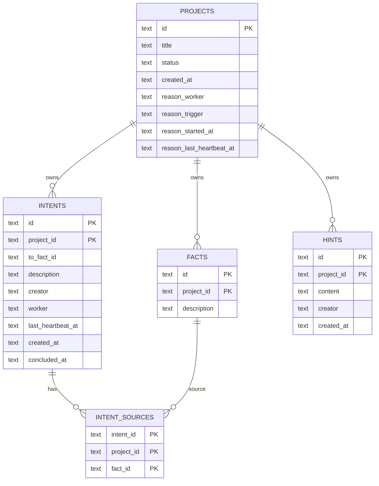

<!--
@ai: 本文件是 Cairn 代码库的完整分析笔记。后续 Codex 会话应先阅读本文件来定位模块、函数、数据流、配置和潜在风险，再进行代码修改或故障分析。
-->

# Cairn 代码库分析

## 1. 仓库类型与运行单元

Cairn 是一个 Python 单包应用，代码位于 `cairn/src/cairn`，通过 `cairn/pyproject.toml` 暴露 CLI：

```toml
[project.scripts]
cairn = "cairn.cli:main"
```

实际运行时有两个长期进程：

| 进程 | 命令 | 职责 |
| --- | --- | --- |
| Server | `cairn serve` | FastAPI 协议服务、SQLite 持久化、前端静态页面 |
| Dispatcher | `cairn dispatch --config dispatch.yaml` | 读取图状态、选择任务、管理容器、执行 Agent、写回图 |

Docker Compose 启动这两个服务，Server 持久化 `./datas/cairn/`，Dispatcher 挂载 Docker socket 和 `dispatch.yaml`。

## 2. 核心实体与关系



### 实体语义

| 实体 | 语义 |
| --- | --- |
| Project | 一个从 origin 到 goal 的问题实例 |
| Fact | 已确认客观事实，只增不改 |
| Intent | 从一个或多个 Fact 出发的探索方向，可 open、claimed、concluded |
| Hint | 人工或外部策略提示，不参与因果图 |
| Project.reason | 项目级 reason lease，不是事实图的一部分 |

## 3. Server 代码分析

### `server/db.py`

职责：

| 函数/对象 | 作用 |
| --- | --- |
| `DEFAULT_DB` | 默认 SQLite 路径 `~/.local/share/cairn/cairn.db` |
| `SCHEMA` | 初始化 settings/projects/facts/intents/intent_sources/hints/counters |
| `configure(path)` | 设置数据库路径并执行 schema |
| `get_conn()` | SQLite 连接上下文，开启 WAL 和 foreign keys |

重要细节：

>>⚠️ 注意：`configure()` 一旦 `_db_path` 已设置就直接 return。测试或多实例场景中，如果同一 Python 进程想切换 DB path，需要额外处理。

### `server/models.py`

职责：

| 模型 | 用途 |
| --- | --- |
| `Settings` | 全局超时配置 |
| `Fact`、`Intent`、`Hint` | 图对象响应模型 |
| `ProjectMeta`、`ProjectSummary`、`ProjectDetail` | 项目元信息和完整图 |
| `CreateProjectRequest` | 创建项目 |
| `CreateIntentRequest` | 创建探索方向 |
| `HeartbeatRequest` | intent/reason heartbeat |
| `ConcludeRequest` | intent 结论写入 |
| `CompleteRequest` | 项目完成 |
| `ReopenRequest` | completed 项目重新打开 |

输入校验主要做文本 trim 和非空检查。`Intent.from_` 使用 alias `"from"` 兼容 JSON 字段。

### `server/services.py`

职责：

| 函数 | 作用 |
| --- | --- |
| `utcnow()` | 生成 UTC 秒级时间 |
| `next_project_id()` | 全局项目 ID，如 `proj_001` |
| `next_fact_id()` | 项目内 Fact ID，如 `f001` |
| `next_intent_id()` | 项目内 Intent ID，如 `i001` |
| `validate_facts_exist()` | 验证 intent/complete 的来源 Fact 存在 |
| `validate_goal_not_in_sources()` | 禁止 `goal` 作为 from |
| `validate_intent_creator_worker()` | 创建时 worker 必须为空或等于 creator |
| `expire_workers()` | intent worker 超时释放 |
| `expire_reason_leases()` | reason lease 超时释放 |

### `server/routers/projects.py`

关键端点：

| 方法 | 路径 | 函数 | 说明 |
| --- | --- | --- | --- |
| GET | `/projects` | `list_projects()` | 返回摘要并执行超时清理 |
| POST | `/projects` | `create_project()` | 创建项目、写 origin/goal/hints |
| GET | `/projects/{project_id}` | `get_project()` | 返回完整图 |
| PUT | `/projects/{project_id}/status` | `update_project_status()` | active/stopped 切换 |
| POST | `/projects/{project_id}/reason/claim` | `claim_project_reason()` | 认领 reason |
| POST | `/projects/{project_id}/reason/heartbeat` | `heartbeat_project_reason()` | 维持 reason |
| POST | `/projects/{project_id}/reason/release` | `release_project_reason()` | 释放 reason |
| POST | `/projects/{project_id}/complete` | `complete_project()` | 写向 goal 的 completion intent 并置 completed |
| POST | `/projects/{project_id}/reopen` | `reopen_project()` | 删除 completion intent，写 external_feedback fact，恢复 active |

`stopped` 行为：

```text
UPDATE projects SET status='stopped'
UPDATE intents SET worker=NULL WHERE project_id=? AND concluded_at IS NULL
clear_project_reason()
```

这会让 Dispatcher 下一轮取消本地任务。

### `server/routers/intents.py`

关键端点：

| 方法 | 路径 | 函数 | 说明 |
| --- | --- | --- | --- |
| POST | `/projects/{project_id}/intents` | `create_intent()` | 创建 open intent |
| POST | `/projects/{project_id}/intents/{intent_id}/heartbeat` | `heartbeat()` | claim 或续租 intent |
| POST | `/projects/{project_id}/intents/{intent_id}/release` | `release()` | 释放 open intent |
| POST | `/projects/{project_id}/intents/{intent_id}/conclude` | `conclude()` | 新建 Fact 并设置 `to_fact_id` |

`heartbeat()` 的双重用途：

```text
如果 intent.worker is null，则本次 heartbeat 也是 claim。
如果 intent.worker == 当前 worker，则本次 heartbeat 是续租。
如果 intent.worker 是其他 worker，则 409。
```

### `server/routers/export.py`

用途：

| format | 输出 | 用途 |
| --- | --- | --- |
| `yaml` | 当前项目图 YAML | Dispatcher 构造 reason/explore prompt |
| `timeline` | 人类可读事件时间线 | UI 或审计 |

导出时会把时间格式转成本地时区字符串。

## 4. Dispatcher 代码分析

### `dispatcher/config.py`

配置模型：

| 模型 | 字段 |
| --- | --- |
| `RuntimeConfig` | `max_workers`、`max_running_projects`、`max_project_workers`、`interval`、`healthcheck_timeout`、`prompt_group` |
| `TasksConfig` | `bootstrap`、`reason`、`explore` |
| `ContainerConfig` | `image`、`network_mode`、`completed_action`、`stopped_action`、`cap_add` |
| `WorkerConfig` | `name`、`type`、`task_types`、`max_running`、`priority`、`env` |

Worker 类型：

| type | 必需环境变量 |
| --- | --- |
| `claudecode` | `ANTHROPIC_MODEL`、`ANTHROPIC_BASE_URL`、`ANTHROPIC_AUTH_TOKEN` |
| `codex` | `CODEX_MODEL`、`CODEX_BASE_URL`、`OPENAI_API_KEY` |
| `pi` | `PI_MODEL`、`PI_BASE_URL`、`PI_API_KEY`、`PI_PROVIDER_API` |
| `mock` | 无必需环境变量 |

>>⚠️ 注意：`common_env` 会合并进每个 worker 的 `env`，worker 自己的 env 覆盖 common env。

### `dispatcher/protocol/client.py`

`CairnClient` 封装 Server API：

| 方法 | Server API |
| --- | --- |
| `list_projects()` | GET `/projects` |
| `get_project(project_id)` | GET `/projects/{project_id}` |
| `get_settings()` | GET `/settings` |
| `export_project(project_id)` | GET `/projects/{id}/export?format=yaml` |
| `heartbeat()` | POST intent heartbeat |
| `claim_reason()` | POST reason claim |
| `reason_heartbeat()` | POST reason heartbeat |
| `release_reason()` | POST reason release |
| `release()` | POST intent release |
| `conclude()` | POST intent conclude |
| `complete()` | POST project complete |
| `create_intent()` | POST project intent |

它使用 thread-local `requests.Session`，适配多线程任务执行。

### `dispatcher/scheduler/loop.py`

这是调度核心。

#### 主循环

```python
run()
  run_startup_healthchecks()
  while True:
    _validate_server_settings()
    _reap_futures()
    _reap_cleanup_futures()
    summaries = client.list_projects()
    _initialize_reason_checkpoints(summaries)
    _refresh_runtime_projects(summaries)
    _cancel_inactive_tasks(summaries)
    _queue_container_cleanups(summaries)
    _dispatch_available(summaries)
    sleep(runtime.interval)
```

#### 项目调度规则

```text
如果 project 非 active：跳过
如果项目是 initial：调度 bootstrap
否则如果存在未认领普通 intent：调度 explore
否则如果 reason 已被认领：跳过
否则如果 reason_trigger 存在：调度 reason
否则跳过
```

#### Worker 选择规则

`_select_worker(project_id, task_type)`：

```text
过滤不支持 task_type 的 worker
过滤已达到 max_running 的 worker
过滤短暂 unhealthy 的 worker
过滤短暂 rejected 的 worker
按 priority 升序
按当前运行数升序
随机打散同级
```

#### Reason checkpoint

`_reason_trigger()` 只在以下变化时触发：

```text
checkpoint is None -> "initial"
facts 增加 -> facts:x->y
hints 增加 -> hints:x->y
open_intents 从 >0 到 0 -> open_intents:x->0
```

>>⚠️ 注意：`reason_checkpoints` 在 Dispatcher 内存中，不持久化。Dispatcher 重启后会通过项目摘要初始化一部分状态。

### `dispatcher/tasks/bootstrap.py`

输入：

```text
ProjectDetail
bootstrap Intent
WorkerConfig
```

主要流程：

```text
start HeartbeatLease.for_intent
ensure_running(project container)
run healthcheck
render bootstrap.md with origin/goal/hints
run worker process
parse JSON
if complete:
  conclude bootstrap intent -> new fact
  complete project from new fact
if timeout/parse fail:
  try bootstrap_conclude fallback
finally:
  lease.stop()
```

输出契约：

```json
{"accepted": true, "data": {"fact": {"description": "..."}, "complete": {"description": "..."}}}
```

### `dispatcher/tasks/reason.py`

输入：

```text
ProjectDetail
export_yaml
WorkerConfig
```

主要流程：

```text
start HeartbeatLease.for_reason
ensure_running(project container)
run healthcheck
prepare open_intents and valid fact ids
write graph snapshot into /tmp/cairn-prompts/...
render reason.md
run worker process
parse JSON
if complete:
  client.complete()
if intents:
  client.create_intent() for each
if noop:
  no graph write
finally:
  release reason
```

输出契约：

```json
{"accepted": true, "data": {"complete": {"from": ["f001"], "description": "..."}}}
```

或：

```json
{"accepted": true, "data": {"intents": [{"from": ["f001"], "description": "..."}]}}
```

或：

```json
{"accepted": true, "data": {}}
```

### `dispatcher/tasks/explore.py`

输入：

```text
ProjectDetail
export_yaml
Intent
WorkerConfig
```

主要流程：

```text
start HeartbeatLease.for_intent
ensure_running(project container)
run healthcheck
write graph snapshot file
render explore.md
run worker process
parse JSON
if fact:
  conclude intent
if timeout/parse fail:
  try explore_conclude fallback
finally:
  lease.stop()
```

输出契约：

```json
{"accepted": true, "data": {"description": "..."}}
```

### `dispatcher/contracts.py`

职责：

| 函数 | 作用 |
| --- | --- |
| `parse_json_output()` | 从 stdout 中提取 JSON object |
| `validate_reason_payload()` | 校验 reason 输出，返回 `complete`、`intents`、`noop`、`rejected` |
| `validate_bootstrap_execute_payload()` | 校验 bootstrap 主阶段输出 |
| `validate_bootstrap_conclude_payload()` | 校验 bootstrap conclude 输出 |
| `validate_explore_payload()` | 校验 explore/conclude 输出 |

兼容性：

```text
支持 {"accepted": true, "data": {...}}
也兼容部分无 accepted 包装的旧格式
```

>>⚠️ 注意：`reason` 在 open intents 为空时必须产出至少一个 intent，否则校验失败。

## 5. Runtime 代码分析

### `runtime/containers.py`

核心行为：

| 方法 | 作用 |
| --- | --- |
| `container_name(project_id)` | 生成 `cairn-dispatch-{project_id}` |
| `ensure_running(project_id)` | 复用、启动或创建项目容器 |
| `create_startup_container()` | 启动健康检查临时容器 |
| `cleanup_completed(project_id)` | completed 后 stop/remove |
| `cleanup_stopped(project_id)` | stopped 后 stop/remove |
| `build_exec_process()` | 构建带 Linux timeout 的 `ManagedProcess` |
| `write_text_file()` | tar archive 写文件进容器 |
| `validate_bind_mounts()` | startup 阶段验证 host bind mount 可用性 |
| `mount_mismatches()` | 诊断已存在项目容器与当前 bind mount 配置是否一致 |

项目容器支持 `container.bind_mounts`，用于 CTF 附件、源码、工具文件和大输出共享。`host_path` 支持 `{project_id}` 模板以隔离每个项目的可写目录；全局附件目录建议设置 `read_only: true`。该机制只提供文件访问能力，不改变 Fact / Intent / Hint 的 Server 黑板真相源。

`build_exec_process()` 会在命令前加：

```bash
timeout -k 5s {timeout_seconds}s ...
```

这是防止单个 Agent 进程无限运行的核心机制。

### `runtime/process.py`

职责：

| 方法 | 作用 |
| --- | --- |
| `start()` | Docker exec_create + exec_start reader thread |
| `communicate(timeout)` | 等待输出，超时 kill |
| `kill()` | inspect exec pid 并在容器内 kill -KILL |
| `cancel(reason)` | 标记取消并 kill |

### `runtime/heartbeat.py`

职责：

| 方法 | 作用 |
| --- | --- |
| `for_intent()` | 构造 intent heartbeat lease |
| `for_reason()` | 构造 reason heartbeat lease |
| `start()` | 启动 daemon thread |
| `attach_process()` | 绑定当前 Docker exec |
| `_run()` | 每 interval heartbeat |
| `_fail()` | 标记失败并 kill 当前进程 |

失败策略：

```text
2xx -> success
403/409 -> lease 无效，立即失败并 kill
其他错误 -> transient failure，超过 2 * interval 后 kill
```

## 6. Worker Driver 分析

### Driver 抽象

`WorkerDriver` 定义：

```python
build_healthcheck(worker) -> list[str]
build_execute(worker, prompt, session) -> DriverResult
build_conclude(worker, prompt, session) -> list[str]
extract_session(session, stdout, stderr) -> str | None
extract_response_text(stdout, stderr) -> str
```

### Claude Code

执行命令：

```bash
claude --session-id {uuid} --dangerously-skip-permissions -p -- "{prompt}"
claude -r {session} --dangerously-skip-permissions -p -- "{conclude_prompt}"
```

健康检查通过 Anthropic Messages API curl。

### Codex

执行命令：

```bash
codex exec --dangerously-bypass-approvals-and-sandbox \
  --model "$CODEX_MODEL" \
  -c 'model_provider="cairn"' \
  -c 'model_providers.cairn.wire_api="responses"' \
  -c 'model_reasoning_effort="high"' \
  -c "model_providers.cairn.base_url=\"$CODEX_BASE_URL\"" \
  -c 'model_providers.cairn.env_key="OPENAI_API_KEY"' \
  -- "{prompt}"
```

conclude 通过：

```bash
codex exec resume {session} ...
```

### Pi

Pi driver 会生成 `models.json`，限制扩展、技能、主题、上下文文件，并只开放工具：

```text
read,write,edit,bash,grep,find,ls
```

Pi stdout 是事件流，driver 从 `turn_end` 或 `agent_end` 中提取 assistant 文本。

### Mock

Mock driver 用 Python 脚本模拟各种结果，适合测试调度、超时、非法输出、拒绝、失败等分支。

## 7. Prompt 设计

Prompt 组位于：

```text
cairn/src/cairn/dispatcher/prompts/default/
cairn/src/cairn/dispatcher/prompts/mock/
```

默认 prompt：

| 文件 | 任务 |
| --- | --- |
| `bootstrap.md` | 初始直接求解，只有达成 goal 才返回 |
| `bootstrap_conclude.md` | bootstrap 超时/解析失败后的事实总结 |
| `reason.md` | 判断完成或生成新 intents |
| `explore.md` | 执行某个具体 intent |
| `explore_conclude.md` | explore 超时/解析失败后的事实总结 |

>>⚠️ 注意：conclude prompt 明确要求 Agent 停止探索，只总结已经确认的事实。这是超时后落地 partial Fact 的关键约束。

## 8. 外部系统与集成

| 系统 | 连接方式 | 配置 |
| --- | --- | --- |
| Docker Engine | Unix socket `/var/run/docker.sock` | docker-compose 挂载到 Dispatcher |
| SQLite | 文件路径 | `~/.local/share/cairn/cairn.db` 或 compose volume |
| Claude/Anthropic compatible API | HTTP | `ANTHROPIC_BASE_URL`、`ANTHROPIC_AUTH_TOKEN` |
| OpenAI Responses compatible API | Codex CLI | `CODEX_BASE_URL`、`OPENAI_API_KEY` |
| Pi provider API | Pi CLI | `PI_BASE_URL`、`PI_API_KEY`、`PI_PROVIDER_API` |

## 9. 配置说明

### Server

```bash
cairn serve --host 127.0.0.1 --port 8000 --db-path ~/.local/share/cairn/cairn.db
```

### Dispatcher

```bash
cairn dispatch --config dispatch.yaml
```

关键字段：

| 字段 | 说明 |
| --- | --- |
| `server` | Cairn Server base URL |
| `runtime.interval` | 调度节拍，也是 heartbeat 周期 |
| `runtime.max_workers` | 全局最大并发任务 |
| `runtime.max_running_projects` | 最多活跃调度项目数 |
| `runtime.max_project_workers` | 单项目最大并发任务 |
| `runtime.healthcheck_timeout` | Worker 健康检查超时 |
| `runtime.prompt_group` | prompt 目录名 |
| `tasks.*.timeout` | 各任务主阶段超时 |
| `tasks.*.conclude_timeout` | 收尾阶段超时 |
| `container.image` | Worker 容器镜像 |
| `container.network_mode` | 容器网络模式 |
| `container.bind_mounts` | 可选 host 文件夹映射列表，支持 `{project_id}` |
| `workers[].priority` | 越小越优先 |

## 10. 运行与验证命令

安装依赖并运行 Server：

```bash
uv run --project cairn cairn serve
```

运行 Dispatcher：

```bash
uv run --project cairn cairn dispatch --config dispatch.yaml
```

只跑启动健康检查：

```bash
uv run --project cairn cairn dispatch --config dispatch.yaml --startup-healthcheck-only
```

Docker Compose：

```bash
docker compose up --build
```

使用 Mock 配置做低风险验证：

```bash
uv run --project cairn cairn dispatch --config dispatch_mock.yaml --once
```

## 11. 明显风险与待办

| 类型 | 内容 |
| --- | --- |
| 安全 | `dispatch.yaml` 不应包含真实密钥或提交到公开仓库 |
| 安全 | Worker 容器内有 Kali 工具和危险 Agent 执行参数，需要隔离 |
| 架构 | 目前按单 Dispatcher 设计，不支持多 Dispatcher 协同 |
| 可观测性 | Intent 不保留完整 worker history |
| 测试 | 仓库未见系统性测试目录，建议补 API 单测、dispatcher mock 集成测试 |
| 语义循环 | 低质量 intent 生成仍需通过 prompt、人工 Hint 和 stop 控制 |
| DB 生命周期 | `db.configure()` 单进程只初始化一次，对测试隔离不友好 |

## 12. 修改代码时的推荐路径

| 需求 | 推荐修改点 |
| --- | --- |
| 新增 API 字段 | `server/models.py`、对应 router、DB schema |
| 新增 Worker 后端 | `dispatcher/workers/adapters/`、`registry.py`、`config.py` WorkerType/env 校验 |
| 调整调度策略 | `dispatcher/scheduler/loop.py` |
| 调整输出契约 | `dispatcher/contracts.py` 和对应 prompt |
| 调整 prompt | `dispatcher/prompts/{group}/`，同步 `config.py` placeholder 校验 |
| 调整容器生命周期 | `dispatcher/runtime/containers.py` |
| 调整 heartbeat | `dispatcher/runtime/heartbeat.py`、Server lease API |
