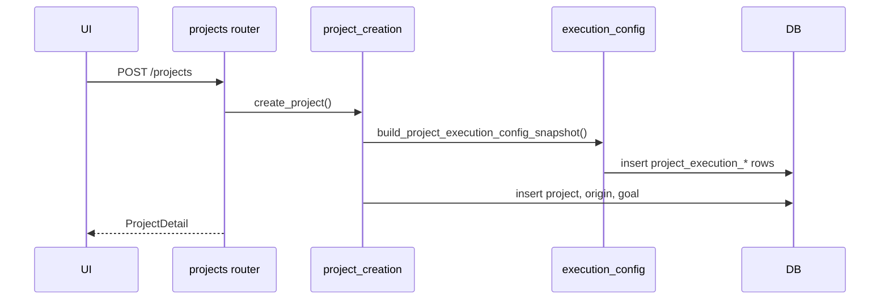
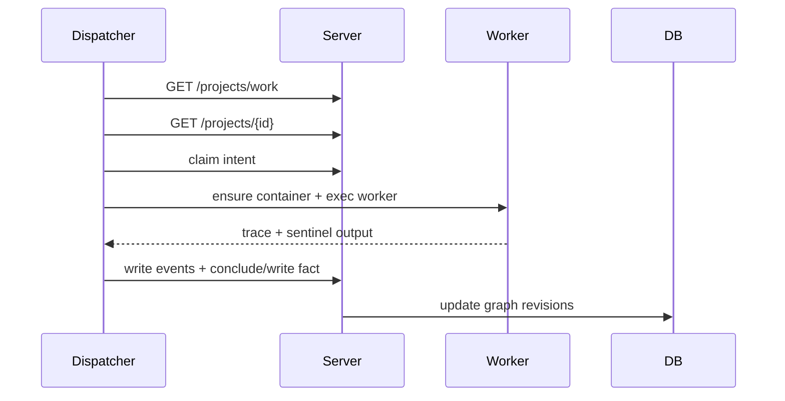
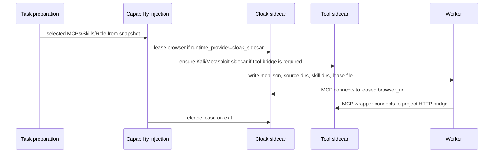
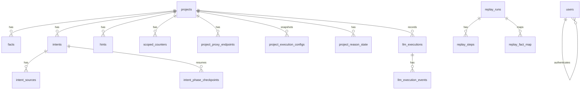

<!--
@ai: 本文件是项目的全面代码分析。当需要了解具体实现细节、函数签名、数据模型或业务逻辑时，请查阅本文件。
本文件按模块组织，每个模块包含其文件清单、核心函数、数据结构和实现细节。

@update: 如需更新本文档，请遵循以下原则：
1. 优先局部修改受影响的章节，而非全文重写
2. 修改后必须在 UPDATE.md 追加一条变更记录
3. 如数据模型或 API 端点有变更，同步更新 ARCHITECTURE.md 中的相关图表
4. 新增的函数入口点不超过 15 个上限时，追加到入口点列表；超过则替换次重要的

生成日期：2026-07-07
-->

# Cairn 全面代码分析

## 1. 项目概览

| 项 | 内容 |
|----|------|
| 项目名称 | Cairn |
| 版本 | `0.2.1` |
| 描述 | Fact-graph based collaborative exploration protocol |
| 核心目标 | 用 fact-intent graph 和共享黑板机制，把未知状态空间搜索任务拆成可并行探索、可回写、可观测的 Agent 工作流。 |

技术栈：

| 层级 | 技术 | 版本/约束 |
|------|------|-----------|
| 运行时/语言 | Python | `>=3.12` |
| Runner 运行时 | Node.js | `22.x` runner image for Claude/Codex/MCP wrappers |
| 后端框架 | FastAPI | `>=0.115` |
| ASGI Server | Uvicorn | `>=0.34` |
| CLI | Click | `>=8.1` |
| 数据库 | PostgreSQL | compose 使用 `postgres:16-alpine` |
| ORM / Migration | SQLAlchemy, Alembic | SQLAlchemy `>=2.0`, Alembic `>=1.13` |
| 配置 | PyYAML, Pydantic v2 | `server.yaml`, `config.yaml`, `config.resources.yaml` |
| Docker 控制 | Docker SDK for Python | `>=7.1.0` |
| HTTP Client | requests, tenacity | Dispatcher 调 Server |
| 认证 | PyJWT, bcrypt | JWT + password hash |
| 观测 | prometheus-client | metrics + LLM execution events |
| 前端 | Alpine ES modules, FastAPI partials, Cytoscape, Tailwind | no-build static SPA |
| 测试 | pytest, httpx, ruff, mypy | `cd cairn && uv run pytest` |

## 2. 工程目录结构

```text
Cairn/
├── cairn/
│   ├── pyproject.toml
│   ├── migrations/versions/          # Alembic PostgreSQL migrations
│   ├── scripts/check_naming.py
│   ├── src/cairn/
│   │   ├── cli.py                    # cairn serve / dispatch / db / config
│   │   ├── server/                   # FastAPI Server
│   │   ├── dispatcher/               # Scheduler, runtime, worker adapters
│   │   └── shared/                   # config, contracts, task types, observability
│   └── tests/                        # 60 top-level test_*.py files
├── capabilities/
│   ├── skills/                       # first-party Skills
│   ├── roles/                        # first-party Roles
│   └── mcp/                          # MCP runtime/source assets
├── container/
│   ├── runner/                       # Node 22 worker runner image and MCP wrapper binaries
│   ├── tools-kali/                   # Kali tool HTTP MCP sidecar image
│   └── tools-metasploit/             # Metasploit HTTP MCP sidecar image
├── README/                           # images and architecture HTML
├── server.yaml                       # deployment/security/database/worker runtime
├── config.yaml                       # dispatch/task/observability/worker pool
├── config.resources.yaml             # servers, MCPs, skills, roles
└── AI/                               # architecture docs
```

核心文件：

| 文件 | 作用 |
|------|------|
| `cairn/src/cairn/cli.py` | CLI 入口 |
| `cairn/src/cairn/server/app.py` | FastAPI app、lifespan、auth guard、路由注册 |
| `cairn/src/cairn/server/orm.py` | SQLAlchemy ORM table mapping |
| `cairn/src/cairn/server/db.py` | PostgreSQL engine、migration、seed |
| `cairn/src/cairn/server/routers/projects.py` | Project graph/reason/complete/reopen API |
| `cairn/src/cairn/server/routers/intents.py` | Intent claim/heartbeat/conclude/checkpoint API |
| `cairn/src/cairn/server/observability/routers.py` | LLM execution/event API |
| `cairn/src/cairn/dispatcher/scheduler/loop.py` | Dispatcher loop assembly |
| `cairn/src/cairn/dispatcher/scheduler/project_dispatcher.py` | Project task decision logic |
| `cairn/src/cairn/dispatcher/scheduler/task_submitter.py` | Claim and submit task futures |
| `cairn/src/cairn/dispatcher/tasks/bootstrap.py` | Bootstrap task |
| `cairn/src/cairn/dispatcher/tasks/explore.py` | Explore task and conclude resume |
| `cairn/src/cairn/dispatcher/tasks/reason.py` | Reason task |
| `cairn/src/cairn/dispatcher/runtime/containers.py` | Docker container facade |
| `cairn/src/cairn/dispatcher/runtime/cloak_sidecar.py` | Project CloakBrowser sidecar |
| `cairn/src/cairn/dispatcher/runtime/tool_sidecar.py` | Project Kali/Metasploit tool sidecar manager |
| `container/runner/Dockerfile` | Node 22 runner image with Python/git/sudo and global MCP/npm tools |
| `container/tools-kali/Dockerfile` | Kali tool sidecar image with mirror-pinned package install |
| `container/tools-metasploit/Dockerfile` | Metasploit tool sidecar image with mirror-pinned package install |

## 3. 关键入口点

| 入口点 | 文件位置 | 触发方式 | 功能说明 |
|--------|----------|----------|----------|
| `serve()` | `cairn/src/cairn/cli.py` | `cairn serve` | 启动 FastAPI/Uvicorn |
| `dispatch()` | `cairn/src/cairn/cli.py` | `cairn dispatch --config config.yaml` | 启动 DispatcherLoop |
| `lifespan()` | `cairn/src/cairn/server/app.py` | Server startup/shutdown | 配置日志、拼装 SPA、DB migration、superuser bootstrap、后台任务 |
| `_enforce_auth()` | `cairn/src/cairn/server/app.py` | 每个非 public HTTP request | Bearer token 全局认证 |
| `create_project()` | `cairn/src/cairn/server/application/project_creation.py` | `POST /projects` | 创建项目、origin/goal、execution config snapshot |
| `DispatcherLoop.run()` | `cairn/src/cairn/dispatcher/scheduler/loop.py` | dispatcher process | tick loop + backoff + cleanup |
| `TickCoordinator.run_iteration()` | `cairn/src/cairn/dispatcher/scheduler/tick_coordinator.py` | 每次 scheduler tick | healthcheck、reap、list work、dispatch、metrics |
| `ProjectDispatcher.try_dispatch_project()` | `cairn/src/cairn/dispatcher/scheduler/project_dispatcher.py` | project scheduling | bootstrap/explore/reason/replay 选择 |
| `TaskSubmitter.dispatch_explore()` | `cairn/src/cairn/dispatcher/scheduler/task_submitter.py` | unclaimed intent | claim intent and submit worker future |
| `run_bootstrap_task()` | `cairn/src/cairn/dispatcher/tasks/bootstrap.py` | bootstrap future | origin 到初始 facts/intents |
| `run_explore_task()` | `cairn/src/cairn/dispatcher/tasks/explore.py` | explore future | 执行 intent，支持 conclude checkpoint |
| `run_reason_task()` | `cairn/src/cairn/dispatcher/tasks/reason.py` | reason future | 评估图状态并生成新 intents/完成 |
| `inject_project_capabilities()` | `cairn/src/cairn/dispatcher/capabilities.py` | task preparation | 注入 MCP、Skill、Role、runtime leases |
| `CloakSidecarManager.lease_browser()` | `cairn/src/cairn/dispatcher/runtime/cloak_sidecar.py` | MCP runtime provider | 租用项目级 browser slot |
| `ExecutionReporter` | `cairn/src/cairn/dispatcher/observability/reporter.py` | task lifecycle | 记录 prompt/stdout/stderr/trace/finish |

## 4. 核心算法

| 算法/逻辑 | 文件位置 | 功能描述 | 复杂度/约束 |
|-----------|----------|----------|-------------|
| Project work rotation | `dispatcher/scheduler/dispatch_coordinator.py` | 在全局 `max_workers`、`max_running_projects` 下优先已有运行项目并轮转 idle 项目 | O(n) per tick |
| Reason trigger dedupe | `dispatcher/scheduler/work_planner.py` | 根据 facts/hints/open intents 和 checkpoint 判断 reason 是否需要运行 | O(f+i+h) |
| Intent claim mutual exclusion | `server/repositories/intents.py` | 条件更新 claim intent，避免多个 worker 同时领取 | DB atomic update |
| AI profile check claim | `server/repositories/ai_profiles.py` | `UPDATE ... FOR UPDATE SKIP LOCKED RETURNING` 领取 pending request | DB row lock |
| Incremental graph polling | `server/application/project_queries.py` and frontend state | 以 graph/timeline revision 判定是否拉取 delta | O(delta) |
| Trace event parsing | `dispatcher/observability/claude_trace.py`, `codex_trace.py` | 将 Claude stream-json / Codex JSONL 映射为统一事件 | O(events) |

## 5. 主要业务流程

### 项目创建



### 调度 Explore



### Capability/MCP Runtime



Resource discovery note: the `cairn-resources` MCP is the canonical worker-facing path for global Servers and project-scoped proxy endpoint discovery/usage reporting. Worker prompts should use that MCP instead of assuming resource details from static prompt text.

Runtime instruction note: task preparation writes `AGENTS.md`, `CLAUDE.md`, `context/project.md`, `context/phase.md`, `context/capabilities.md`, and `context/policy.json` under the task instruction root. Settings → Prompts exposes `GET /prompt-instruction-previews` as a read-only global preview using the same renderer; editable default prompt templates remain responsible for output markers, schemas, and dynamic placeholders.

## 6. 数据模型

主要 ORM tables from `cairn/src/cairn/server/orm.py`:



Key tables:

| 表 | 作用 |
|----|------|
| `projects` | project metadata, status, revisions, reason lease state |
| `facts` | graph facts |
| `intents` | open/concluded work units |
| `intent_sources` | intent source fact list |
| `intent_phase_checkpoints` | currently `explore_conclude` resume state |
| `hints` | user/agent hints |
| `project_proxy_endpoints` | project-scoped proxy endpoint registry |
| `project_execution_configs` | immutable project execution snapshot header |
| `project_execution_task_timeouts` | per task timeout snapshot |
| `project_execution_ai_profiles` | selected AI profile snapshots |
| `project_execution_capabilities` | selected capabilities snapshot |
| `project_reason_state` | reason trigger/checkpoint state |
| `health_check_results`, `ai_profile_check_requests` | AI profile health workflows |
| `users` | login users and superuser flag |
| `llm_executions`, `llm_execution_events` | worker process and event log |
| `replay_runs`, `replay_steps`, `replay_fact_map` | replay project workflow |

Current migration head is `0013_project_proxy_servers`. Sensitive fields include user password hashes, JWT secrets in YAML, dispatcher service token, AI profile API keys, project endpoint credentials, and worker env tokens; generated documentation must use placeholders for those values.

## 7. API 端点

OpenAPI is disabled at runtime. AST scan currently finds **103 FastAPI route decorators**.

| 分组 | 数量 | 主要路径 |
|------|------|----------|
| App/public | 3 | `/`, `/health`, `/metrics` |
| Auth | 4 | `/auth/login`, `/auth/me`, `/auth/users`, `/auth/refresh` |
| Projects | 17 | `/projects`, `/projects/work`, `/projects/{project_id}`, graph, reason, complete, reopen, cloak sidecar |
| Intents | 8 | create, claim, heartbeat, release, conclude, phase checkpoint operations |
| Hints/attachments/files/export | 5 | project hints, uploads, file list/download, export |
| Replay | 2 | replay start/step operations |
| Project proxy endpoints | 7 | project-scoped endpoint CRUD, resolve chain, test, usage |
| AI profiles | 12 | catalog CRUD, secret, checks, reports, project AI profile view |
| Servers | 7 | server resource CRUD, test, command, inspect ports |
| Capabilities/Roles | 14 | catalog, admin, probe/expand/audit, role defaults, project role |
| Prompt groups/Roles prompts | 7 | prompt templates, role prompt admin, runtime instruction preview |
| Execution configs | 2 | project execution config list and task type config |
| Observability | 10 | execution list, event list, incremental/card/view, event writes, finish |
| Settings/System/Task types | 5 | timeouts, task types, system settings, container limits |

Authentication: all API routes go through the global auth guard except `/`, `/auth/login`, `/health`, `/metrics`, and `/static/*`.

## 8. 错误处理策略

- Domain errors: `DomainError` maps to JSON `{"detail": ...}` with its status code.
- Database unavailable: `db.DatabaseUnavailable` and `SQLAlchemyError` map to HTTP 503 with request id.
- Auth errors: missing/invalid token returns 401 with `WWW-Authenticate: Bearer`; inactive user returns 403.
- Dispatcher tick errors: transient failure count is tracked, exposed by health payload, and backed off up to 30 seconds.
- Worker failures: task lifecycle records execution finish state, timeout/error kind, trace events, and best-effort release of intent/reason claims.
- MCP probe failures: returned as probe status/message instead of crashing the server path.

## 9. 配置与运行

Config files:

| 文件 | 内容 |
|------|------|
| `server.yaml` | `app`, `database`, `security`, `admin`, `dispatcher`, `storage`, `worker` |
| `server.yaml` tool sidecars | `runner`, `tool_sidecars.kali`, `tool_sidecars.metasploit` image/network/user/resource settings |
| `config.yaml` | server log/settings, dispatcher runtime, tasks, observability, worker pool |
| `config.resources.yaml` | servers, MCP servers, skills, roles |

Sensitive local values must be documented as `{{PLACEHOLDER}}`, for example:

```yaml
database:
  url: "{{POSTGRES_URL}}"
security:
  jwt_secret: "{{JWT_SECRET}}"
  dispatcher_api_token: "{{DISPATCHER_TOKEN}}"
worker_pool:
  workers:
    - env:
        OPENAI_API_KEY: "{{AI_API_KEY}}"
```

Common commands:

```bash
docker build ./container/runner -t cairn-llm-runner:latest
docker build ./container/tools-kali -t cairn-kali-tools:latest
docker build ./container/tools-metasploit -t cairn-metasploit-tools:latest
uv run --project cairn cairn config check --config config.yaml
uv run --project cairn cairn db migrate
uv run --project cairn cairn serve
uv run --project cairn cairn dispatch --config config.yaml
cd cairn && uv run pytest
node cairn/scripts/check_frontend.mjs
```

## 10. 基础设施与横切关注点

- Logging: shared logging config adds component and trace id; server and dispatcher configure independently.
- Metrics: `/metrics` exports Prometheus counters/histograms for HTTP and dispatcher.
- Request tracing: `RequestIdMiddleware` binds `X-Request-Id` to context vars and response headers.
- Security headers: `X-Content-Type-Options`, `X-Frame-Options`, `Referrer-Policy`.
- Retention: `BackgroundTasks` runs observability retention when enabled.
- Static cache: `NoStoreStaticFiles` disables browser cache for no-build SPA assets.
- Observability redaction: dispatcher reporter and server event writer redact/truncate event content.
- Runtime cleanup: completed/stopped/orphan worker containers, Cloak sidecars, and Kali/Metasploit tool sidecars are cleaned by dispatcher policy.
- Container image builds: runner uses `node:22-bookworm-slim`; runner and sidecar Dockerfiles pin package mirrors before package installs, and the Kali tools image includes archive tooling needed by bundled wordlist/setup flows.

## 11. 测试策略

Current top-level test files: **60** under `cairn/tests`.

Key tests:

| 文件 | 覆盖 |
|------|------|
| `test_architecture_boundaries.py` | server layering, doc/migration/resource contract guardrails |
| `test_route_auth_guard.py` | global auth guard, public path allowlist, disabled OpenAPI |
| `test_db_migrations.py` | migration head, indexes, defaults, removed columns, proxy endpoint constraints |
| `test_scheduler_refactor.py` | dispatcher/project dispatch/task submitter behavior |
| `test_dispatcher_assembly.py` | loop wiring |
| `test_worker_cli_adapters.py` | Claude/Codex/mock CLI args and trace formats |
| `test_capability_admin.py`, `test_capability_manifest.py` | capability catalog/admin/projection |
| `test_mcp_probe.py`, `test_mcp_probe_server.py` | MCP probe path |
| `test_cloak_sidecar.py`, `test_dispatch_sidecar_config.py` | Cloak and tool sidecar config/runtime assertions |
| `test_observability*.py`, `test_redaction_free_text.py` | event recording, reporter, redaction |
| `test_prompt_snapshots.py`, `test_prompt_group_admin.py` | prompt snapshot, runtime instruction preview, and admin editing |
| `test_static_cache.py`, `test_frontend_static.py`, `test_graph_state.py` | assembled SPA and frontend state |
| `test_config_loader.py`, `test_config_preflight.py`, `test_yaml_config.py` | config normalization and validation |

## 12. 待办与已知问题

- Static vendor files contain upstream TODO comments; no first-party TODO/FIXME/HACK was identified in the scanned first-party source.
- `cairn/src/cairn/server/security/deps.py` has wording that implies register may be public, while runtime allowlist and tests make user creation superuser-only.
- FastAPI route count should be AST-scanned because multiline decorators make simple regex counts inaccurate.
- Local config files may contain secrets; never copy raw values into docs or prompts.

## 13. 隐藏细节与注意事项

| 标注 | 说明 |
|------|------|
| 注意 | Project execution config is immutable per project; changing global YAML does not silently mutate old project snapshots. |
| 注意 | `reason` intentionally receives no MCP capability injection. |
| 注意 | Current migration chain skips a `0012` file name but has a valid single Alembic head. |
| 性能敏感 | LLM events are capped by per-event and per-execution byte limits; avoid large raw stream recording unless needed. |
| 性能敏感 | Dispatcher tick does project work listing and runtime cleanup; high project counts should be measured around `list_project_work()`. |
| 向后兼容 | API paths, JSON/YAML fields, DB table names, and protocol filenames are external contracts. |
