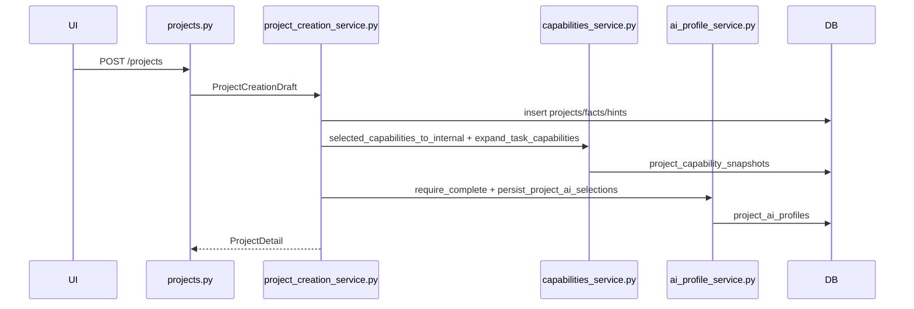
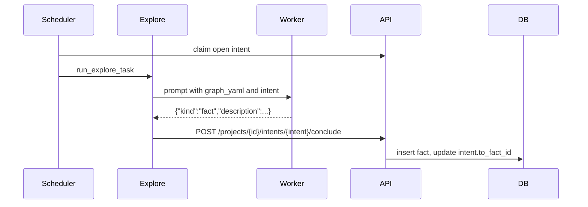
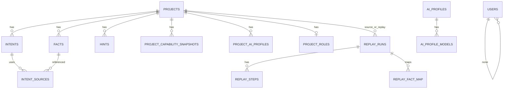
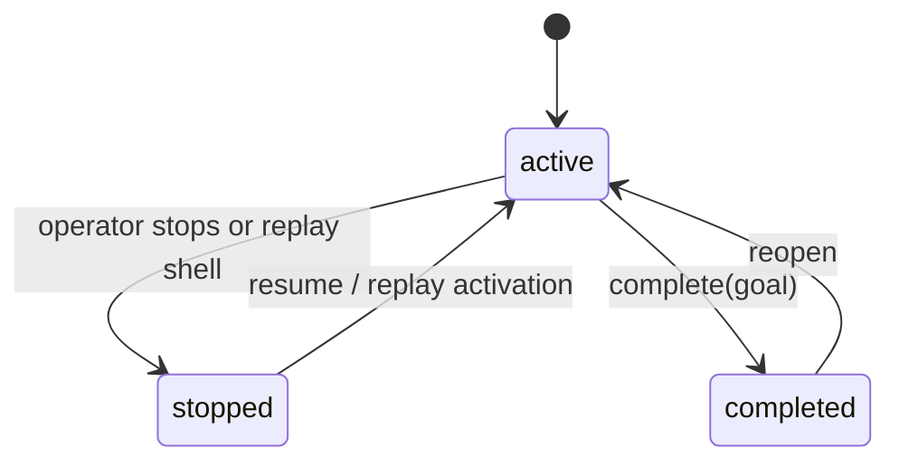

<!--
@ai: 本文件是项目的全面代码分析。当需要了解具体实现细节、函数签名、数据模型或业务逻辑时，请查阅本文件。
本文件按模块组织，每个模块包含其文件清单、核心函数、数据结构和实现细节。

@update: 如需更新本文档，请遵循以下原则：
1. 优先局部修改受影响的章节，而非全文重写
2. 修改后必须在 UPDATE.md 追加一条变更记录
3. 如数据模型或 API 端点有变更，同步更新 ARCHITECTURE.md 中的相关图表
4. 新增的函数入口点不超过 15 个上限时，追加到入口点列表；超过则替换次重要的

生成日期：2026-06-09
-->

# Cairn 全面代码分析

## 1. 项目概览

Cairn 是一个事实图驱动的协作探索协议。它把问题抽象为 origin 到 goal 的未知路径搜索，通过 Facts、Intents、Hints 构成黑板图，Dispatcher 调度 AI worker 在隔离容器中执行 bootstrap、reason、explore 三类任务，并把结构化结果写回 Server。

| 层级 | 技术 | 版本/来源 |
|------|------|-----------|
| 语言 | Python | `>=3.12` |
| API | FastAPI | `>=0.115` |
| Server | Uvicorn, Click | `uvicorn[standard]>=0.34`, `click>=8.1` |
| 数据库 | PostgreSQL | SQLAlchemy、Alembic、psycopg |
| Dispatcher | Docker SDK, requests, tenacity | `docker>=7.1.0`, `requests>=2.32.3`, `tenacity>=8.2` |
| 模型 | Pydantic v2 | `pydantic[email]>=2.7` |
| 安全 | PyJWT, bcrypt, cryptography | JWT、密码 hash、secret 加密 |
| 前端 | Alpine.js, Tailwind, Cytoscape | vendored static assets |
| 测试 | unittest + httpx | `cairn/tests/` |

## 2. 工程目录结构

```text
cairn/src/cairn/
├── cli.py                         # CLI entrypoint
├── server/
│   ├── app.py                     # FastAPI app
│   ├── db.py                      # PostgreSQL engine/session/Alembic/status
│   ├── orm.py                     # SQLAlchemy ORM metadata
│   ├── ../../migrations/          # Alembic migrations
│   ├── services.py                # 图与 reason 状态通用服务
│   ├── project_creation_service.py
│   ├── ai_profile_service.py
│   ├── capabilities_service.py
│   ├── models_pkg/                # Pydantic DTO
│   ├── routers/                   # HTTP resources
│   ├── security/                  # auth/secrets/path safety
│   ├── observability/             # LLM execution storage
│   └── static/                    # no-build SPA
├── dispatcher/
│   ├── config.py                  # dispatch.yaml schema
│   ├── scheduler/                 # loop/cache/worker selection
│   ├── tasks/                     # bootstrap/explore/reason
│   ├── runtime/                   # Docker/process/heartbeat/cancel
│   ├── workers/                   # worker driver registry
│   ├── protocol/client.py         # Server HTTP client
│   └── capabilities.py            # capability injection
└── observability/                 # process-wide logging/metrics/trace
```

核心外部目录：

| 路径 | 作用 |
|------|------|
| `capabilities/` | skills、roles、MCP、payloads、报告模板 |
| `container/` | worker container Dockerfile、运行脚本、说明 |
| `cairn/tests/` | API、dispatcher、security、DB、observability 测试 |
| `datas/` | 本地运行数据、附件、项目文件 |

## 3. 关键入口点

| 入口点 | 文件位置 | 触发方式 | 功能 |
|--------|----------|----------|------|
| `main()` | `cairn/src/cairn/cli.py` | `cairn` CLI | Click command group |
| `serve()` | `cli.py` | `cairn serve` | 配置 DB 并启动 FastAPI |
| `dispatch()` | `cli.py` | `cairn dispatch` | 启动 DispatcherLoop |
| `lifespan()` | `server/app.py` | FastAPI startup/shutdown | logging、DB、superuser、retention |
| `create_project()` | `server/routers/projects.py` | `POST /projects` | 创建项目 |
| `create_project_from_draft()` | `server/project_creation_service.py` | 服务层调用 | 统一创建项目、capability、AI profile snapshot |
| `create_replay_run()` | `server/routers/replay.py` | `POST /projects/{id}/replay-runs` | 创建 replay project |
| `persist_project_ai_selections()` | `server/ai_profile_service.py` | 服务层调用 | 保存三阶段 AI profile snapshot |
| `expand_task_capabilities()` | `server/capabilities_service.py` | 服务层调用 | capability 校验与 required/role_default 展开 |
| `DispatcherLoop.run()` | `dispatcher/scheduler/loop.py` | dispatcher 进程 | leader loop 和调度 tick |
| `run_bootstrap_task()` | `dispatcher/tasks/bootstrap.py` | scheduler 提交 | 项目初始求解 |
| `run_explore_task()` | `dispatcher/tasks/explore.py` | scheduler 提交 | 执行一个 intent |
| `run_reason_task()` | `dispatcher/tasks/reason.py` | scheduler 提交 | 读图并完成/生成 intent/no-op |
| `inject_project_capabilities()` | `dispatcher/capabilities.py` | task 执行前 | 注入 MCP/skills/context |
| `CairnClient` | `dispatcher/protocol/client.py` | dispatcher HTTP | Server API client |

## 4. 核心算法

| 算法/机制 | 位置 | 功能 | 复杂度/特征 |
|-----------|------|------|-------------|
| Fact-intent graph traversal | `routers/replay.py`, `services.py` | 从 completion source 反推 replay route，验证 fact/intent 依赖 | 图 DFS，检测 cycle 和多生产者 |
| Capability expansion | `capabilities_service.py` | 用户选择 + MCP required skills + skill requires + role defaults | per-task catalog walk，去重并保留 source |
| Worker selection | `dispatcher/scheduler/worker_selection.py`, `worker_select.py` | 根据 task_type、健康、忙碌、AI profile overlay 选 worker | 候选过滤 + priority |
| Reason retry/backoff | `server/services.py` | reason 失败后退避、block threshold、lease 状态 | 指数退避，最大 300s |
| Dispatcher leadership | `dispatcher/leadership.py`, `routers/dispatcher_lock.py` | 多 dispatcher 互斥调度 | DB lock + heartbeat TTL |
| Secret encryption | `server/security/secrets.py` | AI profile sk 加密/解密 | Fernet-like app secret envelope |
| Observability retention | `server/observability/retention.py` | 定期删除过期 LLM events | 按 retention_days 清理 |

## 5. 主要业务流程

### 项目创建



### Dispatcher 调度任务

```mermaid
sequenceDiagram
    participant Loop as DispatcherLoop
    participant API as CairnClient/API
    participant Docker as ContainerManager
    participant Task as bootstrap/explore/reason
    participant Worker as Worker CLI

    Loop->>API: acquire leader, list projects
    Loop->>API: claim reason or intent
    Loop->>Docker: ensure_running(project)
    Loop->>Task: run_*_task()
    Task->>API: get capabilities/role/AI profile data
    Task->>Docker: inject files and execute worker
    Worker-->>Task: stdout/stderr structured response
    Task->>API: conclude/create intent/complete/finish reason
```

### Explore 写回 Fact



### Replay

Replay 只允许从 completed project 创建。路由提取 completion source facts，DFS 构造 replay steps，创建 stopped replay project，复制附件后激活。若请求未显式传 capability map，则继承源项目 capability snapshots。

## 6. 数据模型



核心实体：

- `projects`: id、title、status、created_at、proxy_id、reason lease、llm_hidden_event_kinds。
- `facts`: objective findings，`origin` 和 `goal` 是特殊 fact id。
- `intents`: 待执行或已完成探索方向，`to_fact_id IS NULL` 表示未完成。
- `intent_sources`: intent 依赖的 fact 列表。
- `hints`: 人类注入的上下文。
- `project_capability_snapshots`: per-task capability snapshot，source 为 selected/required/role_default。
- `ai_profiles` / `project_ai_profiles`: catalog 和 project task snapshot。
- `replay_runs` / `replay_steps` / `replay_fact_map`: replay 项目映射状态。
- `users`: auth 用户、role、active、password_hash。
- `dispatcher_locks`: leader lock 和 heartbeat。

状态流转：



敏感字段：

| 字段 | 存储 | 说明 |
|------|------|------|
| `users.password_hash` | bcrypt hash | 不存明文密码 |
| `ai_profiles.sk_ciphertext` | encrypted text | 优先读取加密列 |
| `ai_profiles.sk` | legacy plaintext column | 兼容旧数据，写入路径倾向清空或加密 |
| proxy username/password | PostgreSQL | 用于 worker env 注入，应视为敏感 |

## 7. API 端点

## 8. 前端功能面与浏览器回归关注点

前端为单文件 no-build SPA，主要功能集中在 `cairn/src/cairn/server/static/index.html`。这意味着功能完整性回归不能只依赖 API 测试，还必须覆盖 UI 状态和浏览器侧报错。

关键交互面：

- 认证：登录浮层、会话恢复、登出
- 项目列表：新建、重命名、停止、恢复、删除、导出、重开
- 项目图：创建 intent、claim/heartbeat/release/conclude、complete、hint、layout 切换、execution log 面板
- 设置页：server settings、proxy CRUD、capability admin、AI profile CRUD
- Replay：从 completed 项目派生 replay，并测试播放控制
- 文件与导出：附件上传、项目文件列表、YAML/Timeline 导出

本仓库已在关键控件上补充稳定测试选择器，供 `chrome-devtools` MCP 或其他浏览器回归工具使用。浏览器回归协议见 `AI/TESTING_PROTOCOL.md`。

项目没有独立 OpenAPI 文件，FastAPI 运行时可生成 OpenAPI。主要端点分组如下：

| 分组 | 主要路径 | 用途 | 认证 |
|------|----------|------|------|
| Health/static | `/`, `/health`, `/metrics`, `/static/*` | SPA、健康、metrics | public |
| Auth | `/auth/login`, `/auth/refresh`, `/auth/me`, `/auth/users` | 登录、刷新、用户创建 | login/refresh public，其余需 token |
| Projects | `/projects`, `/projects/{id}`, status/title/reopen/complete/reason/* | 项目生命周期、reason lease | Bearer |
| Intents/Hints | `/projects/{id}/intents/*`, `/projects/{id}/hints` | 创建/claim/heartbeat/release/conclude intent，写 hint | Bearer |
| Capabilities/Roles | `/capabilities/*`, `/projects/{id}/capabilities`, `/roles/catalog`, `/projects/{id}/role` | catalog、admin、project snapshot、role snapshot | Bearer |
| AI Profiles | `/ai-profiles/*`, `/projects/{id}/ai-profiles` | AI profile catalog、sync、health/model reports、project selections | Bearer |
| Replay | `/projects/{id}/replay-runs`, `/projects/{id}/replay-runs/advance` | replay project 创建与推进 | Bearer |
| Files/Attachments/Export | `/projects/{id}/files`, `/attachments`, `/export` | 附件、project files、graph export | Bearer |
| Dispatcher Lock | `/dispatcher-lock/*` | leader acquire/heartbeat/release/current | Bearer |
| Observability | `/llm-executions`, `/llm-events*` | LLM execution/event 查询和写入 | Bearer |

## 8. 错误处理策略

- HTTP 层主要使用 FastAPI `HTTPException`，状态码包括 400/401/403/404/409/503。
- PostgreSQL `DatabaseUnavailable` / SQLAlchemy errors 在 `server/app.py` 全局转换为 503 degraded JSON。
- Dispatcher client 将 HTTP 响应包装成 `ApiResult`；GET 网络失败和 5xx 使用 tenacity retry，POST 默认不重试以避免非幂等写入重复。
- Worker 输出解析失败会转为 task outcome：parse_error/failed/rejected/timeout/cancelled/unhealthy，并写入 observability events。
- Reason state 使用 failure count + backoff + block threshold 避免高频失败重试。

## 9. 配置与运行

关键配置来源：

| 配置 | 来源 |
|------|------|
| Server DB path | CLI `--db-path`，默认 `~/.local/share/cairn/cairn.db` |
| Observability DB path | CLI `--observability-db-path` |
| Dispatcher config | `--config dispatch.yaml` |
| API token | `CAIRN_API_TOKEN` |
| JWT secret | `CAIRN_JWT_SECRET` |
| Logging | `CAIRN_LOG_LEVEL` |
| Retention loop | `CAIRN_DISABLE_RETENTION_LOOP=1` 禁用 |
| Dispatcher health | `CAIRN_DISPATCHER_HEALTH_ADDR` |
| Worker env | `dispatch.yaml` + host env，如 `OPENAI_API_KEY`、`ANTHROPIC_AUTH_TOKEN` |

运行命令见 `PROJECT_OVERVIEW.md`。测试通常从 `cairn/` 子目录执行：`PYTHONPATH=src python -m unittest ...`。

## 10. 基础设施与横切关注点

- 日志：`observability/logging.py` 和 dispatcher logging，trace id 通过 contextvar 传播。
- Metrics：Prometheus metrics；缺少 `prometheus_client` 时有 no-op fallback。
- Trace：Server middleware 绑定 `X-Request-Id`，Dispatcher client 透传 trace id。
- LLM observability：prompts/stdout/stderr/events 写入独立 DB，支持 retention 和 redaction。
- 安全：JWT auth、bcrypt password、path traversal 防护、secret encryption、proxy credential 注入。
- Docker runtime：每个 project 独立 worker container，支持 bind mounts、capability directory injection、MCP config 写入。

## 11. 测试策略

测试文件约 29 个，覆盖：

- API/resource routers：auth、projects/intents、capabilities、AI profiles、dispatcher lock、files、observability。
- 数据库：Alembic migrations、PostgreSQL hardening、secret encryption。
- Dispatcher：client retry、leader、health、metrics、worker selection、task type registry、worker CLI adapters。
- 安全：path security、redaction、proxy settings。

已知环境注意：完整测试依赖 `docker`、`python-multipart`、`prometheus-client` 等 pyproject 依赖；缺依赖时部分 import-level 测试会失败。

## 12. 待办与已知问题

扫描非 vendor 文本后，显式 TODO/FIXME/HACK/XXX 很少，主要注意项是：

- `capabilities/` 中模板包含 `CWE-XXX` / `AXX:2021-XXX` 占位，不是代码 TODO。
- 多处 legacy/compat 路径仍存在，主要服务旧数据库、旧 worker 输出或旧依赖版本。
- `server/static/index.html` 是大型 no-build SPA，认知负担高；本次文档仅描述现状，不提出重构执行。
- `capabilities/skills/js-reverse-automation/scripts/validate_artifacts.py` 有 backward-compatible validation 分支，属于 skill 资产逻辑。

## 13. 隐藏细节与注意事项

| 标注 | 内容 |
|------|------|
| 注意 | Dispatcher 不直接写数据库，所有图状态写入都通过 Server API。 |
| 注意 | Project creation 和 Replay creation 共享服务层，AI profiles 必须是 bootstrap/explore/reason 三阶段完整选择。 |
| 注意 | Capability API 的 project response 以 `tasks[task].selected` 和 `tasks[task].snapshots` 为核心；dispatcher 读取 snapshots。 |
| 性能敏感 | `list_projects`、scheduler tick、worker selection、capability injection 是热路径，应避免高开销同步 IO。 |
| 性能敏感 | Observability event 写入可能高频，buffer、retention、redaction 配置会影响吞吐和存储。 |
| 向后兼容 | DB migrations 保留 legacy columns/tables；删除前需要迁移和测试确认。 |
| 向后兼容 | Pydantic `models.py` 是 backwards-compatible re-export，不应随意删除。 |
