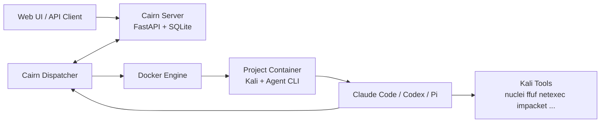

<!--
@ai: 本文件是 Cairn 项目的快速概览。当需要快速了解项目是什么、用了哪些技术、目录结构如何时，请优先阅读本文件。
如需深入了解架构细节，请查阅 AI/ARCHITECTURE.md；如需了解具体实现，请查阅 AI/CODEBASE_ANALYSIS.md。

@update: 本文件应在项目发生重大变更（如核心目标调整、技术栈升级、目录重构）时更新。

生成日期：2026-06-01
-->

# Cairn 快速项目概览

## 项目一句话

Cairn 是一个以 Fact/Intent 图为核心的多 Agent 协作探索系统，通过 Dispatcher 调度容器内的 Claude Code、Codex、Pi 等 Agent，在 Kali 工具环境中推进从 `origin` 到 `goal` 的任务。

## 最重要的心智模型

```text
Server = 协议真相源，只维护图、lease、项目级 capability/role 控制面快照；另有独立 observability DB 存 Execution Log
Dispatcher = 控制面，决定何时跑 bootstrap/reason/explore，并在任务启动前注入项目已选 MCP/Skills/Role
Worker Container = 执行面，每个项目一个 Kali 容器，每个任务实例有独立 `/tmp/cairn-capabilities/{project_id}/{task_instance_id}`
Agent CLI = 真实执行者，在容器里调用工具并返回最终 JSON 契约；Codex/Claude 的结构化流只作为日志旁路
```

## 核心概念

| 概念 | 说明 |
| --- | --- |
| Project | 一个问题实例，有 `active/stopped/completed` 状态 |
| Fact | 已确认事实，只增不改 |
| Intent | 待探索方向，从一个或多个 Fact 出发，最终 conclude 成新 Fact |
| Hint | 人工或外部策略提示，不属于因果图 |
| Reason lease | 项目级互斥，保证单项目同时只有一个 reason |
| Heartbeat | 维持 intent/reason claim，失败或过期会释放/杀进程 |

## 系统架构



## 三种任务

| 任务 | 触发 | 输入 | 输出 |
| --- | --- | --- | --- |
| `bootstrap` | 新项目初始态 | origin、goal、hints | Fact + optional complete |
| `reason` | 无可探索 intent 且图有新变化 | graph YAML、valid facts、open intents | complete 或新 intents 或 no-op |
| `explore` | 存在未认领 intent | graph YAML、intent id、intent description | 一个新 Fact |

## 调度顺序

```text
1. 项目只有 origin/goal -> bootstrap
2. 有未认领普通 intent -> explore
3. 没有 open intent 且状态变化 -> reason
4. reason 生成 intents 后，下一轮 explore
5. reason 或 bootstrap 判断目标达成 -> complete
```

## 工具如 Kali 如何被调用

Cairn 不直接调用 Kali 命令。真实链路是：

```text
Dispatcher docker exec Agent CLI
Agent CLI 在 Kali 容器内运行
Agent 根据 prompt 使用 bash/tool 调用 nuclei、ffuf、netexec、impacket 等
Agent 输出 JSONL / stream-json / 文本
Dispatcher 从最终 assistant 文本提取 JSON 契约并写回 Server
Dispatcher 同时把结构化 trace 作为 Execution Log 写入 observability API
```

`container/Dockerfile` 构建了完整 Kali 环境，并安装 `codex`、`claude-code`、`pi-coding-agent`。

## Host 附件共享

项目容器可通过 `dispatch.yaml` 的 `container.bind_mounts` 挂载 host 目录，适合 CTF 附件、源码、字典、离线工具和大输出文件：

```yaml
container:
  bind_mounts:
    - name: "ctf-attachments"
      host_path: "./attachments"
      container_path: "/mnt/attachments"
      read_only: true
    - name: "project-files"
      host_path: "./datas/project-files/{project_id}"
      container_path: "/mnt/project"
      read_only: false
```

`{project_id}` 会被渲染为当前项目 ID，用于项目级目录隔离。Agent 不会自动知道附件目录语义，需要在 `origin` 或 `Hint` 中说明，例如：`附件源码已挂载在 /mnt/attachments/web-src`。Fact 黑板仍由 Server/SQLite 维护，bind mount 只用于文件共享。

## Remote Support

`dispatch.yaml` 可配置极简远程协作资源：

```yaml
remote_support:
  enabled: true
  dnslog:
    url: "example.dnslog.cn"
  ssh:
    host: "1.2.3.4"
    port: 22
    username: "root"
    password: "{{REMOTE_SSH_PASSWORD}}"
```

启用后 Dispatcher 会把资源注入 worker 环境变量：

```text
CAIRN_DNSLOG_URL
CAIRN_REMOTE_SSH_HOST
CAIRN_REMOTE_SSH_PORT
CAIRN_REMOTE_SSH_USERNAME
CAIRN_REMOTE_SSH_PASSWORD
```

默认 prompt 只在 `bootstrap.md` / `explore.md` 提示这些变量可用；`reason` 和 conclude prompt 不注入，避免破坏黑板架构的事实判定边界。

## MCP / Skill / Role Capabilities

`dispatch.yaml` 可声明可用 MCP、skill 和 primary role catalog。Server 只保存项目启用的能力 ID 与 role prompt 快照，不保存 MCP env、token 或 skill 内容。Dispatcher 启动后把 catalog 注册到 Server；任务执行前读取项目选择，并在项目容器内按任务实例生成：

```text
/tmp/cairn-capabilities/{project_id}/{task_instance_id}/
├── mcp.json
├── mcp/<mcp_id>/
└── skills/<skill_id>/
```

当前能力边界：

- MCP：支持容器内 `stdio + env`，可选 `source_path` 目录会复制到 `mcp/<mcp_id>/`；`command/args/env` 支持 `{capability_root}` 占位符。
- Skill：支持 host/repo 目录文件包，整体复制到 `skills/<skill_id>/`。
- Role：创建项目时选择一个 primary role；Server 保存 role prompt 快照，Dispatcher 在 `bootstrap` / `explore` / `reason` prompt 中注入 `{role_instructions}`。
- 未声明、未启用、task type 不匹配或注入失败的能力 fail closed，并写入 Execution Log；业务 Fact/Intent/Hint 语义不变。

### 本地资源目录

能力相关资源统一放在项目根的 `capabilities/` 目录，`dispatch.yaml` 用相对路径引用：

```text
capabilities/
├── README.md
├── mcp/                          # 本地 MCP server 资料：仓库说明、构建脚本、容器配置、mcp.json 模板
├── skills/<skill_id>/            # 单个 skill 文件包，会被整体复制到容器内
│   └── SKILL.md
└── roles/<role_id>/              # primary role 固定 prompt
    └── ROLE.md
```

`dispatch.yaml` 示例：

```yaml
runtime:
  prompt_group: "cypher"

capabilities:
  mcp_servers:
    - id: "example-mcp"
      name: "Example MCP"
      command: "python3"
      args: ["{capability_root}/mcp/example-mcp/server.py", "--stdio"]
      env: {}
      source_path: "./capabilities/mcp/example-mcp"
      task_types: ["bootstrap", "explore", "reason"]
  skills:
    - id: "cypher-ctf"
      name: "Cypher CTF"
      source_path: "./capabilities/skills/cypher-ctf"
      task_types: ["bootstrap", "explore", "reason"]

roles:
  - id: "cypher-ctf-operator"
    name: "Cypher CTF Operator"
    source_path: "./capabilities/roles/cypher-ctf-operator/ROLE.md"
    task_types: ["bootstrap", "explore", "reason"]
```

### Cypher Agent 预置能力

本轮已落地 `cypher` prompt group 和 4 个内置 skill：

- `cypher-ctf`
- `cypher-pentest`
- `cypher-vuln-research`
- `cypher-flag-oob`

并提供 3 个 primary role：

- `cypher-ctf-operator`
- `cypher-pentest-operator`
- `cypher-vuln-researcher`

这些都是控制面上下文，不会把角色或能力本身写成 Fact；只有 Agent 验证后的结论才写入黑板。

## Heartbeat 如何保证任务存活

Dispatcher 任务启动后会创建 `HeartbeatLease`：

| 任务 | Lease |
| --- | --- |
| `bootstrap` | Intent heartbeat |
| `explore` | Intent heartbeat |
| `reason` | Project reason heartbeat |

heartbeat 每 `runtime.interval` 秒调用一次 Server：

```text
成功 -> 更新 last_heartbeat_at
403/409 -> lease 无效，杀掉当前容器 exec
临时失败 -> 等待 grace，超过 grace 后杀进程
```

Server 会按 `/settings` 中的 `intent_timeout` 和 `reason_timeout` 清理过期 claim。

## 如何避免 infinite loop

主要靠多层限制：

| 层级 | 机制 |
| --- | --- |
| 命令层 | Docker exec 前加 `timeout -k 5s` |
| 任务层 | bootstrap/reason/explore 都有 timeout |
| 收尾层 | conclude fallback 有独立短 timeout |
| 调度层 | reason 只有图状态变化时触发 |
| 图层 | concluded intent 不会再次执行 |
| 并发层 | max_workers/max_project_workers/max_running_projects |
| 输出层 | JSON contract 校验失败不写图 |
| backoff | unhealthy/rejected worker 短暂不可选 |

>>⚠️ 注意：这些机制防止进程和调度死循环，但不能完全防止 Agent 语义上不断生成低质量 intent。实际运行仍需要合理 prompt、`max_intents`、人工 Hint 和项目 stop 控制。

## 常用命令

```bash
uv run --project cairn cairn serve
uv run --project cairn cairn serve --observability-db-path ~/.local/share/cairn/cairn_observability.db
uv run --project cairn cairn dispatch --config dispatch.yaml
uv run --project cairn cairn dispatch --config dispatch.yaml --startup-healthcheck-only
docker compose up --build
```

## 关键文件速查

| 文件 | 作用 |
| --- | --- |
| `cairn/src/cairn/cli.py` | CLI 入口 |
| `cairn/src/cairn/server/app.py` | FastAPI app |
| `cairn/src/cairn/server/db.py` | SQLite schema |
| `cairn/src/cairn/server/observability/` | 独立 Execution Log DB、API、脱敏与查询 |
| `cairn/src/cairn/server/routers/capabilities.py` | 项目 MCP/skill 能力启用、capability catalog、role catalog 与 project role API |
| `cairn/src/cairn/server/routers/projects.py` | Project/status/reason/complete API |
| `cairn/src/cairn/server/routers/intents.py` | Intent create/heartbeat/release/conclude API |
| `cairn/src/cairn/server/routers/export.py` | YAML/timeline 导出 |
| `cairn/src/cairn/dispatcher/scheduler/loop.py` | 主调度循环 |
| `cairn/src/cairn/dispatcher/tasks/bootstrap.py` | bootstrap 任务 |
| `cairn/src/cairn/dispatcher/tasks/reason.py` | reason 任务 |
| `cairn/src/cairn/dispatcher/tasks/explore.py` | explore 任务 |
| `cairn/src/cairn/dispatcher/runtime/containers.py` | Docker 容器管理 |
| `cairn/src/cairn/dispatcher/runtime/heartbeat.py` | heartbeat lease |
| `cairn/src/cairn/dispatcher/capabilities.py` | MCP/skill catalog 构造、项目能力选择解析与容器注入 |
| `cairn/src/cairn/dispatcher/roles.py` | Role catalog 构造、项目 role prompt 快照注入 |
| `capabilities/README.md` | MCP/skill/role 本地资源目录约定 |
| `capabilities/skills/` | Cypher 与示例 skill 文件包 |
| `capabilities/roles/` | Cypher primary role prompt 文件 |
| `cairn/src/cairn/dispatcher/workers/adapters/` | Claude/Codex/Pi/Mock 适配器 |
| `cairn/src/cairn/dispatcher/prompts/default/` | 默认任务 prompt；已支持 capability 与 role 注入 |
| `cairn/src/cairn/dispatcher/prompts/cypher/` | Cypher Agent 专用 bootstrap/explore/reason/conclude prompt |
| `cairn/src/cairn/dispatcher/observability/trace.py` | 解析 Codex/Claude 结构化执行轨迹 |
| `dispatch.yaml` | 真实运行 Dispatcher 配置 |
| `dispatch_mock.yaml` | mock 运行配置 |
| `container/Dockerfile` | Kali Worker 容器镜像 |

## 敏感信息处理

不要在文档、日志或示例里复制真实 API key、SSH 密码或远程辅助服务器凭据。所有密钥应写成：

```text
{{OPENAI_API_KEY}}
{{ANTHROPIC_AUTH_TOKEN}}
{{PI_API_KEY}}
{{REMOTE_SSH_PASSWORD}}
```

Execution Log 默认隐藏 `usage`，并会对 `CAIRN_REMOTE_SSH_PASSWORD` / 通用 `*PASSWORD` 做 redaction；但仍应避免主动把真实 secret 写入 prompt、fact 或文档。

Dispatcher 的 `observability` 配置控制是否记录 prompt/stdout/stderr/raw worker stream 以及 Dispatcher 侧缓冲、脱敏和大小限制；Server 端 observability API 仍使用内置默认设置做二次脱敏与截断。

## 后续修改建议

| 目标 | 修改入口 |
| --- | --- |
| 改调度策略 | `dispatcher/scheduler/loop.py` |
| 新增 Agent 后端 | `dispatcher/workers/adapters/` + `registry.py` + `config.py` |
| 改输出 JSON 契约 | `dispatcher/contracts.py` + prompts |
| 改 Server 协议 | `server/models.py` + routers + `db.py` schema |
| 改容器生命周期 | `dispatcher/runtime/containers.py` |
| 改 heartbeat 行为 | `dispatcher/runtime/heartbeat.py` + Server heartbeat API |
| 改 MCP/skill/role 本地资源位置 | `capabilities/mcp/` / `capabilities/skills/<id>/` / `capabilities/roles/<id>/ROLE.md` + `dispatch.yaml` 的 `capabilities.*` / `roles.*` |
